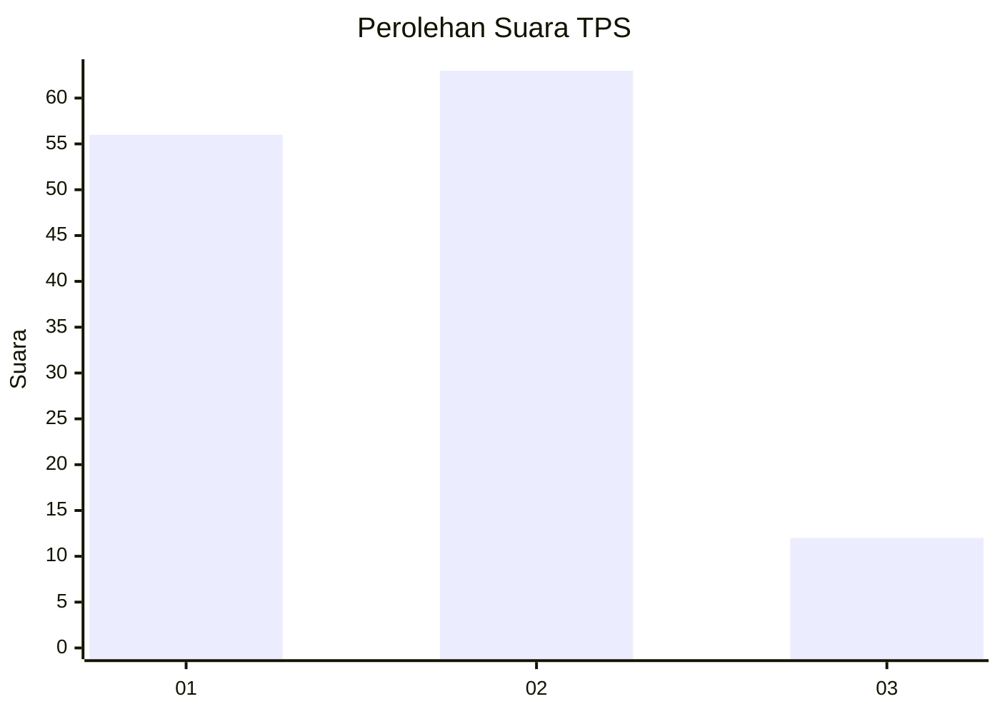
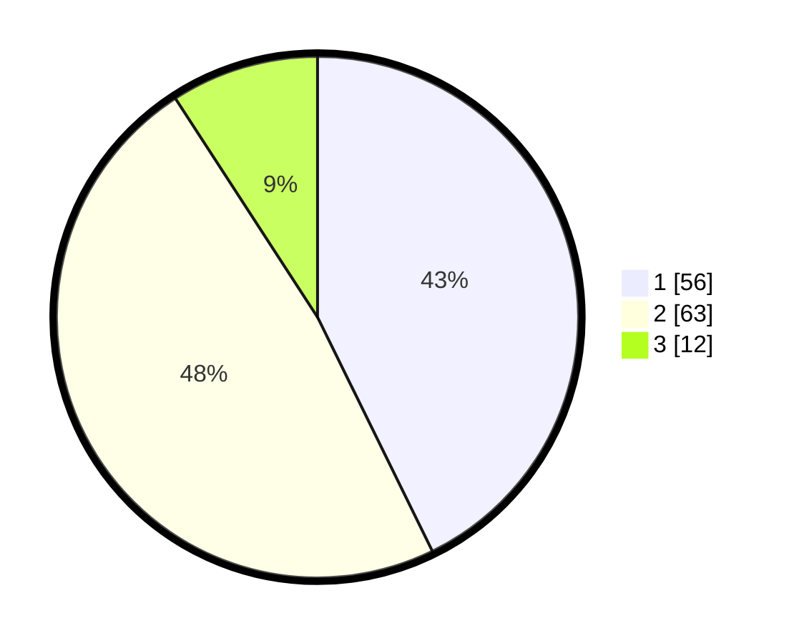

# Hasil

## Grafik

## Tabel

| No. | Nama Paslon    | Suara | Suara (raw) | Persentase |
|:--- |:-------------- | -----:| -----------:| ----------:|
| 1   | ANIES MUHAIMIN | 56    | [56][p-1]   | 42,75      |
| 2   | PRABOWO GIBRAN | 63    | [63][p-2]   | 48,09      |
| 3   | GANJAR MAHFUD  | 12    | [12][p-3]   | 9,16       |

[p-1]: https://github.com/gigit-pemilu/pemilu-2024-61-kalimantan-barat/blob/main/pilpres/hitung-suara/sub/61-kalimantan-barat/sub/71-kota-pontianak/sub/01-pontianak-selatan/sub/1005-kotabaru/sub/055-tps/sub/paslon-1.txt
[p-2]: https://github.com/gigit-pemilu/pemilu-2024-61-kalimantan-barat/blob/main/pilpres/hitung-suara/sub/61-kalimantan-barat/sub/71-kota-pontianak/sub/01-pontianak-selatan/sub/1005-kotabaru/sub/055-tps/sub/paslon-2.txt
[p-3]: https://github.com/gigit-pemilu/pemilu-2024-61-kalimantan-barat/blob/main/pilpres/hitung-suara/sub/61-kalimantan-barat/sub/71-kota-pontianak/sub/01-pontianak-selatan/sub/1005-kotabaru/sub/055-tps/sub/paslon-3.txt

## Foto C Plano

https://sirekap-obj-formc.kpu.go.id/c306/pemilu/ppwp/61/71/01/10/05/6171011005055-20240214-140322--1823e57e-7497-4fe3-8486-8941635846c0.jpg

https://sirekap-obj-formc.kpu.go.id/c306/pemilu/ppwp/61/71/01/10/05/6171011005055-20240214-140450--b249bf3b-937b-4081-9e0a-786e1e50d61d.jpg

https://sirekap-obj-formc.kpu.go.id/c306/pemilu/ppwp/61/71/01/10/05/6171011005055-20240214-140657--21a1113b-0013-4537-ae9c-66272dff4fa6.jpg

## Metadata

| Key        | Value               |
| ---------- | ------------------- |
| Time Stamp | 2024-02-16 00:00:26 |

