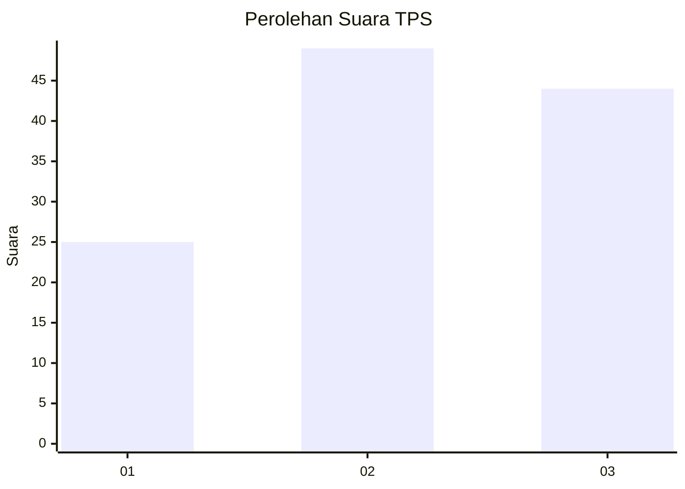
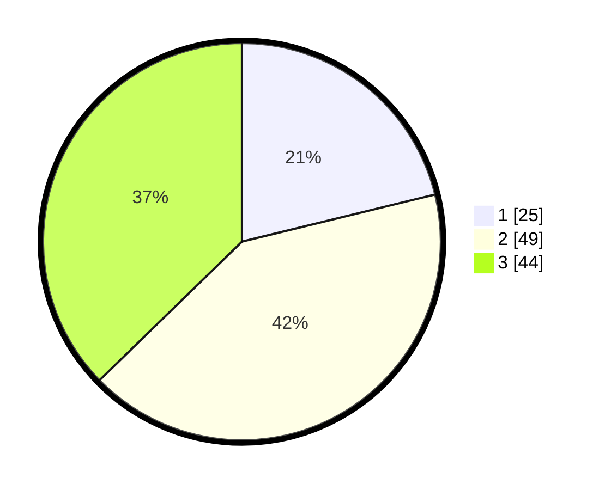

# Hasil

## Grafik

## Tabel

| No. | Nama Paslon    | Suara | Suara (raw) | Persentase |
|:--- |:-------------- | -----:| -----------:| ----------:|
| 1   | ANIES MUHAIMIN | 25    | [25][p-1]   | 21,19      |
| 2   | PRABOWO GIBRAN | 49    | [49][p-2]   | 41,53      |
| 3   | GANJAR MAHFUD  | 44    | [44][p-3]   | 37,29      |

[p-1]: https://github.com/gigit-pemilu/pemilu-2024-61-kalimantan-barat/blob/main/pilpres/hitung-suara/sub/61-kalimantan-barat/sub/71-kota-pontianak/sub/01-pontianak-selatan/sub/1006-akcaya/sub/014-tps/sub/paslon-1.txt
[p-2]: https://github.com/gigit-pemilu/pemilu-2024-61-kalimantan-barat/blob/main/pilpres/hitung-suara/sub/61-kalimantan-barat/sub/71-kota-pontianak/sub/01-pontianak-selatan/sub/1006-akcaya/sub/014-tps/sub/paslon-2.txt
[p-3]: https://github.com/gigit-pemilu/pemilu-2024-61-kalimantan-barat/blob/main/pilpres/hitung-suara/sub/61-kalimantan-barat/sub/71-kota-pontianak/sub/01-pontianak-selatan/sub/1006-akcaya/sub/014-tps/sub/paslon-3.txt

## Foto C Plano

https://sirekap-obj-formc.kpu.go.id/213c/pemilu/ppwp/61/71/01/10/06/6171011006014-20240214-201320--57baf659-1c74-4887-8b92-becb0c909c81.jpg

https://sirekap-obj-formc.kpu.go.id/213c/pemilu/ppwp/61/71/01/10/06/6171011006014-20240214-201340--2e42feb0-0144-4443-b602-9a46556b731a.jpg

https://sirekap-obj-formc.kpu.go.id/213c/pemilu/ppwp/61/71/01/10/06/6171011006014-20240214-201355--4ce54265-81bd-4c35-be3f-1cb5f3e5f6c2.jpg

## Metadata

| Key        | Value               |
| ---------- | ------------------- |
| Time Stamp | 2024-02-16 00:00:26 |

