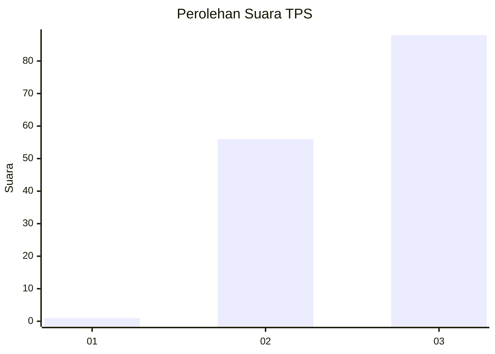
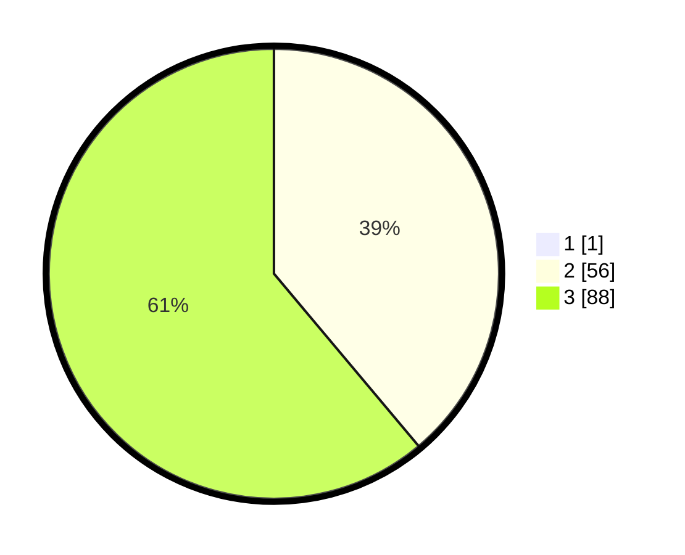

# Hasil

## Grafik

## Tabel

| No. | Nama Paslon    | Suara | Suara (raw) | Persentase |
|:--- |:-------------- | -----:| -----------:| ----------:|
| 1   | ANIES MUHAIMIN | 1     | [1][p-1]    | 0,69       |
| 2   | PRABOWO GIBRAN | 56    | [56][p-2]   | 38,62      |
| 3   | GANJAR MAHFUD  | 88    | [88][p-3]   | 60,69      |

[p-1]: https://github.com/gigit-pemilu/pemilu-2024-61-kalimantan-barat/blob/main/pilpres/hitung-suara/sub/61-kalimantan-barat/sub/71-kota-pontianak/sub/01-pontianak-selatan/sub/1006-akcaya/sub/032-tps/sub/paslon-1.txt
[p-2]: https://github.com/gigit-pemilu/pemilu-2024-61-kalimantan-barat/blob/main/pilpres/hitung-suara/sub/61-kalimantan-barat/sub/71-kota-pontianak/sub/01-pontianak-selatan/sub/1006-akcaya/sub/032-tps/sub/paslon-2.txt
[p-3]: https://github.com/gigit-pemilu/pemilu-2024-61-kalimantan-barat/blob/main/pilpres/hitung-suara/sub/61-kalimantan-barat/sub/71-kota-pontianak/sub/01-pontianak-selatan/sub/1006-akcaya/sub/032-tps/sub/paslon-3.txt

## Foto C Plano

https://sirekap-obj-formc.kpu.go.id/e5b3/pemilu/ppwp/61/71/01/10/06/6171011006032-20240214-185702--ea0deae3-def3-4997-bdca-40566690354d.jpg

https://sirekap-obj-formc.kpu.go.id/e5b3/pemilu/ppwp/61/71/01/10/06/6171011006032-20240214-185754--4a21c0e7-d53c-4ebc-8bb6-28332f4f8824.jpg

https://sirekap-obj-formc.kpu.go.id/e5b3/pemilu/ppwp/61/71/01/10/06/6171011006032-20240214-185833--806eae66-4d7b-4b6d-8611-779360e33cde.jpg

## Metadata

| Key        | Value               |
| ---------- | ------------------- |
| Time Stamp | 2024-02-16 00:00:26 |

## DATA PEMILIH TETAP

Jumlah pemilih dalam DPT: **517**.
 * L: **407**.
 * P: **909**.

## DATA PENGGUNA HAK PILIH

Jumlah pengguna hak pilih dalam DPT: **707**.
 * L: **414**.
 * P: **105**.

Jumlah pengguna hak pilih dalam DPTb: **700**.
 * L: **700**.
 * P: **500**.

Jumlah pengguna hak pilih dalam DPK: **0**.
 * L: **0**.
 * P: **0**.

Jumlah pengguna hak pilih: **77**.
 * L: **147**.
 * P: **70**.

## JUMLAH SUARA SAH DAN TIDAK SAH

JUMLAH SELURUH SUARA SAH: **145**.

JUMLAH SUARA TIDAK SAH: **2**.

JUMLAH SELURUH SUARA SAH DAN SUARA TIDAK SAH: **147**.

