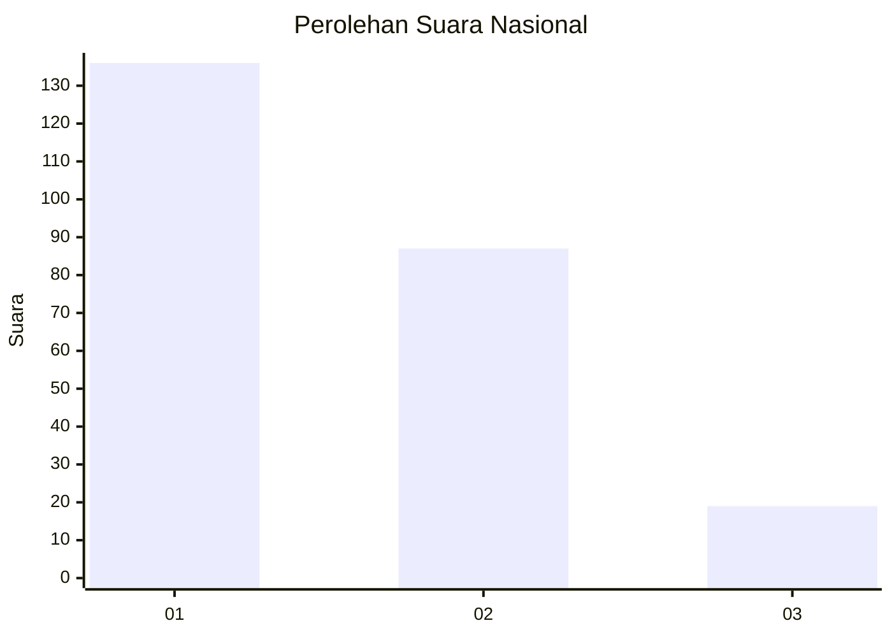
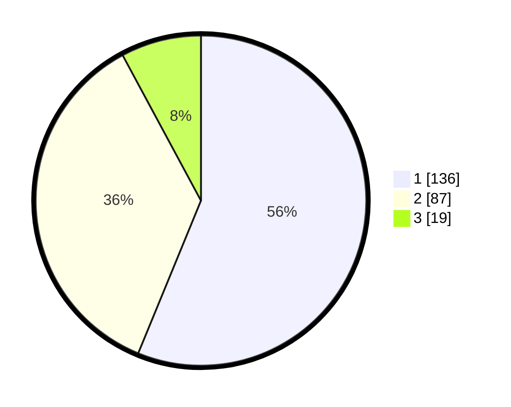

# Hasil

## Grafik

## Tabel

| No. | Nama Paslon    | Suara | Suara (raw) | Persentase |
|:--- |:-------------- | -----:| -----------:| ----------:|
| 1   | ANIES MUHAIMIN | 136   | [136][p-1]  | 56,20      |
| 2   | PRABOWO GIBRAN | 87    | [87][p-2]   | 35,95      |
| 3   | GANJAR MAHFUD  | 19    | [19][p-3]   | 7,85       |

[p-1]: https://github.com/gigit-pemilu/pemilu-2024/blob/main/pilpres/hitung-suara/sub/61-kalimantan-barat/sub/71-kota-pontianak/sub/02-pontianak-timur/sub/1002-banjar-serasan/sub/001-tps/sub/paslon-1.txt
[p-2]: https://github.com/gigit-pemilu/pemilu-2024/blob/main/pilpres/hitung-suara/sub/61-kalimantan-barat/sub/71-kota-pontianak/sub/02-pontianak-timur/sub/1002-banjar-serasan/sub/001-tps/sub/paslon-2.txt
[p-3]: https://github.com/gigit-pemilu/pemilu-2024/blob/main/pilpres/hitung-suara/sub/61-kalimantan-barat/sub/71-kota-pontianak/sub/02-pontianak-timur/sub/1002-banjar-serasan/sub/001-tps/sub/paslon-3.txt

## Foto C Plano

https://sirekap-obj-formc.kpu.go.id/4340/pemilu/ppwp/61/71/02/10/02/6171021002001-20240214-160114--def2fdc0-d5e4-47c7-ad91-cce821621fbe.jpg

https://sirekap-obj-formc.kpu.go.id/4340/pemilu/ppwp/61/71/02/10/02/6171021002001-20240214-155840--c585160f-a34d-4e31-8ca0-fe7db530ef7d.jpg

https://sirekap-obj-formc.kpu.go.id/4340/pemilu/ppwp/61/71/02/10/02/6171021002001-20240214-155921--4b694794-b4f5-4f3e-a36d-bee0bed28554.jpg

## Metadata

| Key        | Value               |
| ---------- | ------------------- |
| Time Stamp | 2024-02-16 00:30:27 |

