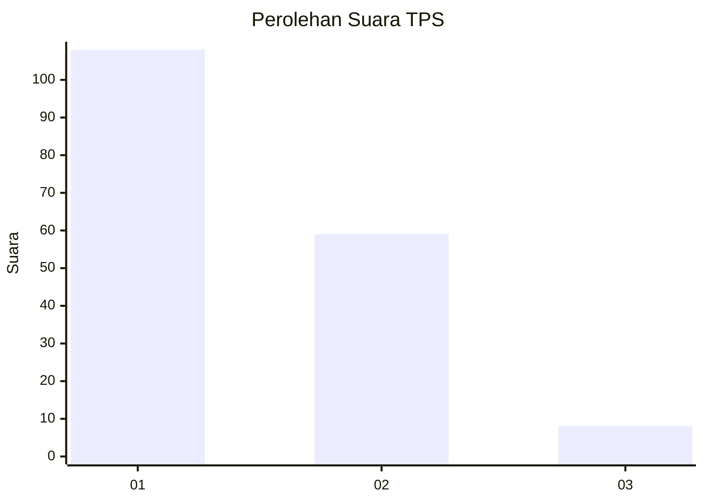
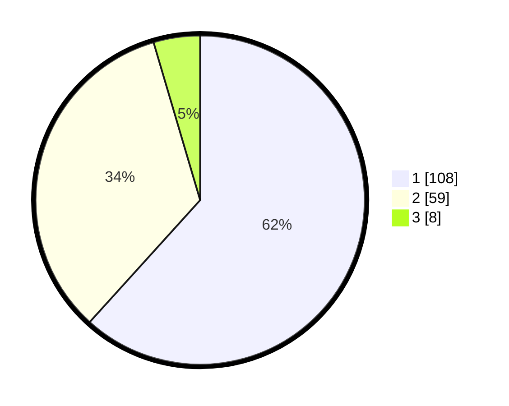

# Hasil

## Grafik

## Tabel

| No. | Nama Paslon    | Suara | Suara (raw) | Persentase |
|:--- |:-------------- | -----:| -----------:| ----------:|
| 1   | ANIES MUHAIMIN | 108   | [108][p-1]  | 61,71      |
| 2   | PRABOWO GIBRAN | 59    | [59][p-2]   | 33,71      |
| 3   | GANJAR MAHFUD  | 8     | [8][p-3]    | 4,57       |

[p-1]: https://github.com/gigit-pemilu/pemilu-2024-61-kalimantan-barat/blob/main/pilpres/hitung-suara/sub/61-kalimantan-barat/sub/71-kota-pontianak/sub/02-pontianak-timur/sub/1003-saigon/sub/005-tps/sub/paslon-1.txt
[p-2]: https://github.com/gigit-pemilu/pemilu-2024-61-kalimantan-barat/blob/main/pilpres/hitung-suara/sub/61-kalimantan-barat/sub/71-kota-pontianak/sub/02-pontianak-timur/sub/1003-saigon/sub/005-tps/sub/paslon-2.txt
[p-3]: https://github.com/gigit-pemilu/pemilu-2024-61-kalimantan-barat/blob/main/pilpres/hitung-suara/sub/61-kalimantan-barat/sub/71-kota-pontianak/sub/02-pontianak-timur/sub/1003-saigon/sub/005-tps/sub/paslon-3.txt

## Foto C Plano

https://sirekap-obj-formc.kpu.go.id/1d30/pemilu/ppwp/61/71/02/10/03/6171021003005-20240229-002146--7b21ad36-e499-4831-b44d-69c7dfba9396.jpg

https://sirekap-obj-formc.kpu.go.id/1d30/pemilu/ppwp/61/71/02/10/03/6171021003005-20240217-112636--3316ddf1-b19d-445f-a437-286de79eb3f3.jpg

https://sirekap-obj-formc.kpu.go.id/1d30/pemilu/ppwp/61/71/02/10/03/6171021003005-20240217-112705--ea958c6f-d06f-430b-82d0-d69a786e3032.jpg

## Metadata

| Key        | Value               |
| ---------- | ------------------- |
| Time Stamp | 2024-02-29 01:00:00 |

