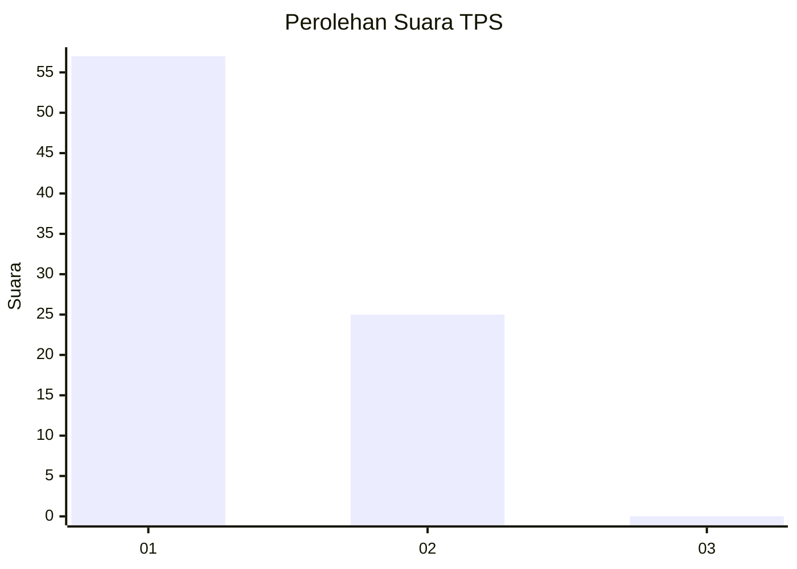
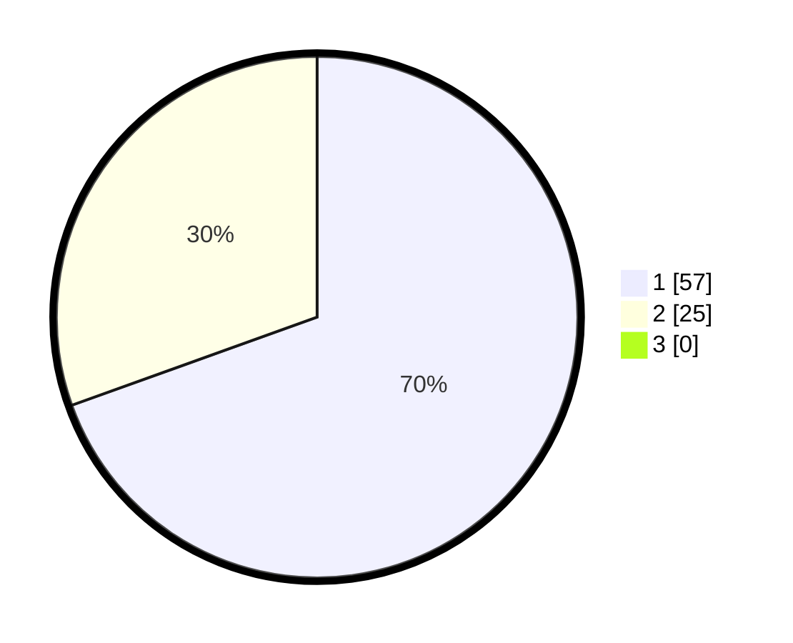

# Hasil

## Grafik

## Tabel

| No. | Nama Paslon    | Suara | Suara (raw) | Persentase |
|:--- |:-------------- | -----:| -----------:| ----------:|
| 1   | ANIES MUHAIMIN | 57    | [57][p-1]   | 69,51      |
| 2   | PRABOWO GIBRAN | 25    | [25][p-2]   | 30,49      |
| 3   | GANJAR MAHFUD  | 0     | [0][p-3]    | 0,00       |

[p-1]: https://github.com/gigit-pemilu/pemilu-2024-61-kalimantan-barat/blob/main/pilpres/hitung-suara/sub/61-kalimantan-barat/sub/71-kota-pontianak/sub/02-pontianak-timur/sub/1003-saigon/sub/006-tps/sub/paslon-1.txt
[p-2]: https://github.com/gigit-pemilu/pemilu-2024-61-kalimantan-barat/blob/main/pilpres/hitung-suara/sub/61-kalimantan-barat/sub/71-kota-pontianak/sub/02-pontianak-timur/sub/1003-saigon/sub/006-tps/sub/paslon-2.txt
[p-3]: https://github.com/gigit-pemilu/pemilu-2024-61-kalimantan-barat/blob/main/pilpres/hitung-suara/sub/61-kalimantan-barat/sub/71-kota-pontianak/sub/02-pontianak-timur/sub/1003-saigon/sub/006-tps/sub/paslon-3.txt

## Foto C Plano

https://sirekap-obj-formc.kpu.go.id/74be/pemilu/ppwp/61/71/02/10/03/6171021003006-20240217-112640--54237344-69f5-4989-be0e-48bb6dabe118.jpg

https://sirekap-obj-formc.kpu.go.id/74be/pemilu/ppwp/61/71/02/10/03/6171021003006-20240217-112726--1898f7ee-1f74-4160-b2d3-6996bb36e970.jpg

https://sirekap-obj-formc.kpu.go.id/74be/pemilu/ppwp/61/71/02/10/03/6171021003006-20240217-112834--216427de-0690-4396-82d9-9f71eafdbc7e.jpg

## Metadata

| Key        | Value               |
| ---------- | ------------------- |
| Time Stamp | 2024-02-24 22:31:28 |

