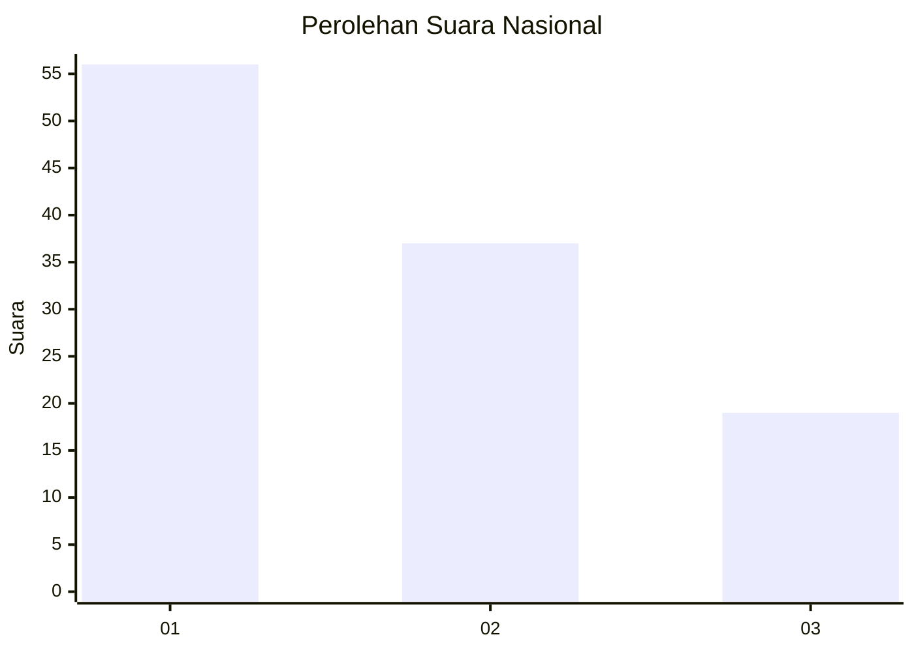
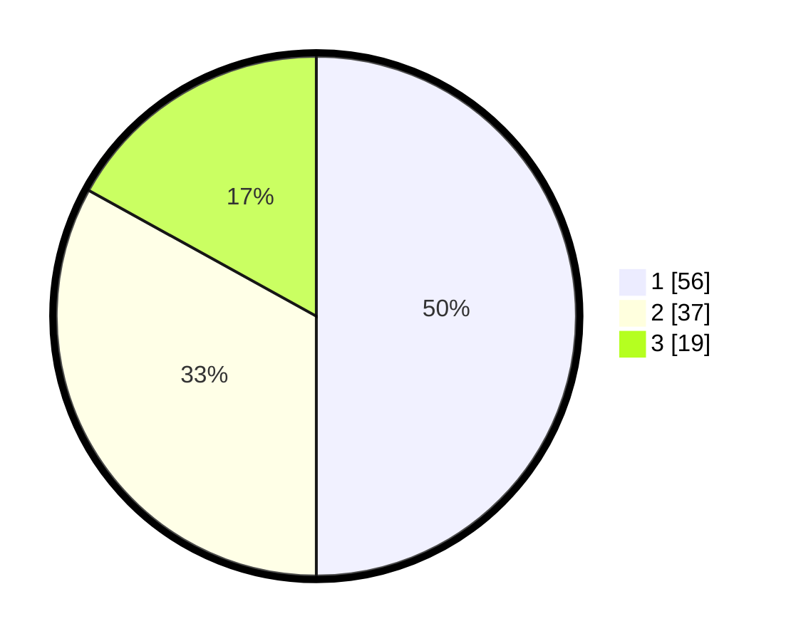

# Hasil

## Grafik

## Tabel

| No. | Nama Paslon    | Suara | Suara (raw) | Persentase |
|:--- |:-------------- | -----:| -----------:| ----------:|
| 1   | ANIES MUHAIMIN | 56    | [56][p-1]   | 50,00      |
| 2   | PRABOWO GIBRAN | 37    | [37][p-2]   | 33,04      |
| 3   | GANJAR MAHFUD  | 19    | [19][p-3]   | 16,96      |

[p-1]: https://github.com/gigit-pemilu/pemilu-2024/blob/main/pilpres/hitung-suara/sub/61-kalimantan-barat/sub/71-kota-pontianak/sub/02-pontianak-timur/sub/1003-saigon/sub/025-tps/sub/paslon-1.txt
[p-2]: https://github.com/gigit-pemilu/pemilu-2024/blob/main/pilpres/hitung-suara/sub/61-kalimantan-barat/sub/71-kota-pontianak/sub/02-pontianak-timur/sub/1003-saigon/sub/025-tps/sub/paslon-2.txt
[p-3]: https://github.com/gigit-pemilu/pemilu-2024/blob/main/pilpres/hitung-suara/sub/61-kalimantan-barat/sub/71-kota-pontianak/sub/02-pontianak-timur/sub/1003-saigon/sub/025-tps/sub/paslon-3.txt

## Foto C Plano

https://sirekap-obj-formc.kpu.go.id/0e54/pemilu/ppwp/61/71/02/10/03/6171021003025-20240217-132853--af6f5309-fd07-4a7a-8df2-c8af553bffcb.jpg

https://sirekap-obj-formc.kpu.go.id/0e54/pemilu/ppwp/61/71/02/10/03/6171021003025-20240217-132952--5bffd99c-cca4-4ba9-8522-b320b14fe504.jpg

https://sirekap-obj-formc.kpu.go.id/0e54/pemilu/ppwp/61/71/02/10/03/6171021003025-20240217-133047--3688c771-e005-46d3-9f8f-f5745058f75b.jpg

## Metadata

| Key        | Value               |
| ---------- | ------------------- |
| Time Stamp | 2024-02-25 11:00:00 |

