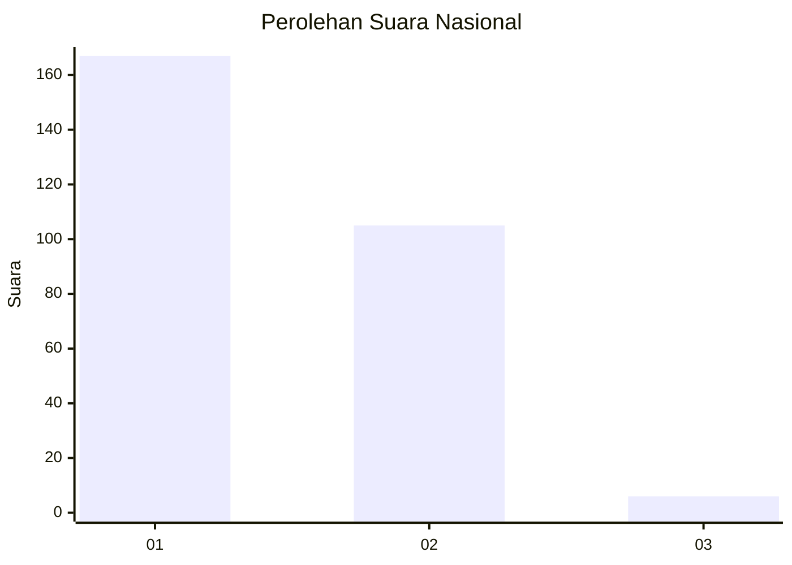
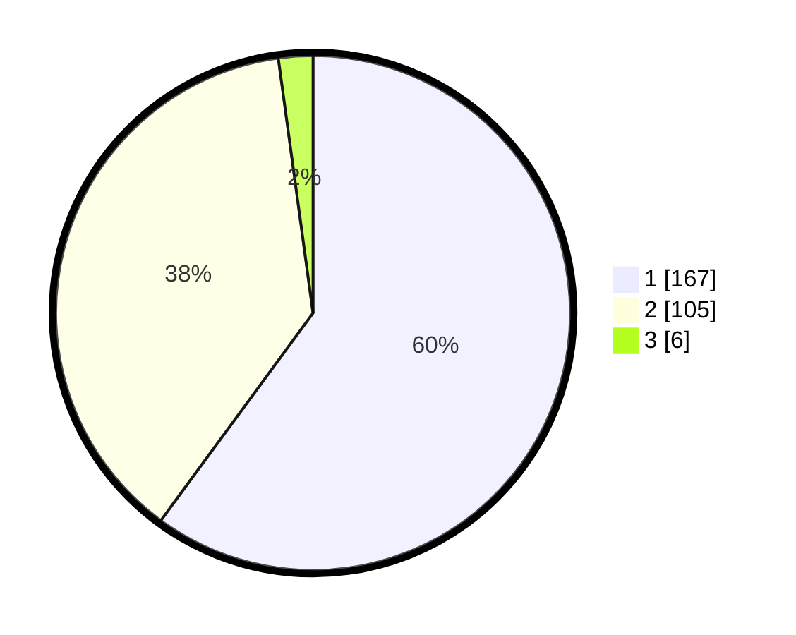

# Hasil

## Grafik

## Tabel

| No. | Nama Paslon    | Suara | Suara (raw) | Persentase |
|:--- |:-------------- | -----:| -----------:| ----------:|
| 1   | ANIES MUHAIMIN | 167   | [167][p-1]  | 60,07      |
| 2   | PRABOWO GIBRAN | 105   | [105][p-2]  | 37,77      |
| 3   | GANJAR MAHFUD  | 6     | [6][p-3]    | 2,16       |

[p-1]: https://github.com/gigit-pemilu/pemilu-2024/blob/main/pilpres/hitung-suara/sub/61-kalimantan-barat/sub/71-kota-pontianak/sub/02-pontianak-timur/sub/1005-tanjung-hilir/sub/010-tps/sub/paslon-1.txt
[p-2]: https://github.com/gigit-pemilu/pemilu-2024/blob/main/pilpres/hitung-suara/sub/61-kalimantan-barat/sub/71-kota-pontianak/sub/02-pontianak-timur/sub/1005-tanjung-hilir/sub/010-tps/sub/paslon-2.txt
[p-3]: https://github.com/gigit-pemilu/pemilu-2024/blob/main/pilpres/hitung-suara/sub/61-kalimantan-barat/sub/71-kota-pontianak/sub/02-pontianak-timur/sub/1005-tanjung-hilir/sub/010-tps/sub/paslon-3.txt

## Foto C Plano

https://sirekap-obj-formc.kpu.go.id/8534/pemilu/ppwp/61/71/02/10/05/6171021005010-20240217-202507--f47668c3-121a-4f42-9dec-004c6a5f8af5.jpg

https://sirekap-obj-formc.kpu.go.id/8534/pemilu/ppwp/61/71/02/10/05/6171021005010-20240214-191519--87efef9c-1995-4138-818a-79eff2362dd0.jpg

https://sirekap-obj-formc.kpu.go.id/8534/pemilu/ppwp/61/71/02/10/05/6171021005010-20240214-191524--ef304135-3074-4619-aa73-1523c728d15f.jpg

## Metadata

| Key        | Value               |
| ---------- | ------------------- |
| Time Stamp | 2024-02-24 23:00:00 |

