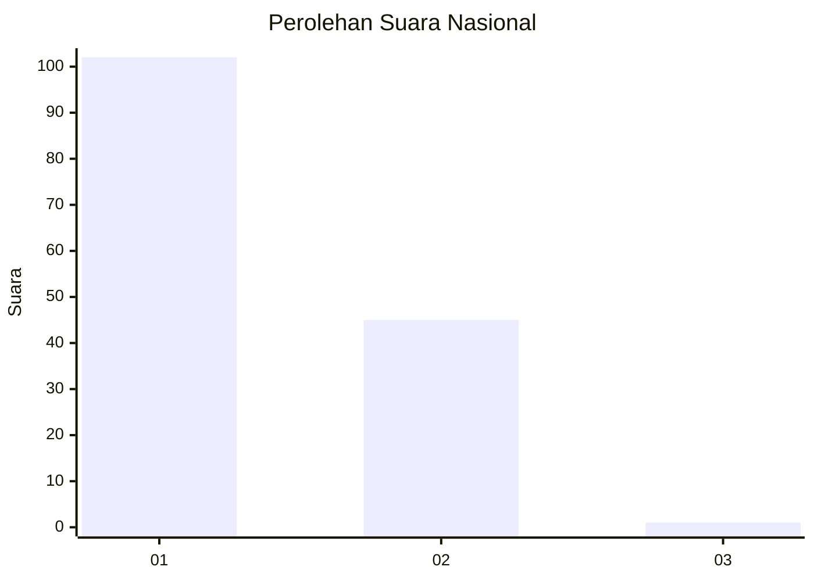
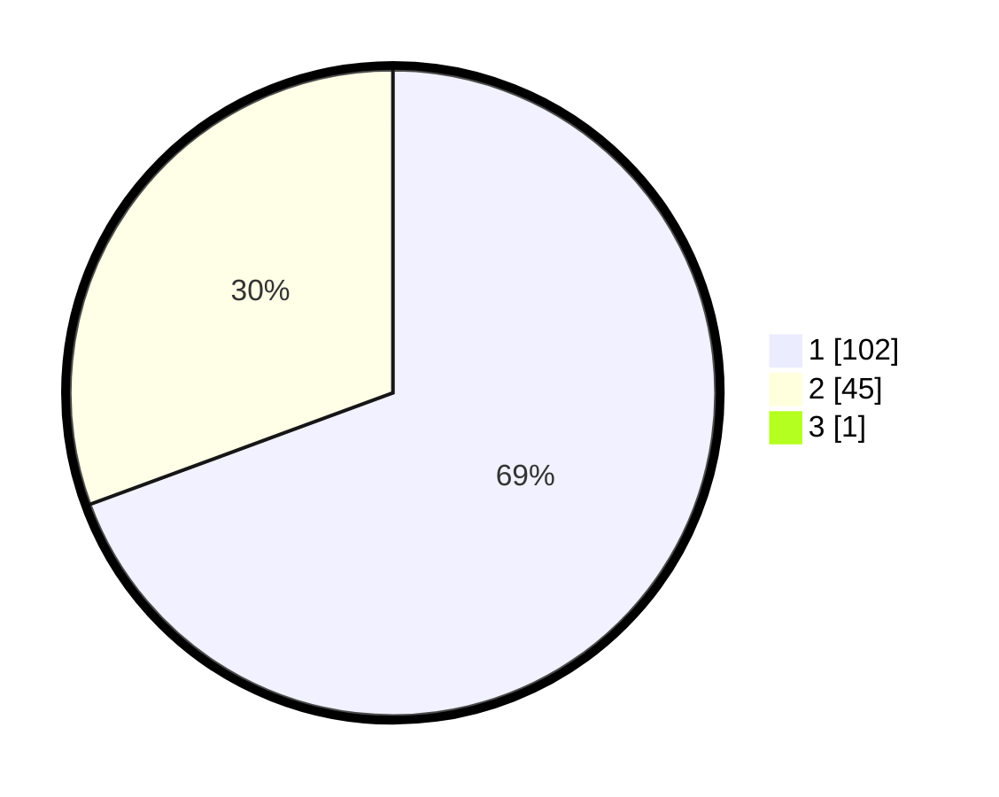

# Hasil

## Grafik

## Tabel

| No. | Nama Paslon    | Suara | Suara (raw) | Persentase |
|:--- |:-------------- | -----:| -----------:| ----------:|
| 1   | ANIES MUHAIMIN | 102   | [102][p-1]  | 68,92      |
| 2   | PRABOWO GIBRAN | 45    | [45][p-2]   | 30,41      |
| 3   | GANJAR MAHFUD  | 1     | [1][p-3]    | 0,68       |

[p-1]: https://github.com/gigit-pemilu/pemilu-2024/blob/main/pilpres/hitung-suara/sub/61-kalimantan-barat/sub/71-kota-pontianak/sub/02-pontianak-timur/sub/1005-tanjung-hilir/sub/021-tps/sub/paslon-1.txt
[p-2]: https://github.com/gigit-pemilu/pemilu-2024/blob/main/pilpres/hitung-suara/sub/61-kalimantan-barat/sub/71-kota-pontianak/sub/02-pontianak-timur/sub/1005-tanjung-hilir/sub/021-tps/sub/paslon-2.txt
[p-3]: https://github.com/gigit-pemilu/pemilu-2024/blob/main/pilpres/hitung-suara/sub/61-kalimantan-barat/sub/71-kota-pontianak/sub/02-pontianak-timur/sub/1005-tanjung-hilir/sub/021-tps/sub/paslon-3.txt

## Foto C Plano

https://sirekap-obj-formc.kpu.go.id/af38/pemilu/ppwp/61/71/02/10/05/6171021005021-20240217-203808--54090bf2-2766-4f4a-879c-ed01a8c332cd.jpg

https://sirekap-obj-formc.kpu.go.id/af38/pemilu/ppwp/61/71/02/10/05/6171021005021-20240214-141442--685afa23-45ba-4e1c-8fe9-59918073b5c7.jpg

https://sirekap-obj-formc.kpu.go.id/af38/pemilu/ppwp/61/71/02/10/05/6171021005021-20240214-141731--ad9e2e6b-be5b-4f8f-be1e-3e8c3b076bf8.jpg

## Metadata

| Key        | Value               |
| ---------- | ------------------- |
| Time Stamp | 2024-02-24 22:31:28 |

