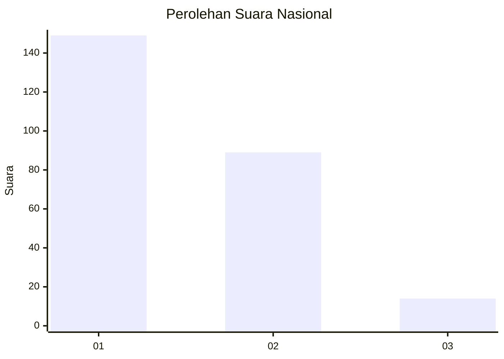
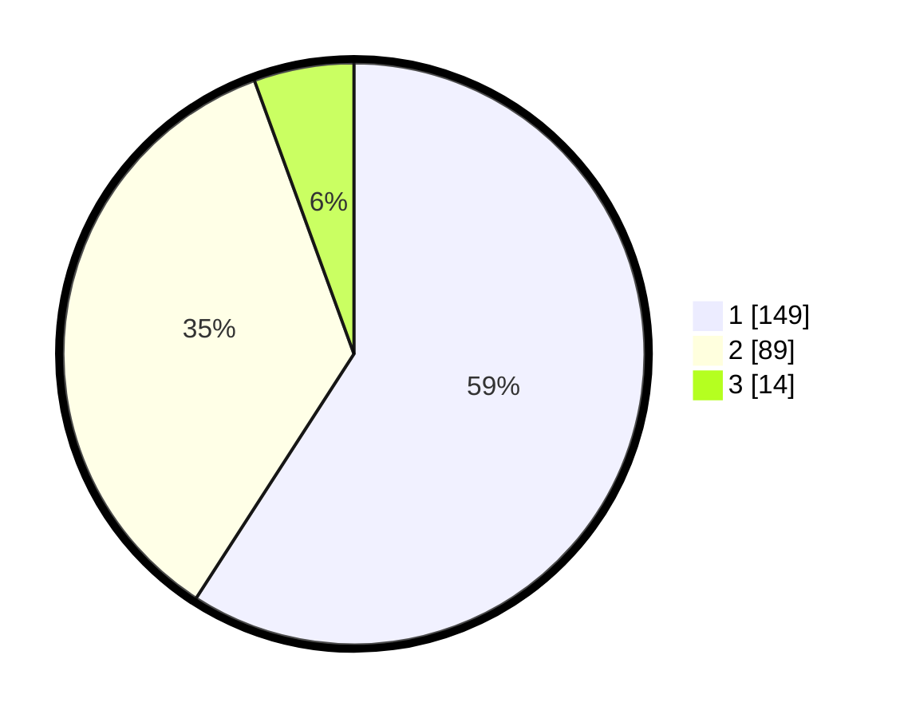

# Hasil

## Grafik

## Tabel

| No. | Nama Paslon    | Suara | Suara (raw) | Persentase |
|:--- |:-------------- | -----:| -----------:| ----------:|
| 1   | ANIES MUHAIMIN | 149   | [149][p-1]  | 59,13      |
| 2   | PRABOWO GIBRAN | 89    | [89][p-2]   | 35,32      |
| 3   | GANJAR MAHFUD  | 14    | [14][p-3]   | 5,56       |

[p-1]: https://github.com/gigit-pemilu/pemilu-2024/blob/main/pilpres/hitung-suara/sub/61-kalimantan-barat/sub/71-kota-pontianak/sub/02-pontianak-timur/sub/1006-dalambugis/sub/050-tps/sub/paslon-1.txt
[p-2]: https://github.com/gigit-pemilu/pemilu-2024/blob/main/pilpres/hitung-suara/sub/61-kalimantan-barat/sub/71-kota-pontianak/sub/02-pontianak-timur/sub/1006-dalambugis/sub/050-tps/sub/paslon-2.txt
[p-3]: https://github.com/gigit-pemilu/pemilu-2024/blob/main/pilpres/hitung-suara/sub/61-kalimantan-barat/sub/71-kota-pontianak/sub/02-pontianak-timur/sub/1006-dalambugis/sub/050-tps/sub/paslon-3.txt

## Foto C Plano

https://sirekap-obj-formc.kpu.go.id/bd15/pemilu/ppwp/61/71/02/10/06/6171021006050-20240215-012328--b4f192fe-9561-408f-a408-131bc82a6148.jpg

https://sirekap-obj-formc.kpu.go.id/bd15/pemilu/ppwp/61/71/02/10/06/6171021006050-20240215-012439--1cbfd47c-0194-4228-823f-ba6ecb514cc2.jpg

https://sirekap-obj-formc.kpu.go.id/bd15/pemilu/ppwp/61/71/02/10/06/6171021006050-20240215-012526--99d3b325-0057-41c1-be6e-909575460379.jpg

## Metadata

| Key        | Value               |
| ---------- | ------------------- |
| Time Stamp | 2024-02-25 20:00:00 |

