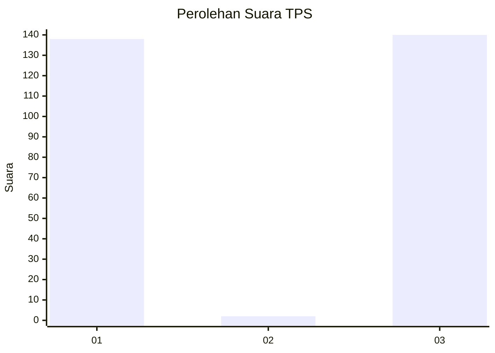
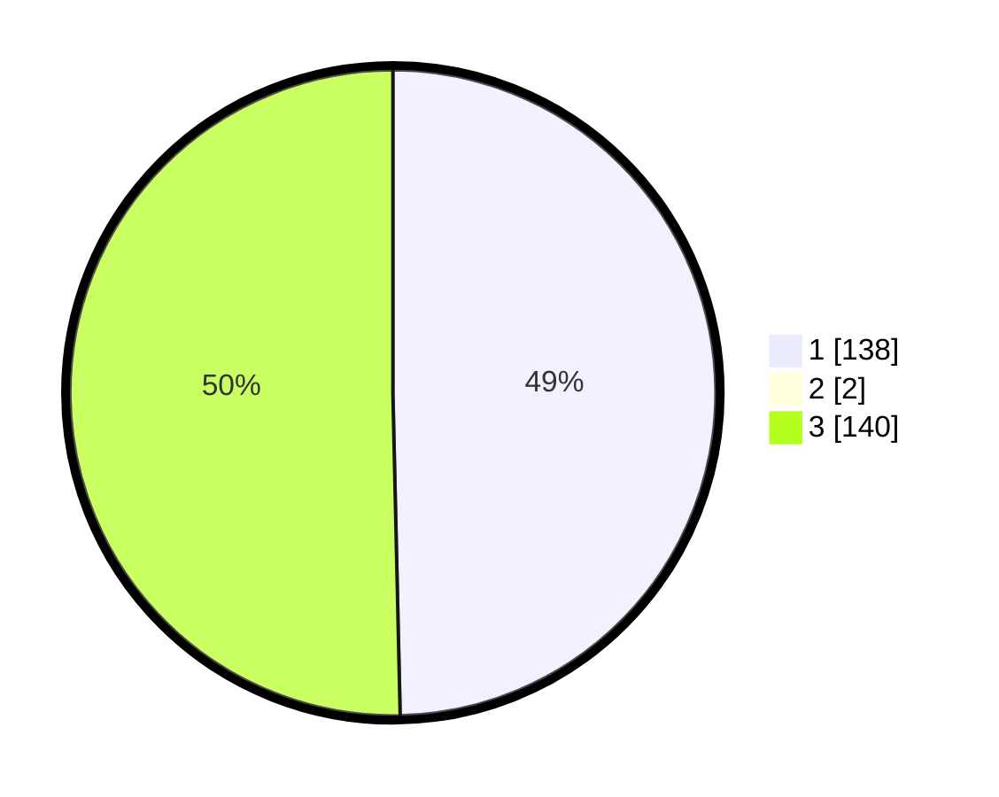

# Hasil

## Grafik

## Tabel

| No. | Nama Paslon    | Suara | Suara (raw) | Persentase |
|:--- |:-------------- | -----:| -----------:| ----------:|
| 1   | ANIES MUHAIMIN | 138   | [138][p-1]  | 49,29      |
| 2   | PRABOWO GIBRAN | 2     | [2][p-2]    | 0,71       |
| 3   | GANJAR MAHFUD  | 140   | [140][p-3]  | 50,00      |

[p-1]: https://github.com/gigit-pemilu/pemilu-2024-61-kalimantan-barat/blob/main/pilpres/hitung-suara/sub/61-kalimantan-barat/sub/71-kota-pontianak/sub/03-pontianak-barat/sub/1002-sungaijawi-dalam/sub/013-tps/sub/paslon-1.txt
[p-2]: https://github.com/gigit-pemilu/pemilu-2024-61-kalimantan-barat/blob/main/pilpres/hitung-suara/sub/61-kalimantan-barat/sub/71-kota-pontianak/sub/03-pontianak-barat/sub/1002-sungaijawi-dalam/sub/013-tps/sub/paslon-2.txt
[p-3]: https://github.com/gigit-pemilu/pemilu-2024-61-kalimantan-barat/blob/main/pilpres/hitung-suara/sub/61-kalimantan-barat/sub/71-kota-pontianak/sub/03-pontianak-barat/sub/1002-sungaijawi-dalam/sub/013-tps/sub/paslon-3.txt

## Foto C Plano

https://sirekap-obj-formc.kpu.go.id/f3ae/pemilu/ppwp/61/71/03/10/02/6171031002013-20240214-235807--ebb6af11-6c96-4887-ab73-904c382ba515.jpg

https://sirekap-obj-formc.kpu.go.id/f3ae/pemilu/ppwp/61/71/03/10/02/6171031002013-20240214-235830--200e333e-58fc-4c04-904f-ccec42ba2c9c.jpg

https://sirekap-obj-formc.kpu.go.id/f3ae/pemilu/ppwp/61/71/03/10/02/6171031002013-20240214-235844--38911ea4-c035-40ce-8fe0-d41805b45b95.jpg

## Metadata

| Key        | Value               |
| ---------- | ------------------- |
| Time Stamp | 2024-02-16 00:30:27 |

