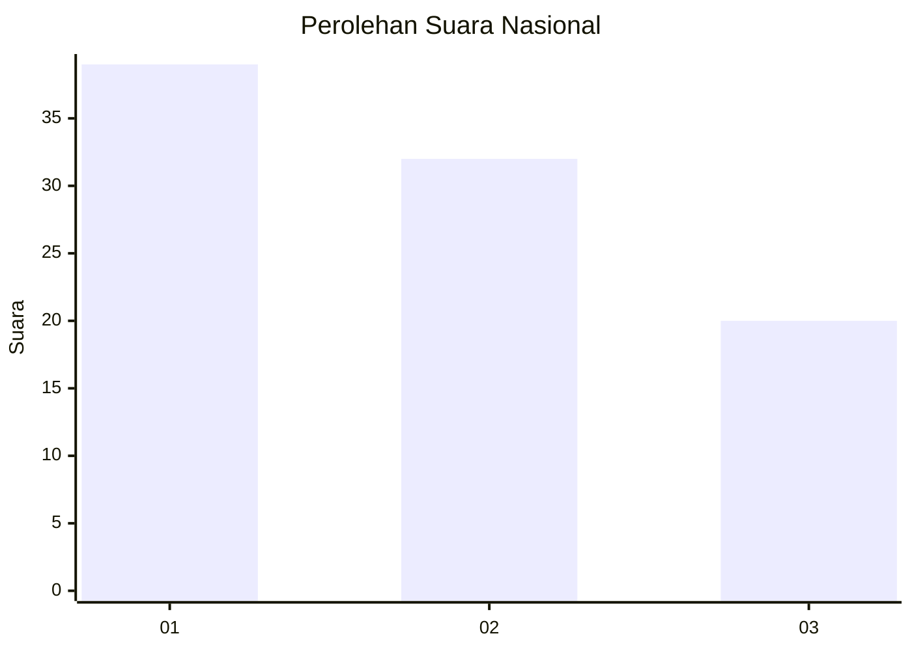
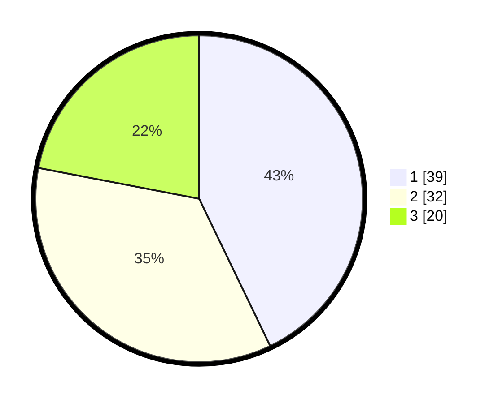

# Hasil

## Grafik

## Tabel

| No. | Nama Paslon    | Suara | Suara (raw) | Persentase |
|:--- |:-------------- | -----:| -----------:| ----------:|
| 1   | ANIES MUHAIMIN | 39    | [39][p-1]   | 42,86      |
| 2   | PRABOWO GIBRAN | 32    | [32][p-2]   | 35,16      |
| 3   | GANJAR MAHFUD  | 20    | [20][p-3]   | 21,98      |

[p-1]: https://github.com/gigit-pemilu/pemilu-2024/blob/main/pilpres/hitung-suara/sub/61-kalimantan-barat/sub/71-kota-pontianak/sub/03-pontianak-barat/sub/1002-sungaijawi-dalam/sub/099-tps/sub/paslon-1.txt
[p-2]: https://github.com/gigit-pemilu/pemilu-2024/blob/main/pilpres/hitung-suara/sub/61-kalimantan-barat/sub/71-kota-pontianak/sub/03-pontianak-barat/sub/1002-sungaijawi-dalam/sub/099-tps/sub/paslon-2.txt
[p-3]: https://github.com/gigit-pemilu/pemilu-2024/blob/main/pilpres/hitung-suara/sub/61-kalimantan-barat/sub/71-kota-pontianak/sub/03-pontianak-barat/sub/1002-sungaijawi-dalam/sub/099-tps/sub/paslon-3.txt

## Foto C Plano

https://sirekap-obj-formc.kpu.go.id/3d0f/pemilu/ppwp/61/71/03/10/02/6171031002099-20240215-003636--16dd7358-4026-4d53-b7f1-d7529e61f340.jpg

https://sirekap-obj-formc.kpu.go.id/3d0f/pemilu/ppwp/61/71/03/10/02/6171031002099-20240215-003753--12b26bba-c0cc-429b-b326-aca35de4cec6.jpg

https://sirekap-obj-formc.kpu.go.id/3d0f/pemilu/ppwp/61/71/03/10/02/6171031002099-20240215-003834--7471fb3e-b0c9-4a74-8ae3-0fd6b7e8f719.jpg

## Metadata

| Key        | Value               |
| ---------- | ------------------- |
| Time Stamp | 2024-02-24 22:31:28 |

