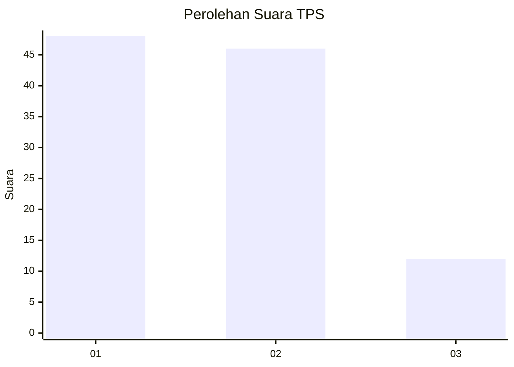
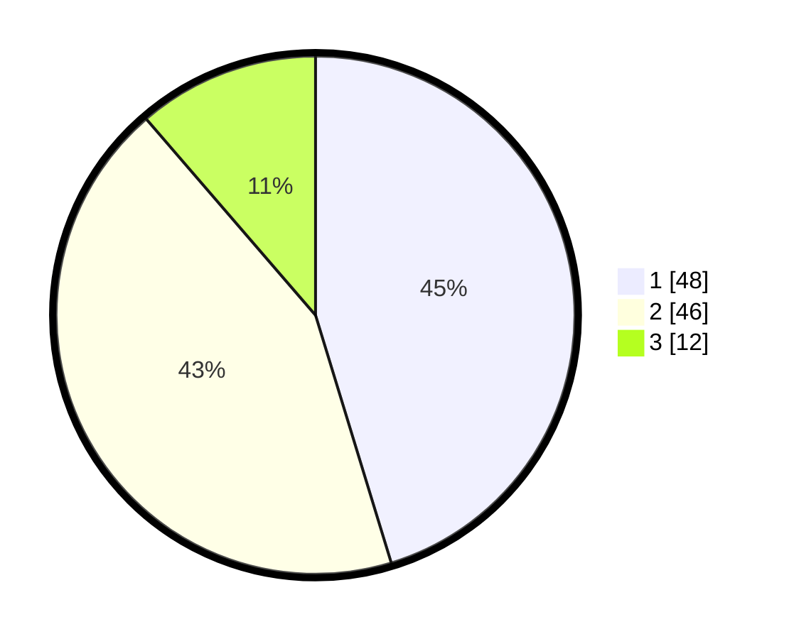

# Hasil

## Grafik

## Tabel

| No. | Nama Paslon    | Suara | Suara (raw) | Persentase |
|:--- |:-------------- | -----:| -----------:| ----------:|
| 1   | ANIES MUHAIMIN | 48    | [48][p-1]   | 45,28      |
| 2   | PRABOWO GIBRAN | 46    | [46][p-2]   | 43,40      |
| 3   | GANJAR MAHFUD  | 12    | [12][p-3]   | 11,32      |

[p-1]: https://github.com/gigit-pemilu/pemilu-2024-61-kalimantan-barat/blob/main/pilpres/hitung-suara/sub/61-kalimantan-barat/sub/71-kota-pontianak/sub/03-pontianak-barat/sub/1002-sungaijawi-dalam/sub/106-tps/sub/paslon-1.txt
[p-2]: https://github.com/gigit-pemilu/pemilu-2024-61-kalimantan-barat/blob/main/pilpres/hitung-suara/sub/61-kalimantan-barat/sub/71-kota-pontianak/sub/03-pontianak-barat/sub/1002-sungaijawi-dalam/sub/106-tps/sub/paslon-2.txt
[p-3]: https://github.com/gigit-pemilu/pemilu-2024-61-kalimantan-barat/blob/main/pilpres/hitung-suara/sub/61-kalimantan-barat/sub/71-kota-pontianak/sub/03-pontianak-barat/sub/1002-sungaijawi-dalam/sub/106-tps/sub/paslon-3.txt

## Foto C Plano

https://sirekap-obj-formc.kpu.go.id/3507/pemilu/ppwp/61/71/03/10/02/6171031002106-20240215-132832--76cd3513-5111-430e-bf7a-94a631f5447d.jpg

https://sirekap-obj-formc.kpu.go.id/3507/pemilu/ppwp/61/71/03/10/02/6171031002106-20240215-133122--71852f13-4409-4ca8-a81c-c69603dee1e9.jpg

https://sirekap-obj-formc.kpu.go.id/3507/pemilu/ppwp/61/71/03/10/02/6171031002106-20240215-133542--a019bad4-43e2-47bb-99ac-6c07463e5529.jpg

## Metadata

| Key        | Value               |
| ---------- | ------------------- |
| Time Stamp | 2024-02-16 02:30:27 |

