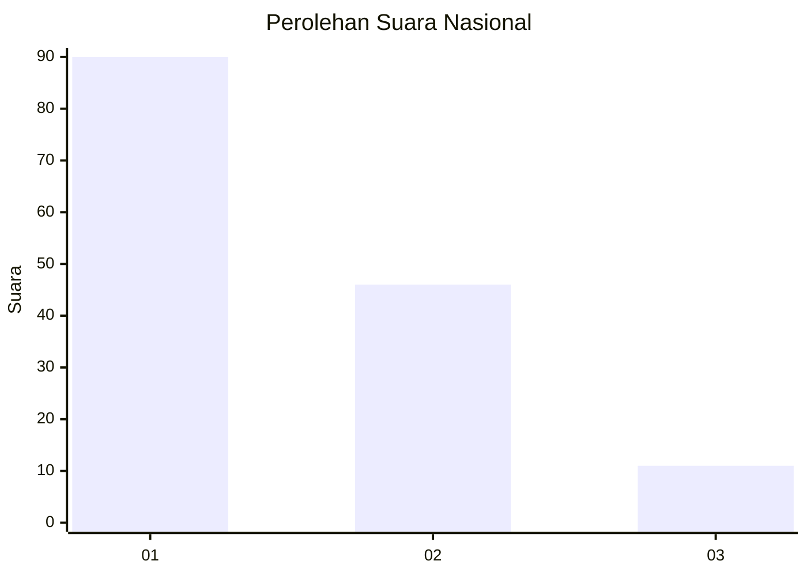
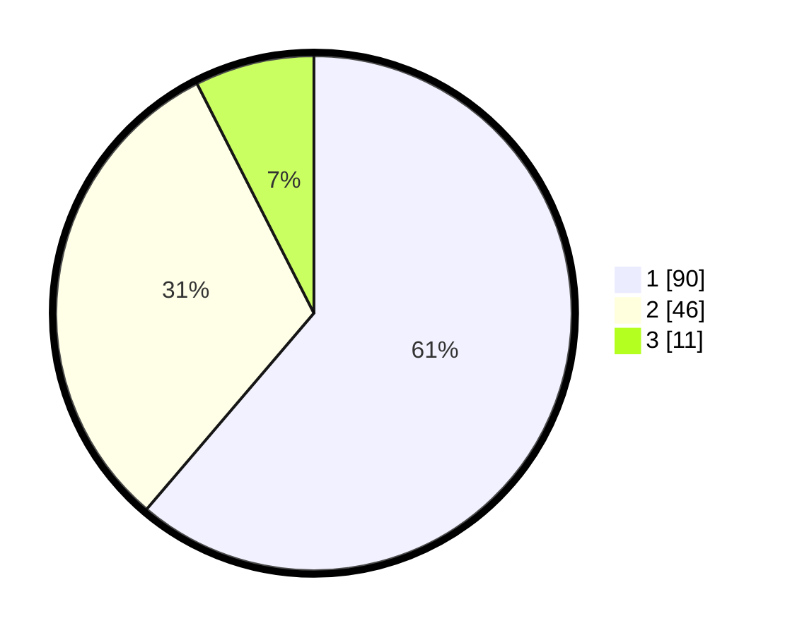

# Hasil

## Grafik

## Tabel

| No. | Nama Paslon    | Suara | Suara (raw) | Persentase |
|:--- |:-------------- | -----:| -----------:| ----------:|
| 1   | ANIES MUHAIMIN | 90    | [90][p-1]   | 61,22      |
| 2   | PRABOWO GIBRAN | 46    | [46][p-2]   | 31,29      |
| 3   | GANJAR MAHFUD  | 11    | [11][p-3]   | 7,48       |

[p-1]: https://github.com/gigit-pemilu/pemilu-2024/blob/main/pilpres/hitung-suara/sub/61-kalimantan-barat/sub/71-kota-pontianak/sub/03-pontianak-barat/sub/1002-sungaijawi-dalam/sub/107-tps/sub/paslon-1.txt
[p-2]: https://github.com/gigit-pemilu/pemilu-2024/blob/main/pilpres/hitung-suara/sub/61-kalimantan-barat/sub/71-kota-pontianak/sub/03-pontianak-barat/sub/1002-sungaijawi-dalam/sub/107-tps/sub/paslon-2.txt
[p-3]: https://github.com/gigit-pemilu/pemilu-2024/blob/main/pilpres/hitung-suara/sub/61-kalimantan-barat/sub/71-kota-pontianak/sub/03-pontianak-barat/sub/1002-sungaijawi-dalam/sub/107-tps/sub/paslon-3.txt

## Foto C Plano

https://sirekap-obj-formc.kpu.go.id/a0d8/pemilu/ppwp/61/71/03/10/02/6171031002107-20240214-221224--ac98e483-6fc9-4d1b-83ef-ff091c7477b7.jpg

https://sirekap-obj-formc.kpu.go.id/a0d8/pemilu/ppwp/61/71/03/10/02/6171031002107-20240214-221244--c8d1e7ff-4ca2-4685-83fe-c9586f79ce1d.jpg

https://sirekap-obj-formc.kpu.go.id/a0d8/pemilu/ppwp/61/71/03/10/02/6171031002107-20240214-221322--24e38965-330c-46b1-acde-6367585d4b9f.jpg

## Metadata

| Key        | Value               |
| ---------- | ------------------- |
| Time Stamp | 2024-02-24 22:31:28 |

