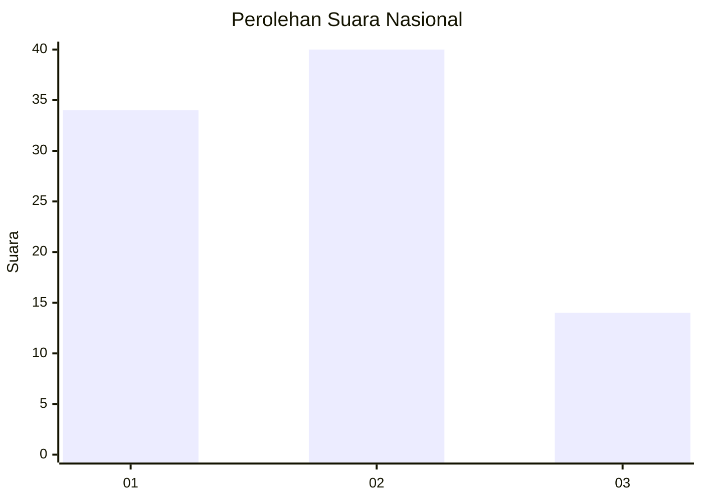
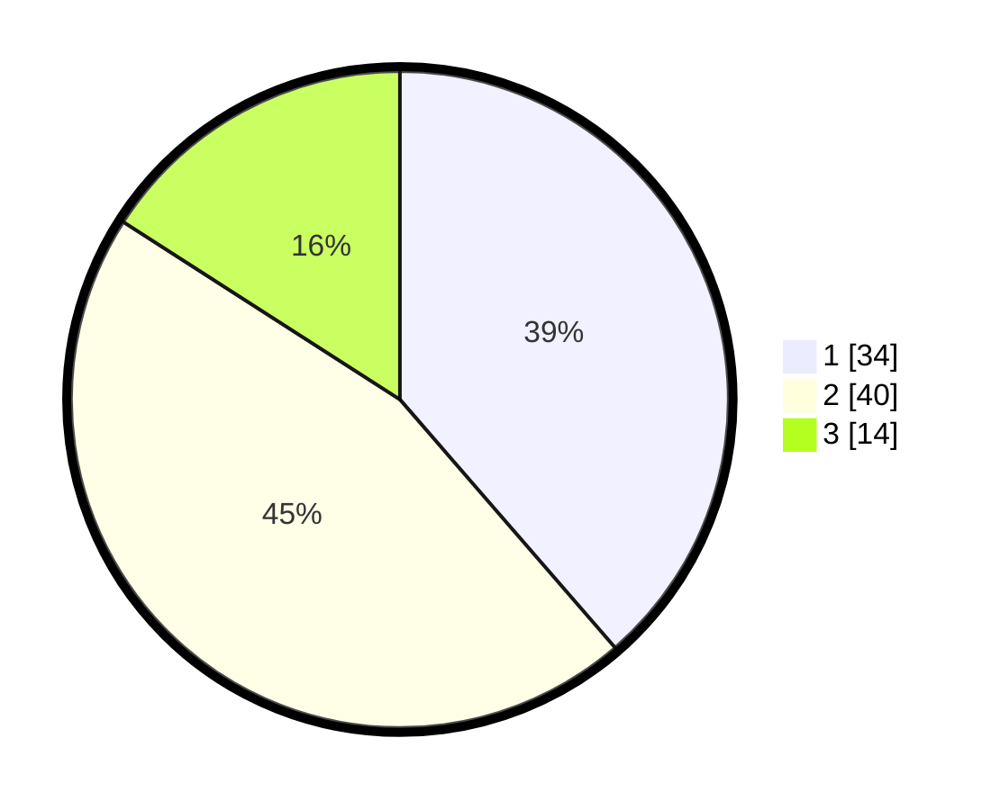

# Hasil

## Grafik

## Tabel

| No. | Nama Paslon    | Suara | Suara (raw) | Persentase |
|:--- |:-------------- | -----:| -----------:| ----------:|
| 1   | ANIES MUHAIMIN | 34    | [34][p-1]   | 38,64      |
| 2   | PRABOWO GIBRAN | 40    | [40][p-2]   | 45,45      |
| 3   | GANJAR MAHFUD  | 14    | [14][p-3]   | 15,91      |

[p-1]: https://github.com/gigit-pemilu/pemilu-2024/blob/main/pilpres/hitung-suara/sub/61-kalimantan-barat/sub/71-kota-pontianak/sub/03-pontianak-barat/sub/1003-sungaijawi-luar/sub/024-tps/sub/paslon-1.txt
[p-2]: https://github.com/gigit-pemilu/pemilu-2024/blob/main/pilpres/hitung-suara/sub/61-kalimantan-barat/sub/71-kota-pontianak/sub/03-pontianak-barat/sub/1003-sungaijawi-luar/sub/024-tps/sub/paslon-2.txt
[p-3]: https://github.com/gigit-pemilu/pemilu-2024/blob/main/pilpres/hitung-suara/sub/61-kalimantan-barat/sub/71-kota-pontianak/sub/03-pontianak-barat/sub/1003-sungaijawi-luar/sub/024-tps/sub/paslon-3.txt

## Foto C Plano

https://sirekap-obj-formc.kpu.go.id/e270/pemilu/ppwp/61/71/03/10/03/6171031003024-20240214-141144--e13e9072-3589-40a9-86ab-b2f9b59be8a3.jpg

https://sirekap-obj-formc.kpu.go.id/e270/pemilu/ppwp/61/71/03/10/03/6171031003024-20240214-141056--faf49f8a-a83a-41f0-b869-5299c3e236ea.jpg

https://sirekap-obj-formc.kpu.go.id/e270/pemilu/ppwp/61/71/03/10/03/6171031003024-20240214-141722--66f1cf0b-1165-4ee3-8b93-2119d0848dc9.jpg

## Metadata

| Key        | Value               |
| ---------- | ------------------- |
| Time Stamp | 2024-02-16 02:30:27 |

