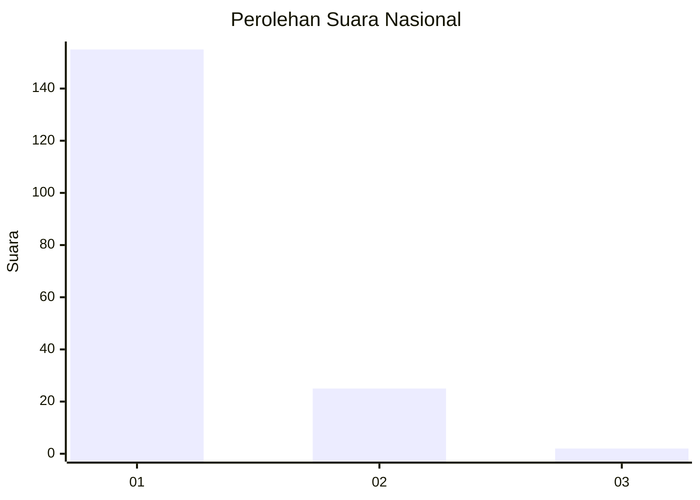
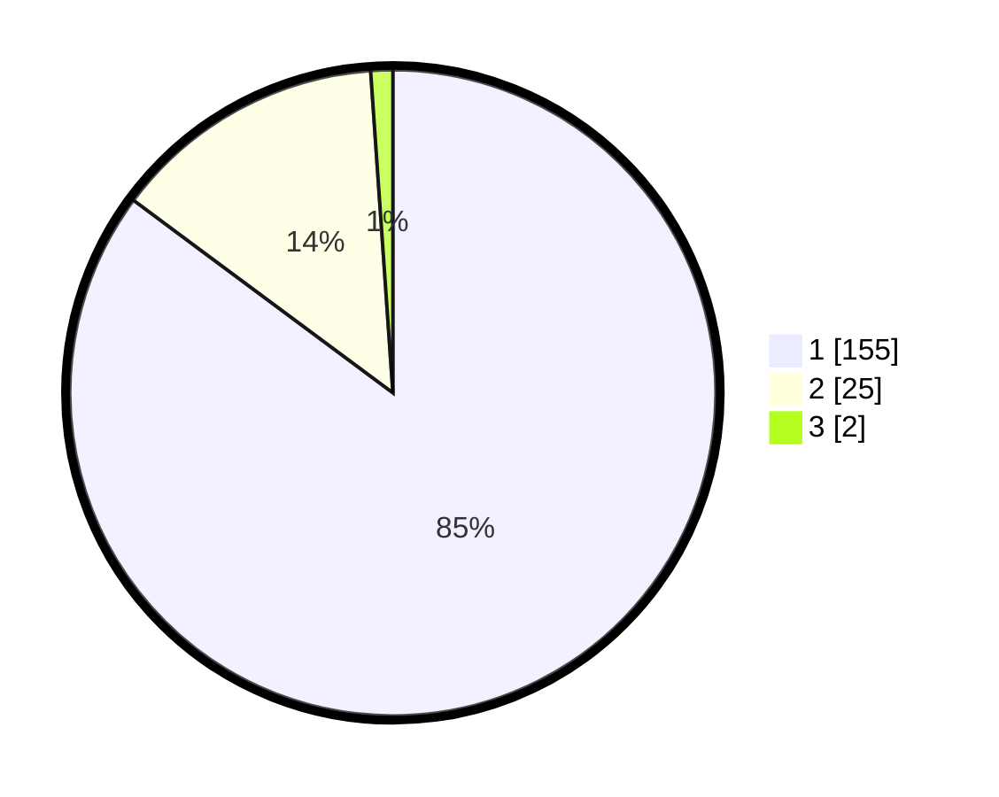

# Hasil

## Grafik

## Tabel

| No. | Nama Paslon    | Suara | Suara (raw) | Persentase |
|:--- |:-------------- | -----:| -----------:| ----------:|
| 1   | ANIES MUHAIMIN | 155   | [155][p-1]  | 85,16      |
| 2   | PRABOWO GIBRAN | 25    | [25][p-2]   | 13,74      |
| 3   | GANJAR MAHFUD  | 2     | [2][p-3]    | 1,10       |

[p-1]: https://github.com/gigit-pemilu/pemilu-2024/blob/main/pilpres/hitung-suara/sub/61-kalimantan-barat/sub/71-kota-pontianak/sub/03-pontianak-barat/sub/1003-sungaijawi-luar/sub/026-tps/sub/paslon-1.txt
[p-2]: https://github.com/gigit-pemilu/pemilu-2024/blob/main/pilpres/hitung-suara/sub/61-kalimantan-barat/sub/71-kota-pontianak/sub/03-pontianak-barat/sub/1003-sungaijawi-luar/sub/026-tps/sub/paslon-2.txt
[p-3]: https://github.com/gigit-pemilu/pemilu-2024/blob/main/pilpres/hitung-suara/sub/61-kalimantan-barat/sub/71-kota-pontianak/sub/03-pontianak-barat/sub/1003-sungaijawi-luar/sub/026-tps/sub/paslon-3.txt

## Foto C Plano

https://sirekap-obj-formc.kpu.go.id/6324/pemilu/ppwp/61/71/03/10/03/6171031003026-20240214-192239--99efbe90-38c3-4a75-b5c4-f47971d477c1.jpg

https://sirekap-obj-formc.kpu.go.id/6324/pemilu/ppwp/61/71/03/10/03/6171031003026-20240214-192247--80f79f02-952a-4701-bd6d-ddd5c95246eb.jpg

https://sirekap-obj-formc.kpu.go.id/6324/pemilu/ppwp/61/71/03/10/03/6171031003026-20240214-192258--9c9a357f-4bb9-4d51-bb6b-57d4746d696e.jpg

## Metadata

| Key        | Value               |
| ---------- | ------------------- |
| Time Stamp | 2024-02-16 02:30:27 |

