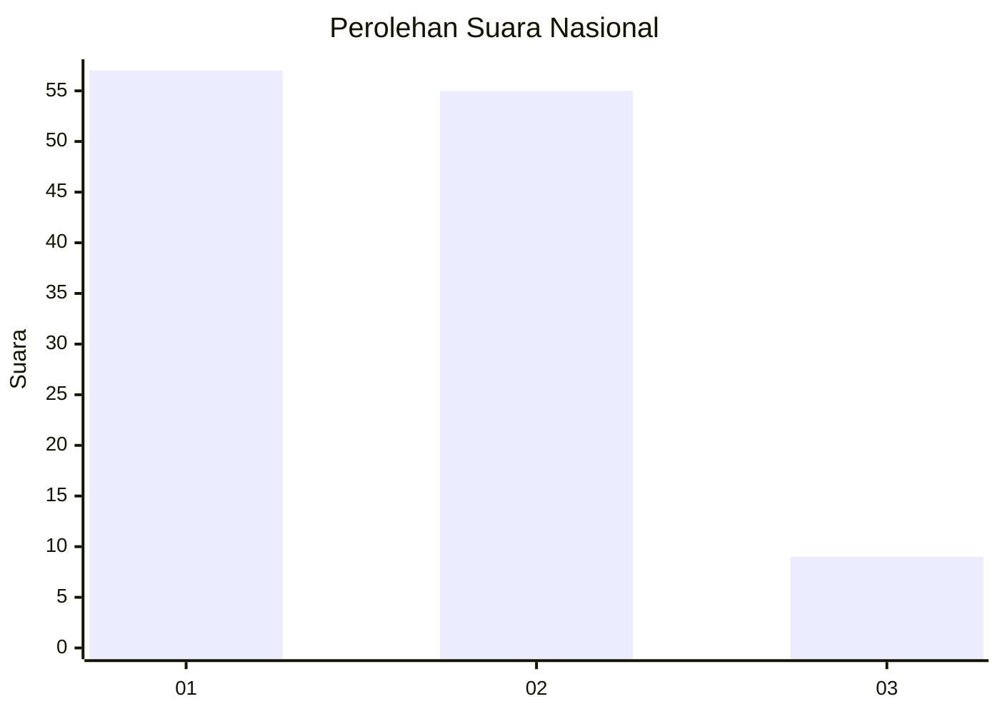
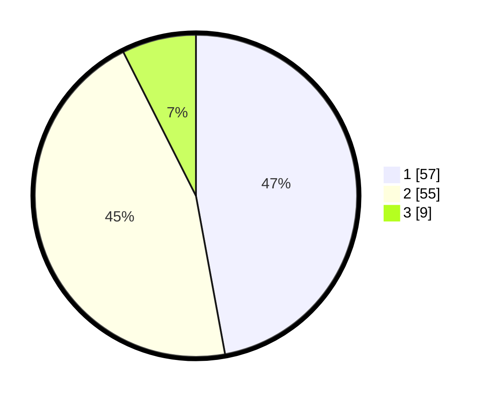

# Hasil

## Grafik

## Tabel

| No. | Nama Paslon    | Suara | Suara (raw) | Persentase |
|:--- |:-------------- | -----:| -----------:| ----------:|
| 1   | ANIES MUHAIMIN | 57    | [57][p-1]   | 47,11      |
| 2   | PRABOWO GIBRAN | 55    | [55][p-2]   | 45,45      |
| 3   | GANJAR MAHFUD  | 9     | [9][p-3]    | 7,44       |

[p-1]: https://github.com/gigit-pemilu/pemilu-2024/blob/main/pilpres/hitung-suara/sub/61-kalimantan-barat/sub/71-kota-pontianak/sub/03-pontianak-barat/sub/1003-sungaijawi-luar/sub/036-tps/sub/paslon-1.txt
[p-2]: https://github.com/gigit-pemilu/pemilu-2024/blob/main/pilpres/hitung-suara/sub/61-kalimantan-barat/sub/71-kota-pontianak/sub/03-pontianak-barat/sub/1003-sungaijawi-luar/sub/036-tps/sub/paslon-2.txt
[p-3]: https://github.com/gigit-pemilu/pemilu-2024/blob/main/pilpres/hitung-suara/sub/61-kalimantan-barat/sub/71-kota-pontianak/sub/03-pontianak-barat/sub/1003-sungaijawi-luar/sub/036-tps/sub/paslon-3.txt

## Foto C Plano

https://sirekap-obj-formc.kpu.go.id/0bc7/pemilu/ppwp/61/71/03/10/03/6171031003036-20240217-225304--15b3a689-e771-4dd3-8655-41819ae46b18.jpg

https://sirekap-obj-formc.kpu.go.id/0bc7/pemilu/ppwp/61/71/03/10/03/6171031003036-20240217-225346--0f34dc4f-e4f4-4e56-a4f7-8f40ee7a13de.jpg

https://sirekap-obj-formc.kpu.go.id/0bc7/pemilu/ppwp/61/71/03/10/03/6171031003036-20240217-225431--6a32f8fe-e491-403b-a996-3413a7ada782.jpg

## Metadata

| Key        | Value               |
| ---------- | ------------------- |
| Time Stamp | 2024-02-19 15:00:00 |

## DATA PEMILIH TETAP

Jumlah pemilih dalam DPT: **444**.
 * L: **0**.
 * P: **522**.

## DATA PENGGUNA HAK PILIH

Jumlah pengguna hak pilih dalam DPT: **444**.
 * L: **734**.
 * P: **606**.

Jumlah pengguna hak pilih dalam DPTb: **46**.
 * L: **22**.
 * P: **44**.

Jumlah pengguna hak pilih dalam DPK: **3**.
 * L: **602**.
 * P: **603**.

Jumlah pengguna hak pilih: **123**.
 * L: **59**.
 * P: **67**.

## JUMLAH SUARA SAH DAN TIDAK SAH

JUMLAH SELURUH SUARA SAH: **121**.

JUMLAH SUARA TIDAK SAH: **2**.

JUMLAH SELURUH SUARA SAH DAN SUARA TIDAK SAH: **123**.

