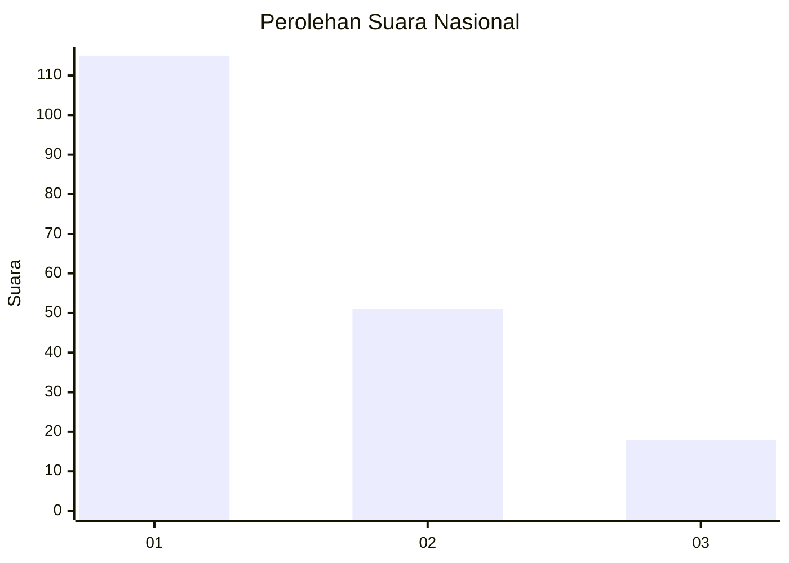
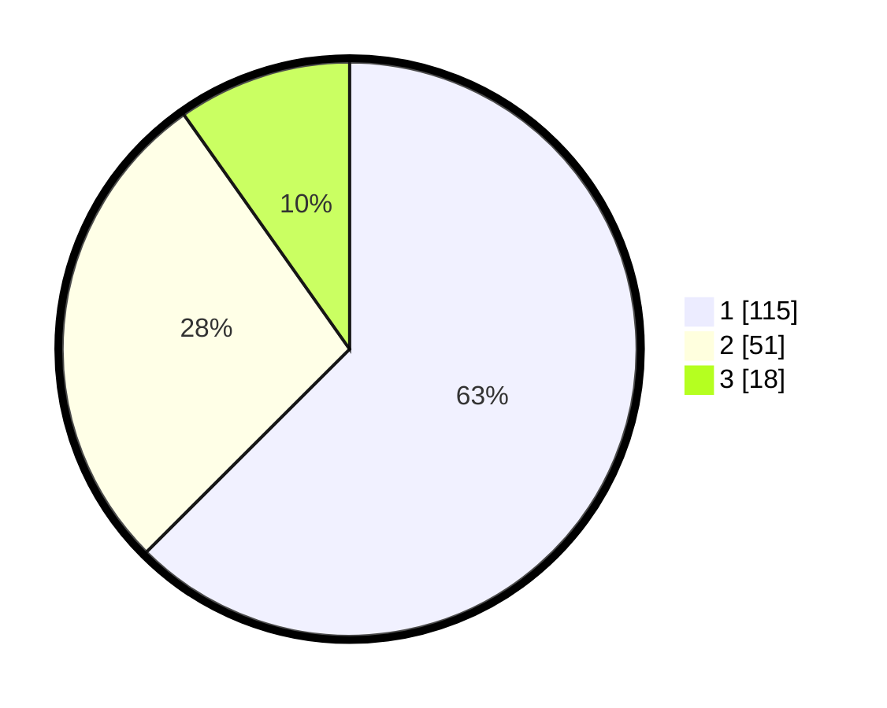

# Hasil

## Grafik

## Tabel

| No. | Nama Paslon    | Suara | Suara (raw) | Persentase |
|:--- |:-------------- | -----:| -----------:| ----------:|
| 1   | ANIES MUHAIMIN | 115   | [115][p-1]  | 62,50      |
| 2   | PRABOWO GIBRAN | 51    | [51][p-2]   | 27,72      |
| 3   | GANJAR MAHFUD  | 18    | [18][p-3]   | 9,78       |

[p-1]: https://github.com/gigit-pemilu/pemilu-2024/blob/main/pilpres/hitung-suara/sub/61-kalimantan-barat/sub/71-kota-pontianak/sub/03-pontianak-barat/sub/1003-sungaijawi-luar/sub/050-tps/sub/paslon-1.txt
[p-2]: https://github.com/gigit-pemilu/pemilu-2024/blob/main/pilpres/hitung-suara/sub/61-kalimantan-barat/sub/71-kota-pontianak/sub/03-pontianak-barat/sub/1003-sungaijawi-luar/sub/050-tps/sub/paslon-2.txt
[p-3]: https://github.com/gigit-pemilu/pemilu-2024/blob/main/pilpres/hitung-suara/sub/61-kalimantan-barat/sub/71-kota-pontianak/sub/03-pontianak-barat/sub/1003-sungaijawi-luar/sub/050-tps/sub/paslon-3.txt

## Foto C Plano

https://sirekap-obj-formc.kpu.go.id/542a/pemilu/ppwp/61/71/03/10/03/6171031003050-20240214-155240--3b2a87ea-4293-47fc-9ef2-ae177be4feb0.jpg

https://sirekap-obj-formc.kpu.go.id/542a/pemilu/ppwp/61/71/03/10/03/6171031003050-20240214-155742--11bcd80e-3172-437e-88ef-fdac441b82ec.jpg

https://sirekap-obj-formc.kpu.go.id/542a/pemilu/ppwp/61/71/03/10/03/6171031003050-20240214-155509--5a28bcf7-da21-4572-995e-172f5deeed84.jpg

## Metadata

| Key        | Value               |
| ---------- | ------------------- |
| Time Stamp | 2024-02-19 06:16:00 |

