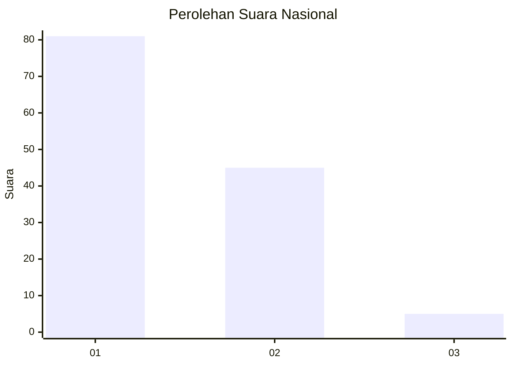
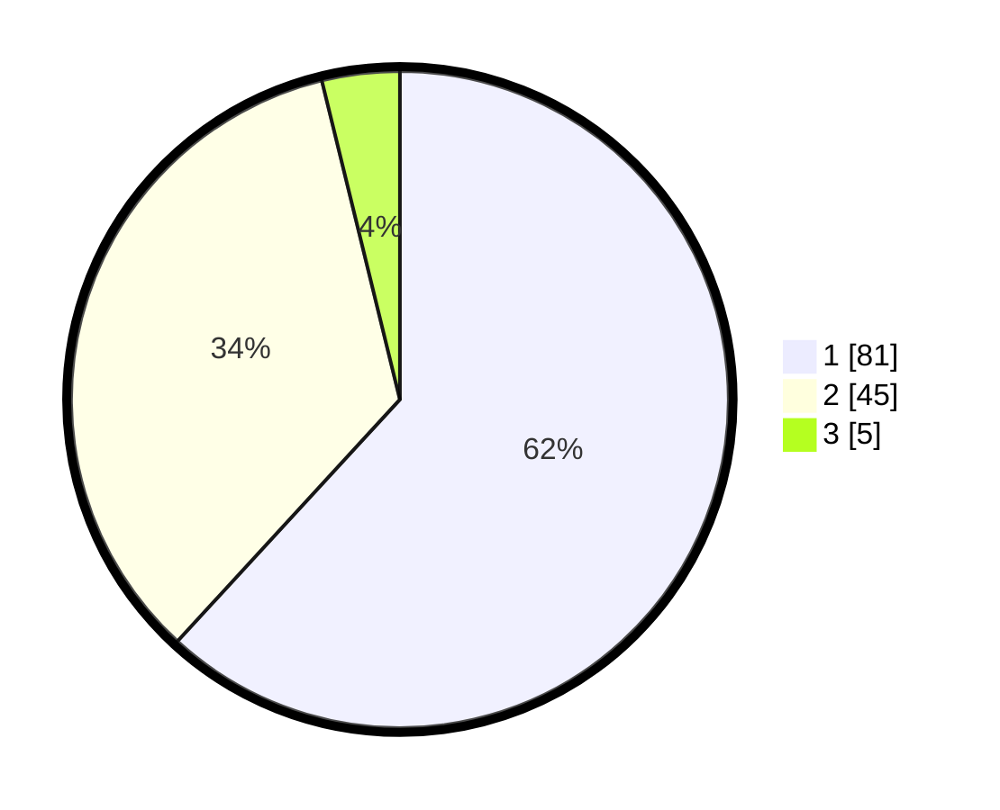

# Hasil

## Grafik

## Tabel

| No. | Nama Paslon    | Suara | Suara (raw) | Persentase |
|:--- |:-------------- | -----:| -----------:| ----------:|
| 1   | ANIES MUHAIMIN | 81    | [81][p-1]   | 61,83      |
| 2   | PRABOWO GIBRAN | 45    | [45][p-2]   | 34,35      |
| 3   | GANJAR MAHFUD  | 5     | [5][p-3]    | 3,82       |

[p-1]: https://github.com/gigit-pemilu/pemilu-2024/blob/main/pilpres/hitung-suara/sub/61-kalimantan-barat/sub/71-kota-pontianak/sub/03-pontianak-barat/sub/1003-sungaijawi-luar/sub/137-tps/sub/paslon-1.txt
[p-2]: https://github.com/gigit-pemilu/pemilu-2024/blob/main/pilpres/hitung-suara/sub/61-kalimantan-barat/sub/71-kota-pontianak/sub/03-pontianak-barat/sub/1003-sungaijawi-luar/sub/137-tps/sub/paslon-2.txt
[p-3]: https://github.com/gigit-pemilu/pemilu-2024/blob/main/pilpres/hitung-suara/sub/61-kalimantan-barat/sub/71-kota-pontianak/sub/03-pontianak-barat/sub/1003-sungaijawi-luar/sub/137-tps/sub/paslon-3.txt

## Foto C Plano

https://sirekap-obj-formc.kpu.go.id/3da3/pemilu/ppwp/61/71/03/10/03/6171031003137-20240214-220737--2f005d51-55f0-4abf-ada7-b29e3c8916b8.jpg

https://sirekap-obj-formc.kpu.go.id/3da3/pemilu/ppwp/61/71/03/10/03/6171031003137-20240214-220906--d8b7694a-00ab-40a4-a8a9-4413fb2edd25.jpg

https://sirekap-obj-formc.kpu.go.id/3da3/pemilu/ppwp/61/71/03/10/03/6171031003137-20240214-220956--fa093d32-99d0-451b-b57c-42028ea54dc7.jpg

## Metadata

| Key        | Value               |
| ---------- | ------------------- |
| Time Stamp | 2024-02-25 16:00:00 |

