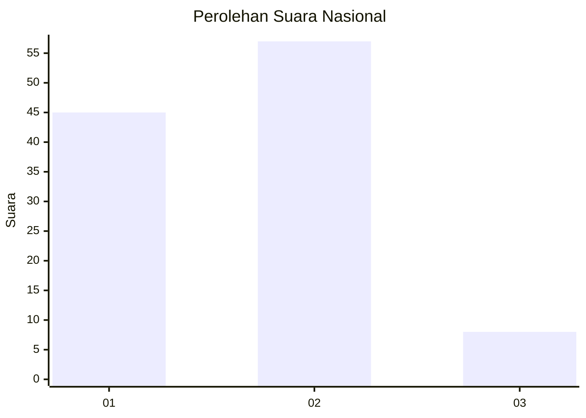

# Hasil

## Grafik

## Tabel

| No. | Nama Paslon    | Suara | Suara (raw) | Persentase |
|:--- |:-------------- | -----:| -----------:| ----------:|
| 1   | ANIES MUHAIMIN | 45    | [45][p-1]   | 40,91      |
| 2   | PRABOWO GIBRAN | 57    | [57][p-2]   | 51,82      |
| 3   | GANJAR MAHFUD  | 8     | [8][p-3]    | 7,27       |

[p-1]: https://github.com/gigit-pemilu/pemilu-2024/blob/main/pilpres/hitung-suara/sub/61-kalimantan-barat/sub/71-kota-pontianak/sub/03-pontianak-barat/sub/1004-sungaibeliung/sub/064-tps/sub/paslon-1.txt
[p-2]: https://github.com/gigit-pemilu/pemilu-2024/blob/main/pilpres/hitung-suara/sub/61-kalimantan-barat/sub/71-kota-pontianak/sub/03-pontianak-barat/sub/1004-sungaibeliung/sub/064-tps/sub/paslon-2.txt
[p-3]: https://github.com/gigit-pemilu/pemilu-2024/blob/main/pilpres/hitung-suara/sub/61-kalimantan-barat/sub/71-kota-pontianak/sub/03-pontianak-barat/sub/1004-sungaibeliung/sub/064-tps/sub/paslon-3.txt

## Foto C Plano

https://sirekap-obj-formc.kpu.go.id/3d1b/pemilu/ppwp/61/71/03/10/04/6171031004064-20240214-220320--2470bd70-61ce-4c4e-857c-22dc1ff49654.jpg

https://sirekap-obj-formc.kpu.go.id/3d1b/pemilu/ppwp/61/71/03/10/04/6171031004064-20240217-150906--ca246fbc-7e23-4ad9-96b2-89ee80c20bf2.jpg

https://sirekap-obj-formc.kpu.go.id/3d1b/pemilu/ppwp/61/71/03/10/04/6171031004064-20240217-165807--d3b9fba5-97ce-40e7-ab3c-009738d99c38.jpg

## Metadata

| Key        | Value               |
| ---------- | ------------------- |
| Time Stamp | 2024-02-24 22:31:28 |

