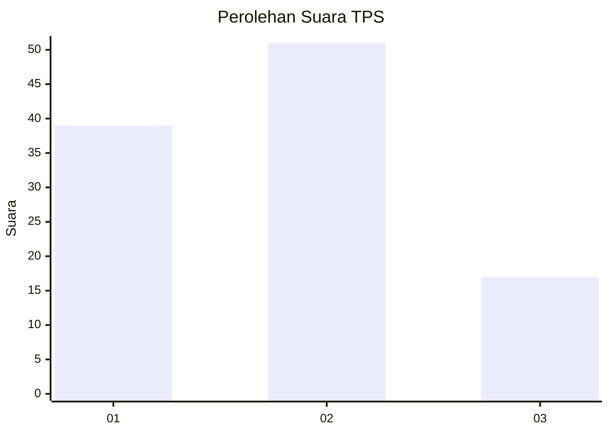
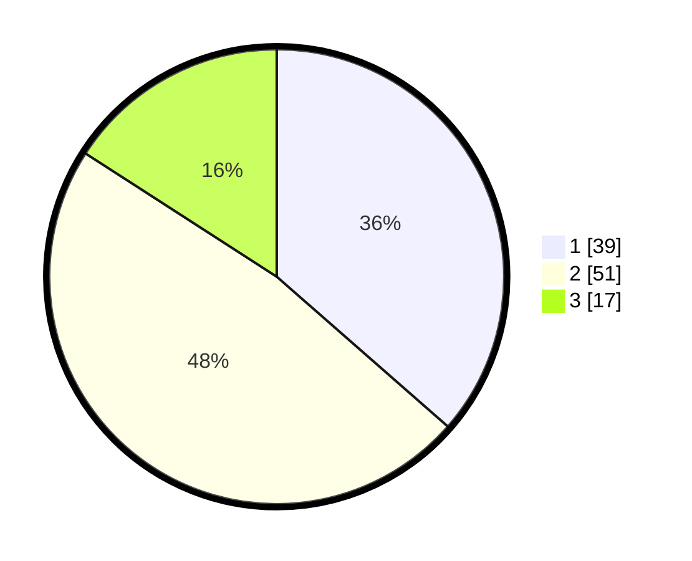

# Hasil

## Grafik

## Tabel

| No. | Nama Paslon    | Suara | Suara (raw) | Persentase |
|:--- |:-------------- | -----:| -----------:| ----------:|
| 1   | ANIES MUHAIMIN | 39    | [39][p-1]   | 36,45      |
| 2   | PRABOWO GIBRAN | 51    | [51][p-2]   | 47,66      |
| 3   | GANJAR MAHFUD  | 17    | [17][p-3]   | 15,89      |

[p-1]: https://github.com/gigit-pemilu/pemilu-2024-61-kalimantan-barat/blob/main/pilpres/hitung-suara/sub/61-kalimantan-barat/sub/71-kota-pontianak/sub/03-pontianak-barat/sub/1004-sungaibeliung/sub/065-tps/sub/paslon-1.txt
[p-2]: https://github.com/gigit-pemilu/pemilu-2024-61-kalimantan-barat/blob/main/pilpres/hitung-suara/sub/61-kalimantan-barat/sub/71-kota-pontianak/sub/03-pontianak-barat/sub/1004-sungaibeliung/sub/065-tps/sub/paslon-2.txt
[p-3]: https://github.com/gigit-pemilu/pemilu-2024-61-kalimantan-barat/blob/main/pilpres/hitung-suara/sub/61-kalimantan-barat/sub/71-kota-pontianak/sub/03-pontianak-barat/sub/1004-sungaibeliung/sub/065-tps/sub/paslon-3.txt

## Foto C Plano

https://sirekap-obj-formc.kpu.go.id/4218/pemilu/ppwp/61/71/03/10/04/6171031004065-20240214-224633--2b26f0e5-57b2-4ced-9d6c-2e911fd9249f.jpg

https://sirekap-obj-formc.kpu.go.id/4218/pemilu/ppwp/61/71/03/10/04/6171031004065-20240214-224605--741b2298-7eac-4e08-a8b2-edd2751f7eb8.jpg

https://sirekap-obj-formc.kpu.go.id/4218/pemilu/ppwp/61/71/03/10/04/6171031004065-20240214-224537--e7b5719e-81a8-4572-baac-3ba25111ec23.jpg

## Metadata

| Key        | Value               |
| ---------- | ------------------- |
| Time Stamp | 2024-02-16 00:30:27 |

