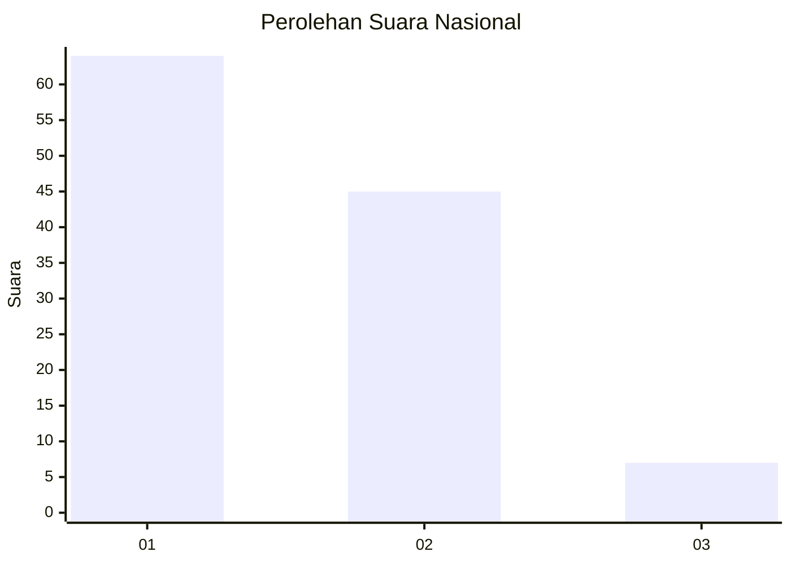
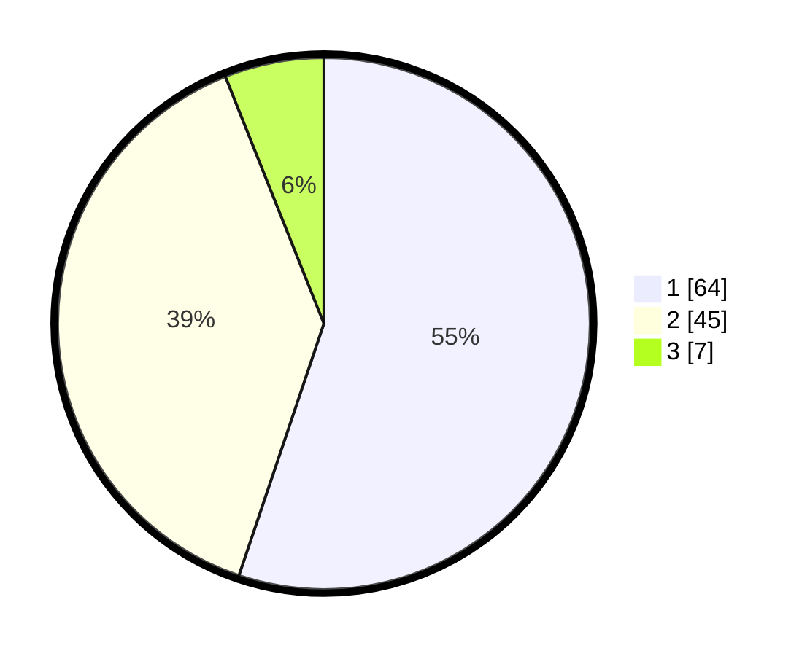

# Hasil

## Grafik

## Tabel

| No. | Nama Paslon    | Suara | Suara (raw) | Persentase |
|:--- |:-------------- | -----:| -----------:| ----------:|
| 1   | ANIES MUHAIMIN | 64    | [64][p-1]   | 55,17      |
| 2   | PRABOWO GIBRAN | 45    | [45][p-2]   | 38,79      |
| 3   | GANJAR MAHFUD  | 7     | [7][p-3]    | 6,03       |

[p-1]: https://github.com/gigit-pemilu/pemilu-2024/blob/main/pilpres/hitung-suara/sub/61-kalimantan-barat/sub/71-kota-pontianak/sub/03-pontianak-barat/sub/1004-sungaibeliung/sub/076-tps/sub/paslon-1.txt
[p-2]: https://github.com/gigit-pemilu/pemilu-2024/blob/main/pilpres/hitung-suara/sub/61-kalimantan-barat/sub/71-kota-pontianak/sub/03-pontianak-barat/sub/1004-sungaibeliung/sub/076-tps/sub/paslon-2.txt
[p-3]: https://github.com/gigit-pemilu/pemilu-2024/blob/main/pilpres/hitung-suara/sub/61-kalimantan-barat/sub/71-kota-pontianak/sub/03-pontianak-barat/sub/1004-sungaibeliung/sub/076-tps/sub/paslon-3.txt

## Foto C Plano

https://sirekap-obj-formc.kpu.go.id/652b/pemilu/ppwp/61/71/03/10/04/6171031004076-20240214-212722--33d2f810-3bb4-4dde-a589-f5e57595a9e8.jpg

https://sirekap-obj-formc.kpu.go.id/652b/pemilu/ppwp/61/71/03/10/04/6171031004076-20240214-191216--0c8d965e-1fe9-4528-9228-3f64e7083c2c.jpg

https://sirekap-obj-formc.kpu.go.id/652b/pemilu/ppwp/61/71/03/10/04/6171031004076-20240214-191509--69026aca-b167-4d7b-bff1-3c9bc29ca0c1.jpg

## Metadata

| Key        | Value               |
| ---------- | ------------------- |
| Time Stamp | 2024-02-16 00:30:27 |

