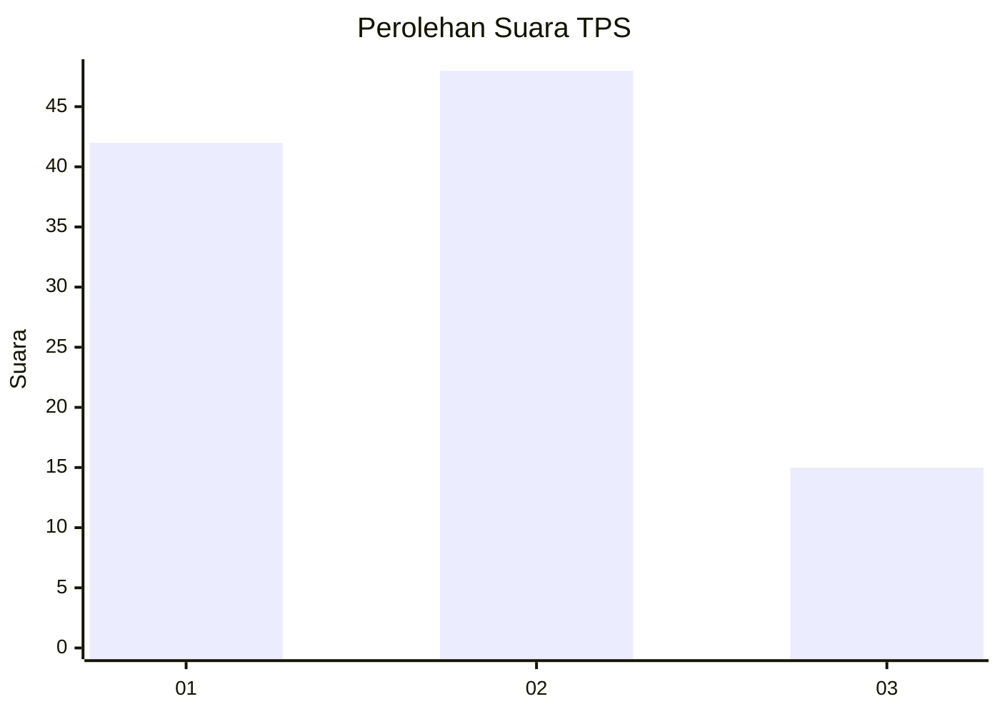
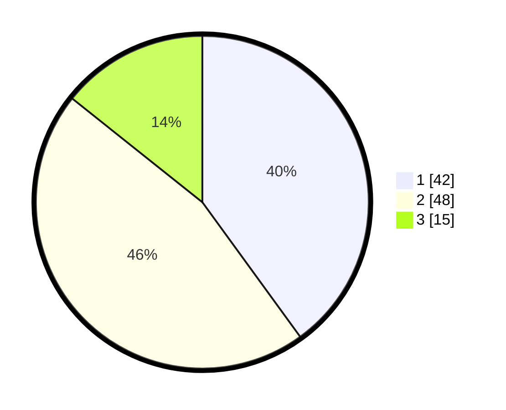

# Hasil

## Grafik

## Tabel

| No. | Nama Paslon    | Suara | Suara (raw) | Persentase |
|:--- |:-------------- | -----:| -----------:| ----------:|
| 1   | ANIES MUHAIMIN | 42    | [42][p-1]   | 40,00      |
| 2   | PRABOWO GIBRAN | 48    | [48][p-2]   | 45,71      |
| 3   | GANJAR MAHFUD  | 15    | [15][p-3]   | 14,29      |

[p-1]: https://github.com/gigit-pemilu/pemilu-2024-61-kalimantan-barat/blob/main/pilpres/hitung-suara/sub/61-kalimantan-barat/sub/71-kota-pontianak/sub/03-pontianak-barat/sub/1004-sungaibeliung/sub/188-tps/sub/paslon-1.txt
[p-2]: https://github.com/gigit-pemilu/pemilu-2024-61-kalimantan-barat/blob/main/pilpres/hitung-suara/sub/61-kalimantan-barat/sub/71-kota-pontianak/sub/03-pontianak-barat/sub/1004-sungaibeliung/sub/188-tps/sub/paslon-2.txt
[p-3]: https://github.com/gigit-pemilu/pemilu-2024-61-kalimantan-barat/blob/main/pilpres/hitung-suara/sub/61-kalimantan-barat/sub/71-kota-pontianak/sub/03-pontianak-barat/sub/1004-sungaibeliung/sub/188-tps/sub/paslon-3.txt

## Foto C Plano

https://sirekap-obj-formc.kpu.go.id/270b/pemilu/ppwp/61/71/03/10/04/6171031004188-20240214-220040--3263438e-0fae-49d4-84c2-8ee15e44a3a4.jpg

https://sirekap-obj-formc.kpu.go.id/270b/pemilu/ppwp/61/71/03/10/04/6171031004188-20240214-220419--e39c51b2-8c80-4e6a-ae2d-85f3a03f9682.jpg

https://sirekap-obj-formc.kpu.go.id/270b/pemilu/ppwp/61/71/03/10/04/6171031004188-20240214-220512--40c46362-cd1c-43cf-8e33-eb9fb71dba3e.jpg

## Metadata

| Key        | Value               |
| ---------- | ------------------- |
| Time Stamp | 2024-02-16 01:30:27 |

