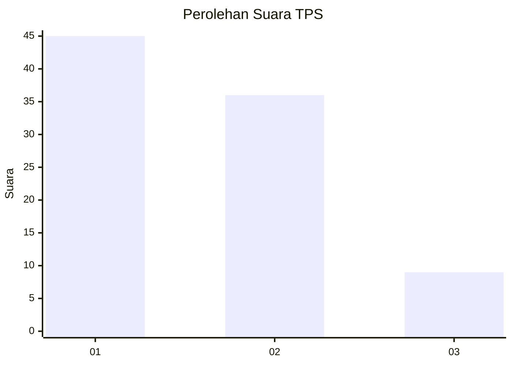
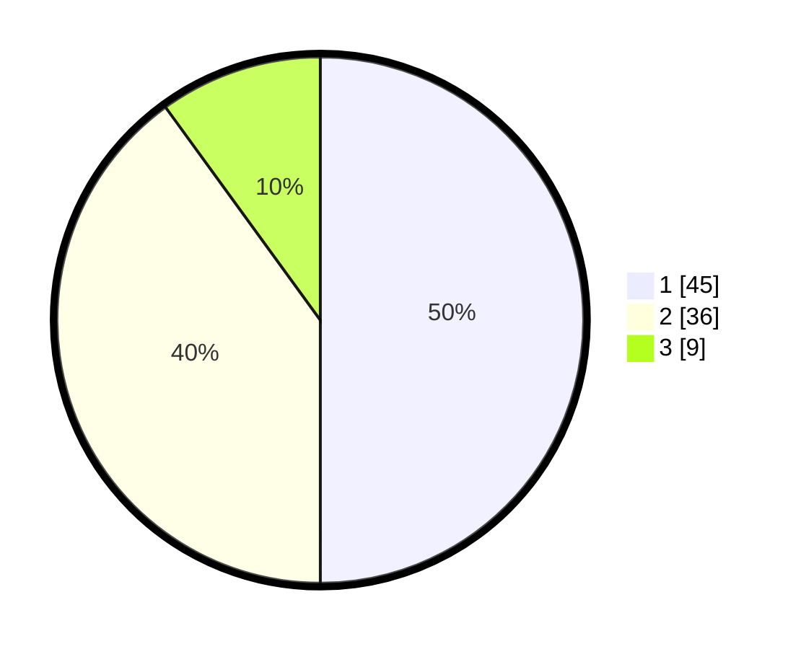

# Hasil

## Grafik

## Tabel

| No. | Nama Paslon    | Suara | Suara (raw) | Persentase |
|:--- |:-------------- | -----:| -----------:| ----------:|
| 1   | ANIES MUHAIMIN | 45    | [45][p-1]   | 50,00      |
| 2   | PRABOWO GIBRAN | 36    | [36][p-2]   | 40,00      |
| 3   | GANJAR MAHFUD  | 9     | [9][p-3]    | 10,00      |

[p-1]: https://github.com/gigit-pemilu/pemilu-2024-61-kalimantan-barat/blob/main/pilpres/hitung-suara/sub/61-kalimantan-barat/sub/71-kota-pontianak/sub/04-pontianak-utara/sub/1001-siantan-hulu/sub/006-tps/sub/paslon-1.txt
[p-2]: https://github.com/gigit-pemilu/pemilu-2024-61-kalimantan-barat/blob/main/pilpres/hitung-suara/sub/61-kalimantan-barat/sub/71-kota-pontianak/sub/04-pontianak-utara/sub/1001-siantan-hulu/sub/006-tps/sub/paslon-2.txt
[p-3]: https://github.com/gigit-pemilu/pemilu-2024-61-kalimantan-barat/blob/main/pilpres/hitung-suara/sub/61-kalimantan-barat/sub/71-kota-pontianak/sub/04-pontianak-utara/sub/1001-siantan-hulu/sub/006-tps/sub/paslon-3.txt

## Foto C Plano

https://sirekap-obj-formc.kpu.go.id/f47f/pemilu/ppwp/61/71/04/10/01/6171041001006-20240214-141000--59f57ff7-414d-46fe-b19d-47d33912713f.jpg

https://sirekap-obj-formc.kpu.go.id/f47f/pemilu/ppwp/61/71/04/10/01/6171041001006-20240214-141441--455792c2-6820-4883-b361-6b5fc4e13d6b.jpg

## Metadata

| Key        | Value               |
| ---------- | ------------------- |
| Time Stamp | 2024-02-16 14:30:33 |

