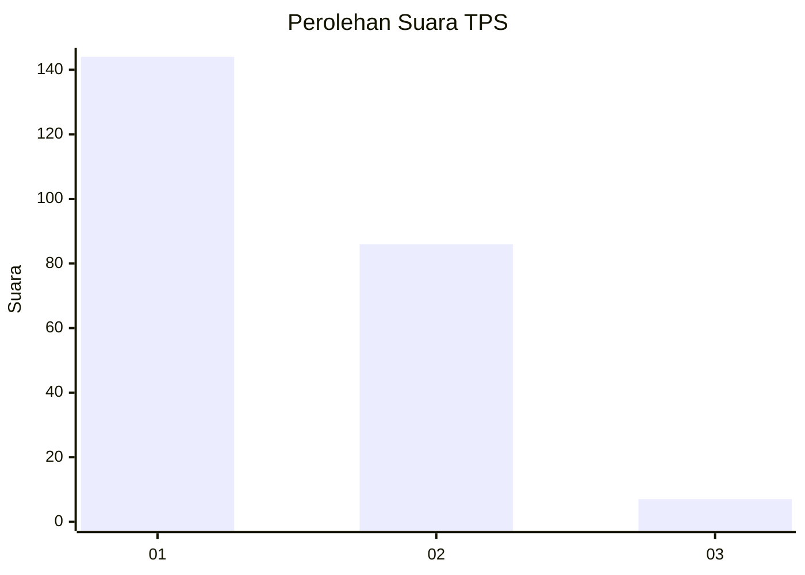
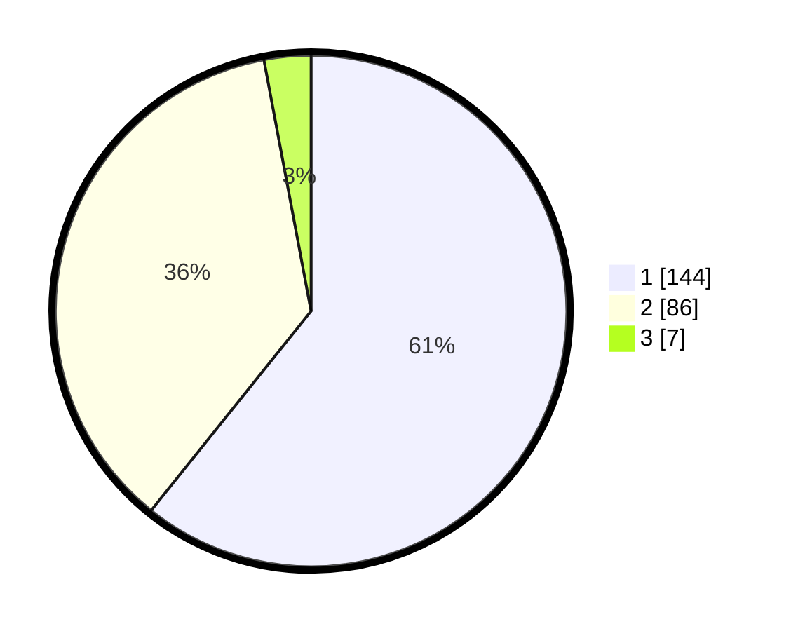

# Hasil

## Grafik

## Tabel

| No. | Nama Paslon    | Suara | Suara (raw) | Persentase |
|:--- |:-------------- | -----:| -----------:| ----------:|
| 1   | ANIES MUHAIMIN | 144   | [144][p-1]  | 60,76      |
| 2   | PRABOWO GIBRAN | 86    | [86][p-2]   | 36,29      |
| 3   | GANJAR MAHFUD  | 7     | [7][p-3]    | 2,95       |

[p-1]: https://github.com/gigit-pemilu/pemilu-2024-61-kalimantan-barat/blob/main/pilpres/hitung-suara/sub/61-kalimantan-barat/sub/71-kota-pontianak/sub/04-pontianak-utara/sub/1001-siantan-hulu/sub/017-tps/sub/paslon-1.txt
[p-2]: https://github.com/gigit-pemilu/pemilu-2024-61-kalimantan-barat/blob/main/pilpres/hitung-suara/sub/61-kalimantan-barat/sub/71-kota-pontianak/sub/04-pontianak-utara/sub/1001-siantan-hulu/sub/017-tps/sub/paslon-2.txt
[p-3]: https://github.com/gigit-pemilu/pemilu-2024-61-kalimantan-barat/blob/main/pilpres/hitung-suara/sub/61-kalimantan-barat/sub/71-kota-pontianak/sub/04-pontianak-utara/sub/1001-siantan-hulu/sub/017-tps/sub/paslon-3.txt

## Foto C Plano

https://sirekap-obj-formc.kpu.go.id/7234/pemilu/ppwp/61/71/04/10/01/6171041001017-20240217-114412--b2f0ff92-798b-44b0-801b-ab1a5f9a1ab4.jpg

https://sirekap-obj-formc.kpu.go.id/7234/pemilu/ppwp/61/71/04/10/01/6171041001017-20240217-114501--e64cefcf-fd01-4812-8fea-70c1e1b157ca.jpg

https://sirekap-obj-formc.kpu.go.id/7234/pemilu/ppwp/61/71/04/10/01/6171041001017-20240217-114616--1e374332-484e-4549-ac32-ca857ff89764.jpg

## Metadata

| Key        | Value               |
| ---------- | ------------------- |
| Time Stamp | 2024-02-19 06:16:00 |

