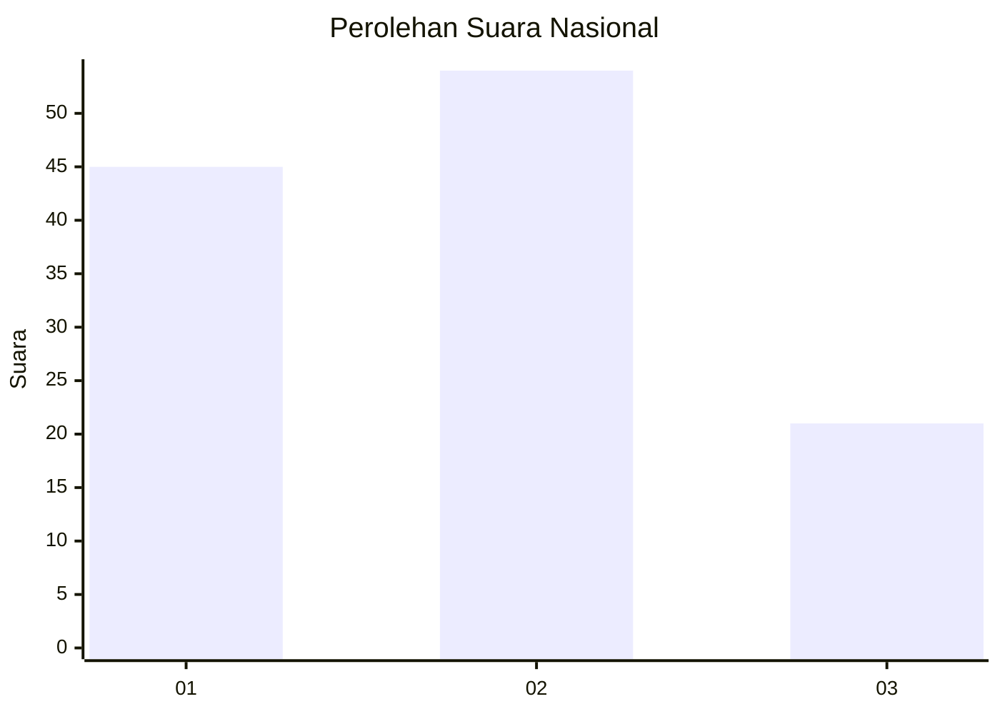
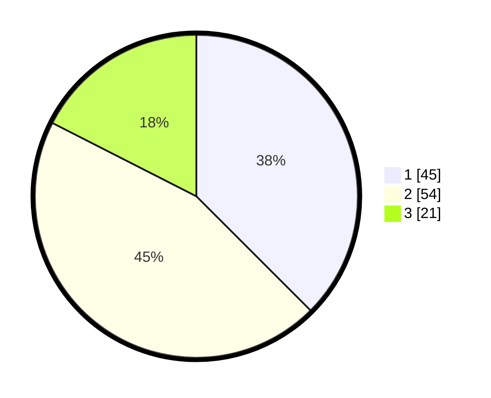

# Hasil

## Grafik

## Tabel

| No. | Nama Paslon    | Suara | Suara (raw) | Persentase |
|:--- |:-------------- | -----:| -----------:| ----------:|
| 1   | ANIES MUHAIMIN | 45    | [45][p-1]   | 37,50      |
| 2   | PRABOWO GIBRAN | 54    | [54][p-2]   | 45,00      |
| 3   | GANJAR MAHFUD  | 21    | [21][p-3]   | 17,50      |

[p-1]: https://github.com/gigit-pemilu/pemilu-2024/blob/main/pilpres/hitung-suara/sub/61-kalimantan-barat/sub/71-kota-pontianak/sub/04-pontianak-utara/sub/1001-siantan-hulu/sub/020-tps/sub/paslon-1.txt
[p-2]: https://github.com/gigit-pemilu/pemilu-2024/blob/main/pilpres/hitung-suara/sub/61-kalimantan-barat/sub/71-kota-pontianak/sub/04-pontianak-utara/sub/1001-siantan-hulu/sub/020-tps/sub/paslon-2.txt
[p-3]: https://github.com/gigit-pemilu/pemilu-2024/blob/main/pilpres/hitung-suara/sub/61-kalimantan-barat/sub/71-kota-pontianak/sub/04-pontianak-utara/sub/1001-siantan-hulu/sub/020-tps/sub/paslon-3.txt

## Foto C Plano

https://sirekap-obj-formc.kpu.go.id/c2f3/pemilu/ppwp/61/71/04/10/01/6171041001020-20240214-214405--2c1466a0-d33c-4056-bec2-c4d7704c5714.jpg

https://sirekap-obj-formc.kpu.go.id/c2f3/pemilu/ppwp/61/71/04/10/01/6171041001020-20240214-213533--cea43b14-2508-48da-bd9d-2ade15f493b6.jpg

https://sirekap-obj-formc.kpu.go.id/c2f3/pemilu/ppwp/61/71/04/10/01/6171041001020-20240214-214314--fcdae832-14df-47c8-b215-c2ad9538676d.jpg

## Metadata

| Key        | Value               |
| ---------- | ------------------- |
| Time Stamp | 2024-02-25 11:00:00 |

