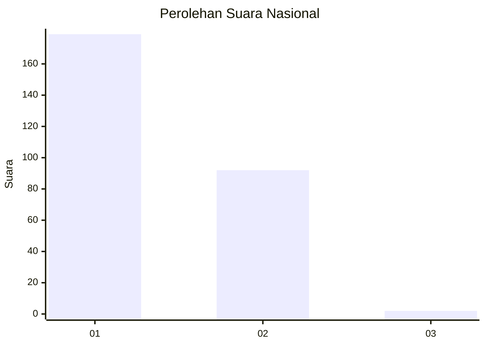
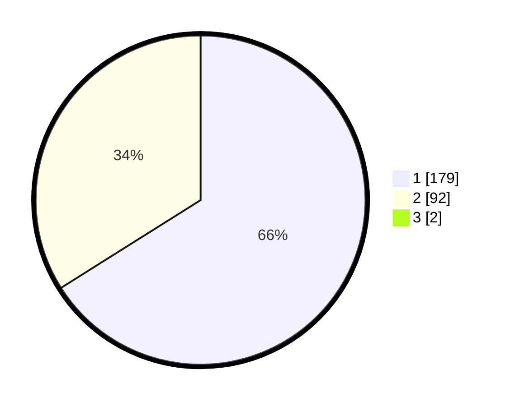

# Hasil

## Grafik

## Tabel

| No. | Nama Paslon    | Suara | Suara (raw) | Persentase |
|:--- |:-------------- | -----:| -----------:| ----------:|
| 1   | ANIES MUHAIMIN | 179   | [179][p-1]  | 65,57      |
| 2   | PRABOWO GIBRAN | 92    | [92][p-2]   | 33,70      |
| 3   | GANJAR MAHFUD  | 2     | [2][p-3]    | 0,73       |

[p-1]: https://github.com/gigit-pemilu/pemilu-2024/blob/main/pilpres/hitung-suara/sub/61-kalimantan-barat/sub/71-kota-pontianak/sub/04-pontianak-utara/sub/1001-siantan-hulu/sub/037-tps/sub/paslon-1.txt
[p-2]: https://github.com/gigit-pemilu/pemilu-2024/blob/main/pilpres/hitung-suara/sub/61-kalimantan-barat/sub/71-kota-pontianak/sub/04-pontianak-utara/sub/1001-siantan-hulu/sub/037-tps/sub/paslon-2.txt
[p-3]: https://github.com/gigit-pemilu/pemilu-2024/blob/main/pilpres/hitung-suara/sub/61-kalimantan-barat/sub/71-kota-pontianak/sub/04-pontianak-utara/sub/1001-siantan-hulu/sub/037-tps/sub/paslon-3.txt

## Foto C Plano

https://sirekap-obj-formc.kpu.go.id/8f0b/pemilu/ppwp/61/71/04/10/01/6171041001037-20240218-155836--384f3c89-3d0c-4572-a7fe-cd60785d4a55.jpg

https://sirekap-obj-formc.kpu.go.id/8f0b/pemilu/ppwp/61/71/04/10/01/6171041001037-20240218-155923--48af4d6e-39a2-48f6-978b-9082479a4f6c.jpg

https://sirekap-obj-formc.kpu.go.id/8f0b/pemilu/ppwp/61/71/04/10/01/6171041001037-20240218-155959--e2ff2d21-593d-49ec-a1dc-3405321c0739.jpg

## Metadata

| Key        | Value               |
| ---------- | ------------------- |
| Time Stamp | 2024-02-24 22:31:28 |

