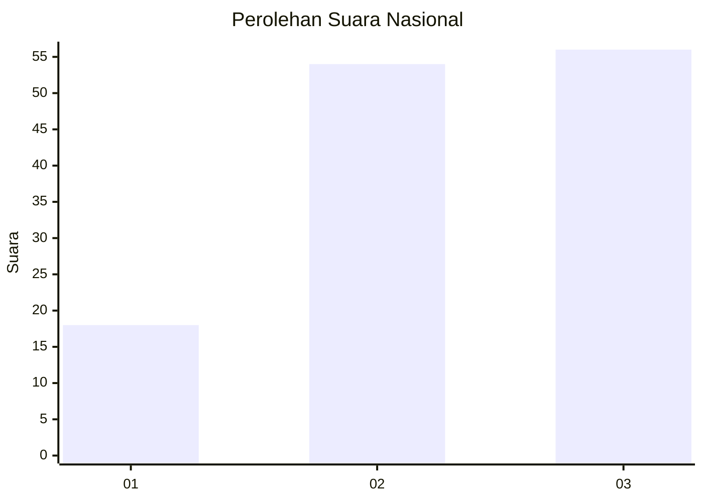
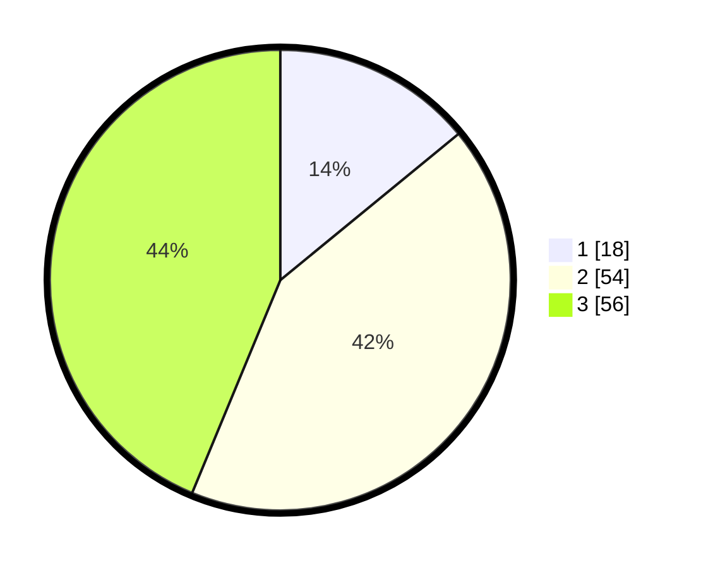

# Hasil

## Grafik

## Tabel

| No. | Nama Paslon    | Suara | Suara (raw) | Persentase |
|:--- |:-------------- | -----:| -----------:| ----------:|
| 1   | ANIES MUHAIMIN | 18    | [18][p-1]   | 14,06      |
| 2   | PRABOWO GIBRAN | 54    | [54][p-2]   | 42,19      |
| 3   | GANJAR MAHFUD  | 56    | [56][p-3]   | 43,75      |

[p-1]: https://github.com/gigit-pemilu/pemilu-2024/blob/main/pilpres/hitung-suara/sub/61-kalimantan-barat/sub/71-kota-pontianak/sub/04-pontianak-utara/sub/1001-siantan-hulu/sub/126-tps/sub/paslon-1.txt
[p-2]: https://github.com/gigit-pemilu/pemilu-2024/blob/main/pilpres/hitung-suara/sub/61-kalimantan-barat/sub/71-kota-pontianak/sub/04-pontianak-utara/sub/1001-siantan-hulu/sub/126-tps/sub/paslon-2.txt
[p-3]: https://github.com/gigit-pemilu/pemilu-2024/blob/main/pilpres/hitung-suara/sub/61-kalimantan-barat/sub/71-kota-pontianak/sub/04-pontianak-utara/sub/1001-siantan-hulu/sub/126-tps/sub/paslon-3.txt

## Foto C Plano

https://sirekap-obj-formc.kpu.go.id/8db8/pemilu/ppwp/61/71/04/10/01/6171041001126-20240218-111034--6e071c0a-037f-4de5-a521-43f900d671f1.jpg

https://sirekap-obj-formc.kpu.go.id/8db8/pemilu/ppwp/61/71/04/10/01/6171041001126-20240218-111131--caf1263c-b95a-4e29-ad17-45dc8fe5e34b.jpg

https://sirekap-obj-formc.kpu.go.id/8db8/pemilu/ppwp/61/71/04/10/01/6171041001126-20240218-111104--c910a3c9-9ec8-4b21-94d6-c1ca81eb2d75.jpg

## Metadata

| Key        | Value               |
| ---------- | ------------------- |
| Time Stamp | 2024-02-25 23:00:00 |

