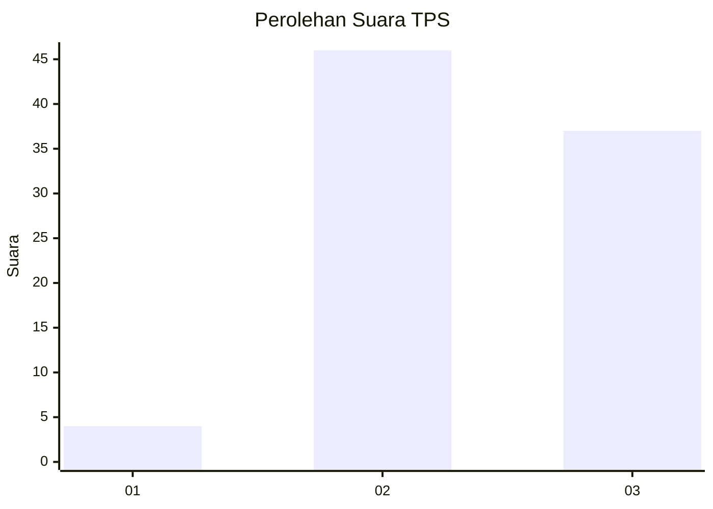
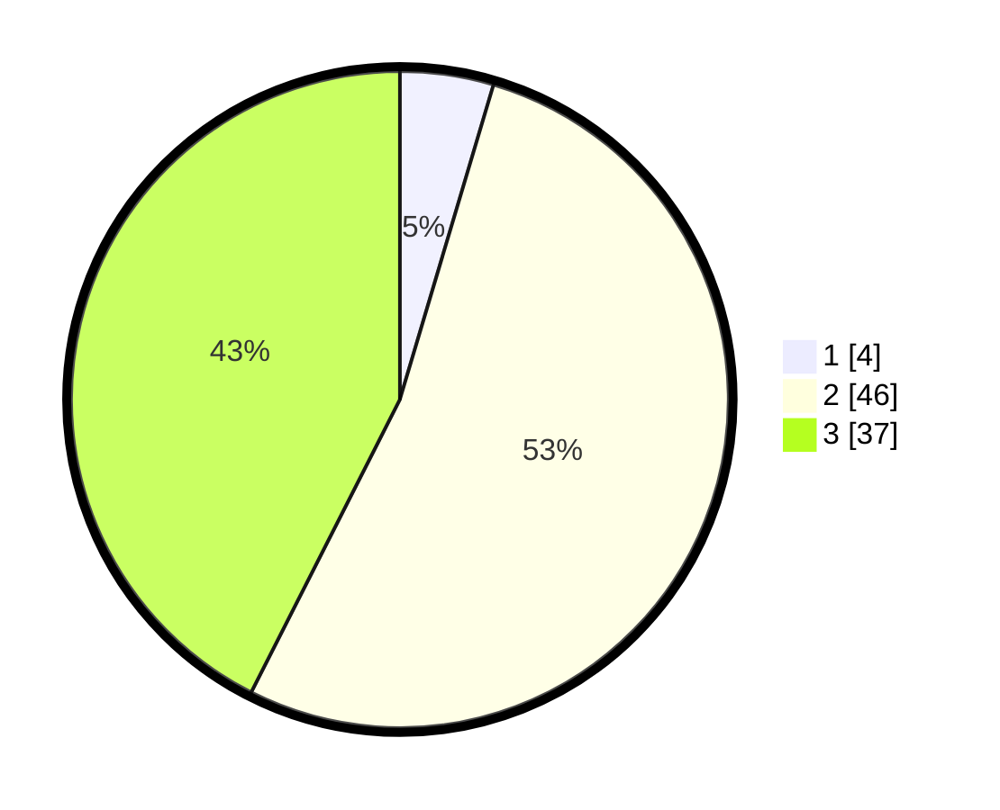

# Hasil

## Grafik

## Tabel

| No. | Nama Paslon    | Suara | Suara (raw) | Persentase |
|:--- |:-------------- | -----:| -----------:| ----------:|
| 1   | ANIES MUHAIMIN | 4     | [4][p-1]    | 4,60       |
| 2   | PRABOWO GIBRAN | 46    | [46][p-2]   | 52,87      |
| 3   | GANJAR MAHFUD  | 37    | [37][p-3]   | 42,53      |

[p-1]: https://github.com/gigit-pemilu/pemilu-2024-61-kalimantan-barat/blob/main/pilpres/hitung-suara/sub/61-kalimantan-barat/sub/71-kota-pontianak/sub/04-pontianak-utara/sub/1001-siantan-hulu/sub/149-tps/sub/paslon-1.txt
[p-2]: https://github.com/gigit-pemilu/pemilu-2024-61-kalimantan-barat/blob/main/pilpres/hitung-suara/sub/61-kalimantan-barat/sub/71-kota-pontianak/sub/04-pontianak-utara/sub/1001-siantan-hulu/sub/149-tps/sub/paslon-2.txt
[p-3]: https://github.com/gigit-pemilu/pemilu-2024-61-kalimantan-barat/blob/main/pilpres/hitung-suara/sub/61-kalimantan-barat/sub/71-kota-pontianak/sub/04-pontianak-utara/sub/1001-siantan-hulu/sub/149-tps/sub/paslon-3.txt

## Foto C Plano

https://sirekap-obj-formc.kpu.go.id/1dca/pemilu/ppwp/61/71/04/10/01/6171041001149-20240218-120808--7e5de837-7a14-44f5-813d-2dd29c0504bc.jpg

https://sirekap-obj-formc.kpu.go.id/1dca/pemilu/ppwp/61/71/04/10/01/6171041001149-20240218-120848--b3af4d06-336f-4dc1-9c9d-5af53cd8998c.jpg

https://sirekap-obj-formc.kpu.go.id/1dca/pemilu/ppwp/61/71/04/10/01/6171041001149-20240218-120916--12d063fb-0aed-49e6-9e15-da4480d72b22.jpg

## Metadata

| Key        | Value               |
| ---------- | ------------------- |
| Time Stamp | 2024-02-24 22:31:28 |

