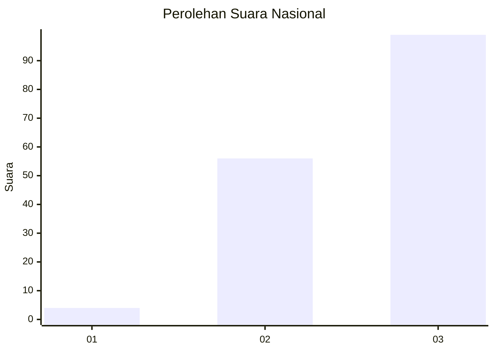
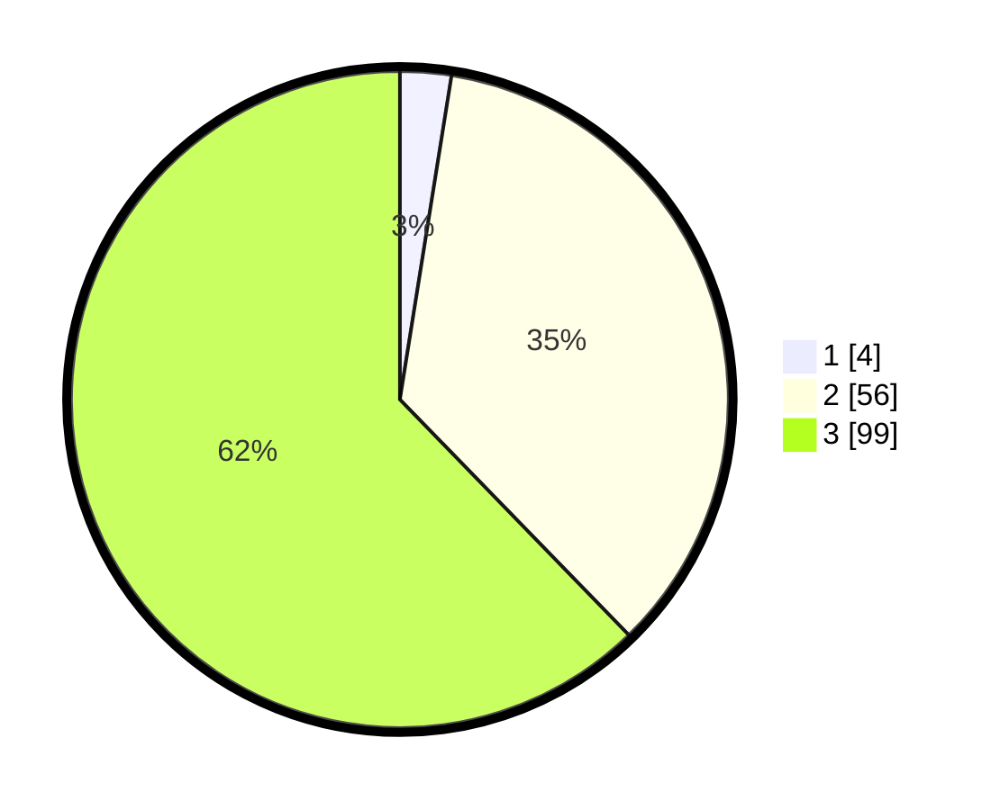

# Hasil

## Grafik

## Tabel

| No. | Nama Paslon    | Suara | Suara (raw) | Persentase |
|:--- |:-------------- | -----:| -----------:| ----------:|
| 1   | ANIES MUHAIMIN | 4     | [4][p-1]    | 2,52       |
| 2   | PRABOWO GIBRAN | 56    | [56][p-2]   | 35,22      |
| 3   | GANJAR MAHFUD  | 99    | [99][p-3]   | 62,26      |

[p-1]: https://github.com/gigit-pemilu/pemilu-2024/blob/main/pilpres/hitung-suara/sub/61-kalimantan-barat/sub/71-kota-pontianak/sub/04-pontianak-utara/sub/1002-siantan-tengah/sub/008-tps/sub/paslon-1.txt
[p-2]: https://github.com/gigit-pemilu/pemilu-2024/blob/main/pilpres/hitung-suara/sub/61-kalimantan-barat/sub/71-kota-pontianak/sub/04-pontianak-utara/sub/1002-siantan-tengah/sub/008-tps/sub/paslon-2.txt
[p-3]: https://github.com/gigit-pemilu/pemilu-2024/blob/main/pilpres/hitung-suara/sub/61-kalimantan-barat/sub/71-kota-pontianak/sub/04-pontianak-utara/sub/1002-siantan-tengah/sub/008-tps/sub/paslon-3.txt

## Foto C Plano

https://sirekap-obj-formc.kpu.go.id/30fc/pemilu/ppwp/61/71/04/10/02/6171041002008-20240218-141800--8b0da160-186e-4dbd-9c21-01ff3abdb654.jpg

https://sirekap-obj-formc.kpu.go.id/30fc/pemilu/ppwp/61/71/04/10/02/6171041002008-20240218-141834--d82f89a8-3abd-4961-957b-5da69bf38e8c.jpg

https://sirekap-obj-formc.kpu.go.id/30fc/pemilu/ppwp/61/71/04/10/02/6171041002008-20240218-141915--1cb70407-c2c7-4f25-a9c7-4dfe2de4d64c.jpg

## Metadata

| Key        | Value               |
| ---------- | ------------------- |
| Time Stamp | 2024-02-24 22:31:28 |

