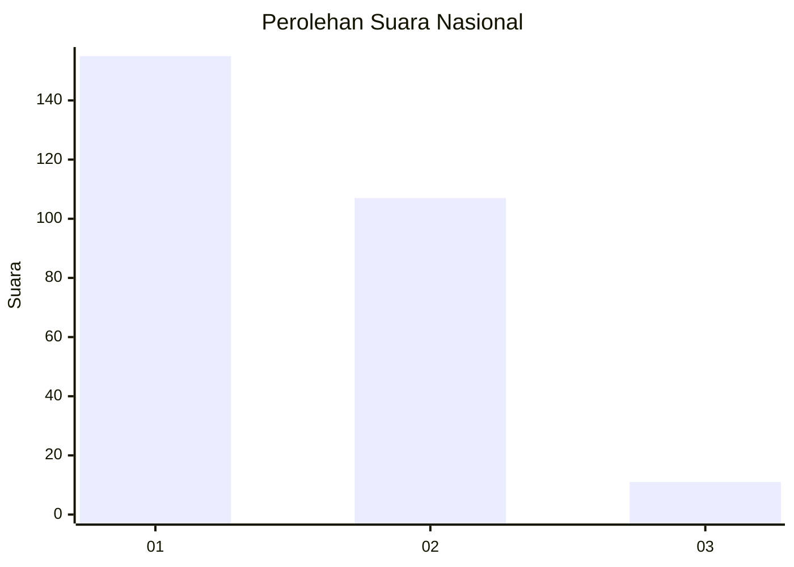
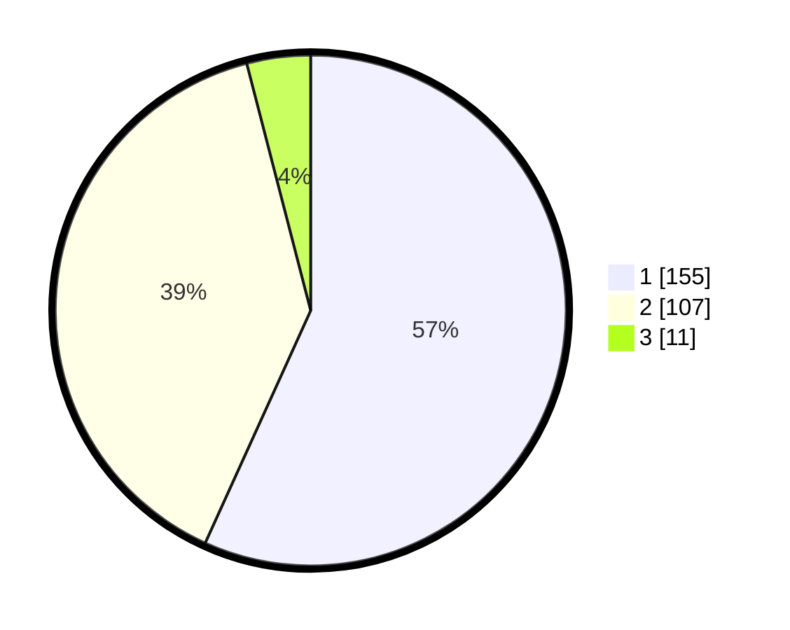

# Hasil

## Grafik

## Tabel

| No. | Nama Paslon    | Suara | Suara (raw) | Persentase |
|:--- |:-------------- | -----:| -----------:| ----------:|
| 1   | ANIES MUHAIMIN | 155   | [155][p-1]  | 56,78      |
| 2   | PRABOWO GIBRAN | 107   | [107][p-2]  | 39,19      |
| 3   | GANJAR MAHFUD  | 11    | [11][p-3]   | 4,03       |

[p-1]: https://github.com/gigit-pemilu/pemilu-2024/blob/main/pilpres/hitung-suara/sub/61-kalimantan-barat/sub/71-kota-pontianak/sub/04-pontianak-utara/sub/1002-siantan-tengah/sub/023-tps/sub/paslon-1.txt
[p-2]: https://github.com/gigit-pemilu/pemilu-2024/blob/main/pilpres/hitung-suara/sub/61-kalimantan-barat/sub/71-kota-pontianak/sub/04-pontianak-utara/sub/1002-siantan-tengah/sub/023-tps/sub/paslon-2.txt
[p-3]: https://github.com/gigit-pemilu/pemilu-2024/blob/main/pilpres/hitung-suara/sub/61-kalimantan-barat/sub/71-kota-pontianak/sub/04-pontianak-utara/sub/1002-siantan-tengah/sub/023-tps/sub/paslon-3.txt

## Foto C Plano

https://sirekap-obj-formc.kpu.go.id/6c21/pemilu/ppwp/61/71/04/10/02/6171041002023-20240214-210118--b75fe9af-45a8-4aa5-9e62-0b68daa85ccc.jpg

https://sirekap-obj-formc.kpu.go.id/6c21/pemilu/ppwp/61/71/04/10/02/6171041002023-20240214-210459--0966ccd9-502a-4b4f-9588-9350d9276bfa.jpg

https://sirekap-obj-formc.kpu.go.id/6c21/pemilu/ppwp/61/71/04/10/02/6171041002023-20240214-210544--16408059-5011-4e44-b86b-80e6b1ee2740.jpg

## Metadata

| Key        | Value               |
| ---------- | ------------------- |
| Time Stamp | 2024-02-25 15:00:00 |

