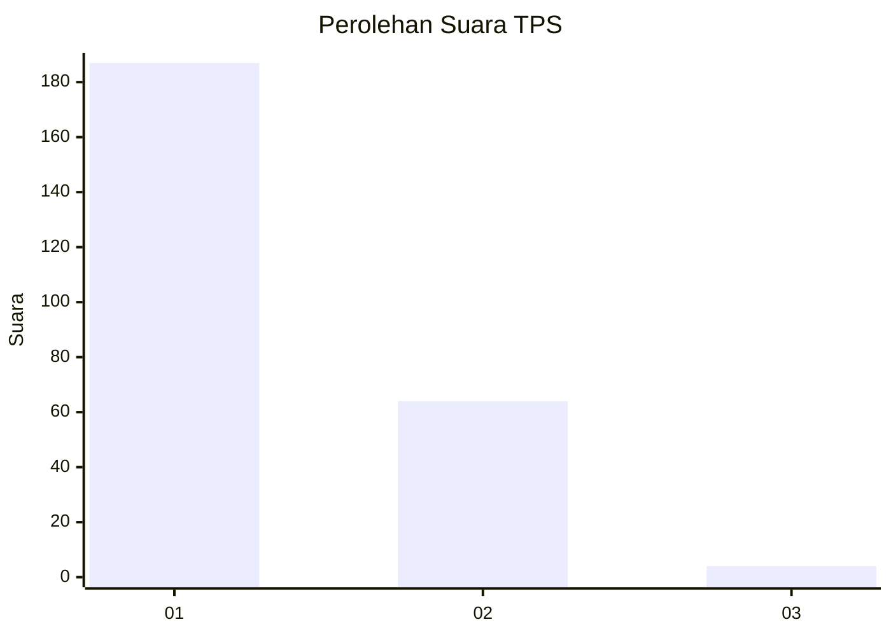
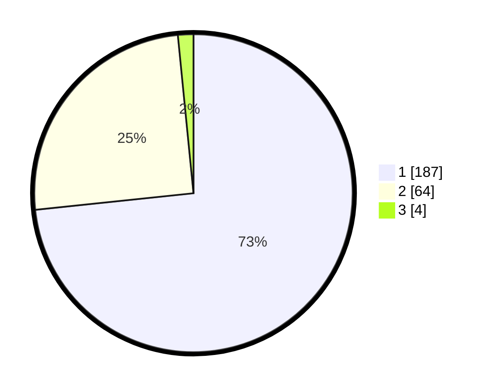

# Hasil

## Grafik

## Tabel

| No. | Nama Paslon    | Suara | Suara (raw) | Persentase |
|:--- |:-------------- | -----:| -----------:| ----------:|
| 1   | ANIES MUHAIMIN | 187   | [187][p-1]  | 73,33      |
| 2   | PRABOWO GIBRAN | 64    | [64][p-2]   | 25,10      |
| 3   | GANJAR MAHFUD  | 4     | [4][p-3]    | 1,57       |

[p-1]: https://github.com/gigit-pemilu/pemilu-2024-61-kalimantan-barat/blob/main/pilpres/hitung-suara/sub/61-kalimantan-barat/sub/71-kota-pontianak/sub/04-pontianak-utara/sub/1002-siantan-tengah/sub/028-tps/sub/paslon-1.txt
[p-2]: https://github.com/gigit-pemilu/pemilu-2024-61-kalimantan-barat/blob/main/pilpres/hitung-suara/sub/61-kalimantan-barat/sub/71-kota-pontianak/sub/04-pontianak-utara/sub/1002-siantan-tengah/sub/028-tps/sub/paslon-2.txt
[p-3]: https://github.com/gigit-pemilu/pemilu-2024-61-kalimantan-barat/blob/main/pilpres/hitung-suara/sub/61-kalimantan-barat/sub/71-kota-pontianak/sub/04-pontianak-utara/sub/1002-siantan-tengah/sub/028-tps/sub/paslon-3.txt

## Foto C Plano

https://sirekap-obj-formc.kpu.go.id/af38/pemilu/ppwp/61/71/04/10/02/6171041002028-20240218-151322--2bf493c9-4c7f-43b2-b44f-ec007c07a50e.jpg

https://sirekap-obj-formc.kpu.go.id/af38/pemilu/ppwp/61/71/04/10/02/6171041002028-20240218-151344--a811fa55-f710-48ff-8d3c-45c7e9b34a6b.jpg

https://sirekap-obj-formc.kpu.go.id/af38/pemilu/ppwp/61/71/04/10/02/6171041002028-20240218-151419--d1861f69-bced-4cf0-bb73-256dbf656c3c.jpg

## Metadata

| Key        | Value               |
| ---------- | ------------------- |
| Time Stamp | 2024-02-24 22:31:28 |

