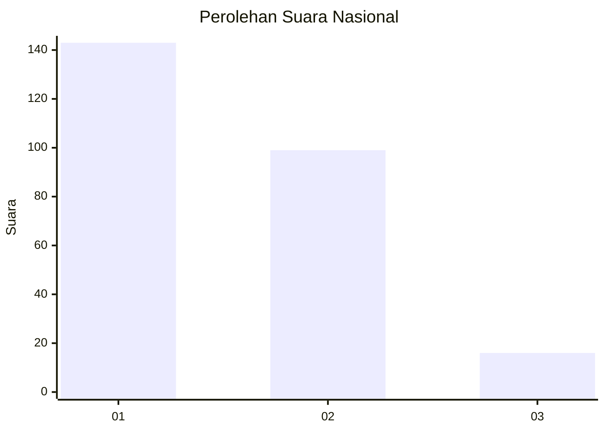
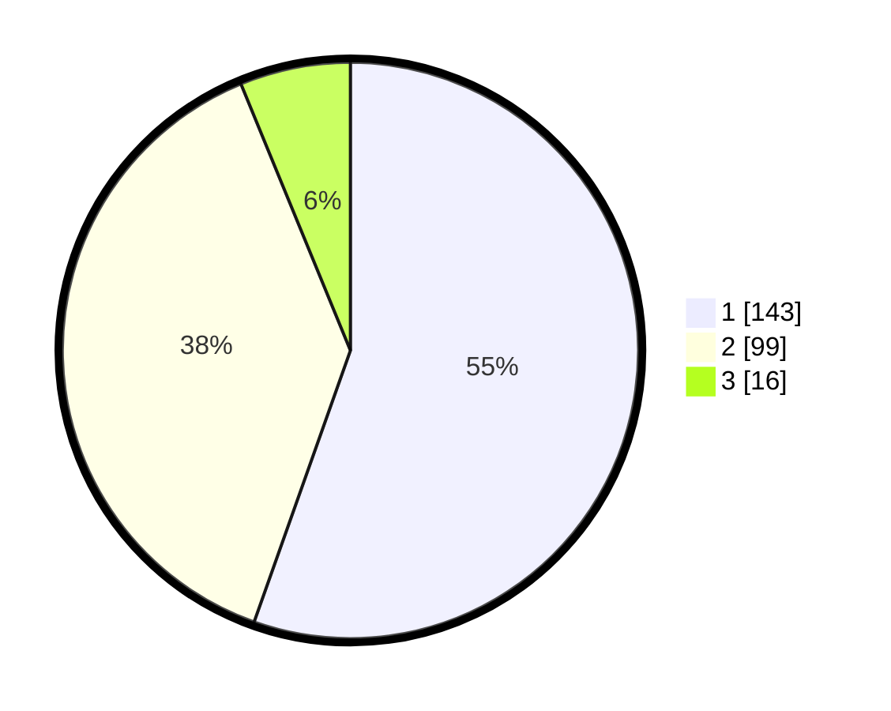

# Hasil

## Grafik

## Tabel

| No. | Nama Paslon    | Suara | Suara (raw) | Persentase |
|:--- |:-------------- | -----:| -----------:| ----------:|
| 1   | ANIES MUHAIMIN | 143   | [143][p-1]  | 55,43      |
| 2   | PRABOWO GIBRAN | 99    | [99][p-2]   | 38,37      |
| 3   | GANJAR MAHFUD  | 16    | [16][p-3]   | 6,20       |

[p-1]: https://github.com/gigit-pemilu/pemilu-2024/blob/main/pilpres/hitung-suara/sub/61-kalimantan-barat/sub/71-kota-pontianak/sub/04-pontianak-utara/sub/1002-siantan-tengah/sub/030-tps/sub/paslon-1.txt
[p-2]: https://github.com/gigit-pemilu/pemilu-2024/blob/main/pilpres/hitung-suara/sub/61-kalimantan-barat/sub/71-kota-pontianak/sub/04-pontianak-utara/sub/1002-siantan-tengah/sub/030-tps/sub/paslon-2.txt
[p-3]: https://github.com/gigit-pemilu/pemilu-2024/blob/main/pilpres/hitung-suara/sub/61-kalimantan-barat/sub/71-kota-pontianak/sub/04-pontianak-utara/sub/1002-siantan-tengah/sub/030-tps/sub/paslon-3.txt

## Foto C Plano

https://sirekap-obj-formc.kpu.go.id/3c6d/pemilu/ppwp/61/71/04/10/02/6171041002030-20240218-153044--868bc881-675b-416d-a234-431205da1abb.jpg

https://sirekap-obj-formc.kpu.go.id/3c6d/pemilu/ppwp/61/71/04/10/02/6171041002030-20240218-153117--cd3d19f8-1618-418b-b2e5-e4b8260804ea.jpg

https://sirekap-obj-formc.kpu.go.id/3c6d/pemilu/ppwp/61/71/04/10/02/6171041002030-20240218-153152--888a4ac7-1e5d-48fe-8591-fefe08715440.jpg

## Metadata

| Key        | Value               |
| ---------- | ------------------- |
| Time Stamp | 2024-02-25 22:00:00 |

