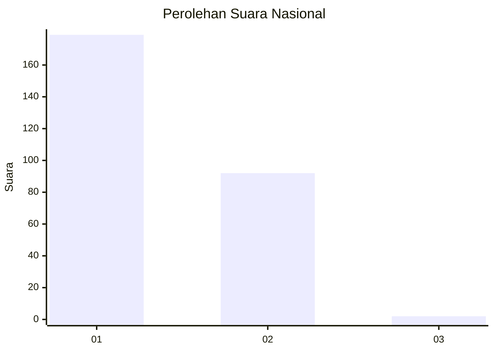
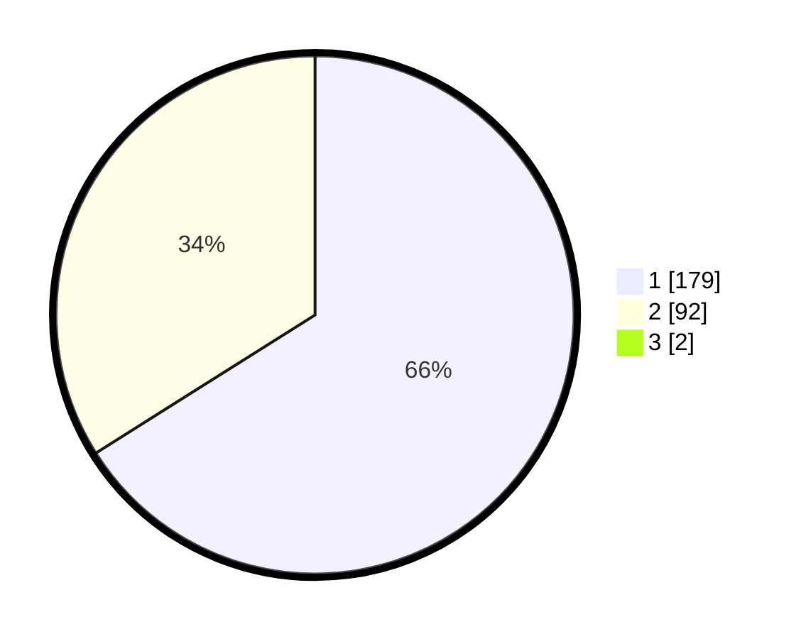

# Hasil

## Grafik

## Tabel

| No. | Nama Paslon    | Suara | Suara (raw) | Persentase |
|:--- |:-------------- | -----:| -----------:| ----------:|
| 1   | ANIES MUHAIMIN | 179   | [179][p-1]  | 65,57      |
| 2   | PRABOWO GIBRAN | 92    | [92][p-2]   | 33,70      |
| 3   | GANJAR MAHFUD  | 2     | [2][p-3]    | 0,73       |

[p-1]: https://github.com/gigit-pemilu/pemilu-2024/blob/main/pilpres/hitung-suara/sub/61-kalimantan-barat/sub/71-kota-pontianak/sub/04-pontianak-utara/sub/1002-siantan-tengah/sub/037-tps/sub/paslon-1.txt
[p-2]: https://github.com/gigit-pemilu/pemilu-2024/blob/main/pilpres/hitung-suara/sub/61-kalimantan-barat/sub/71-kota-pontianak/sub/04-pontianak-utara/sub/1002-siantan-tengah/sub/037-tps/sub/paslon-2.txt
[p-3]: https://github.com/gigit-pemilu/pemilu-2024/blob/main/pilpres/hitung-suara/sub/61-kalimantan-barat/sub/71-kota-pontianak/sub/04-pontianak-utara/sub/1002-siantan-tengah/sub/037-tps/sub/paslon-3.txt

## Foto C Plano

https://sirekap-obj-formc.kpu.go.id/1c9b/pemilu/ppwp/61/71/04/10/02/6171041002037-20240215-004109--be820f27-9fce-4a0f-a880-a12c53d190bf.jpg

https://sirekap-obj-formc.kpu.go.id/1c9b/pemilu/ppwp/61/71/04/10/02/6171041002037-20240214-231328--dfc044d7-56c0-4987-a197-900aa9bbb8f4.jpg

https://sirekap-obj-formc.kpu.go.id/1c9b/pemilu/ppwp/61/71/04/10/02/6171041002037-20240214-231517--632fd00a-a8b9-4a48-8c7f-048fc716e61d.jpg

## Metadata

| Key        | Value               |
| ---------- | ------------------- |
| Time Stamp | 2024-02-19 06:16:00 |

