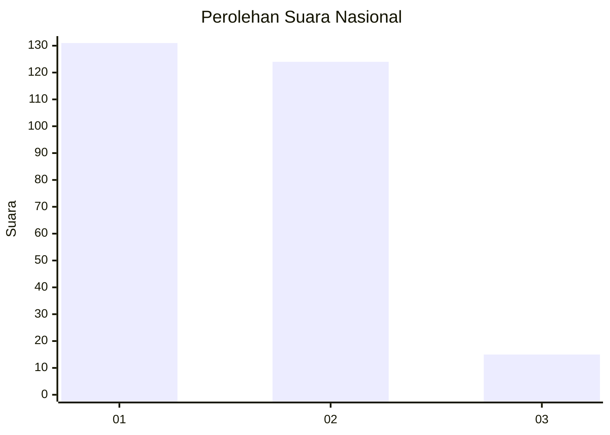
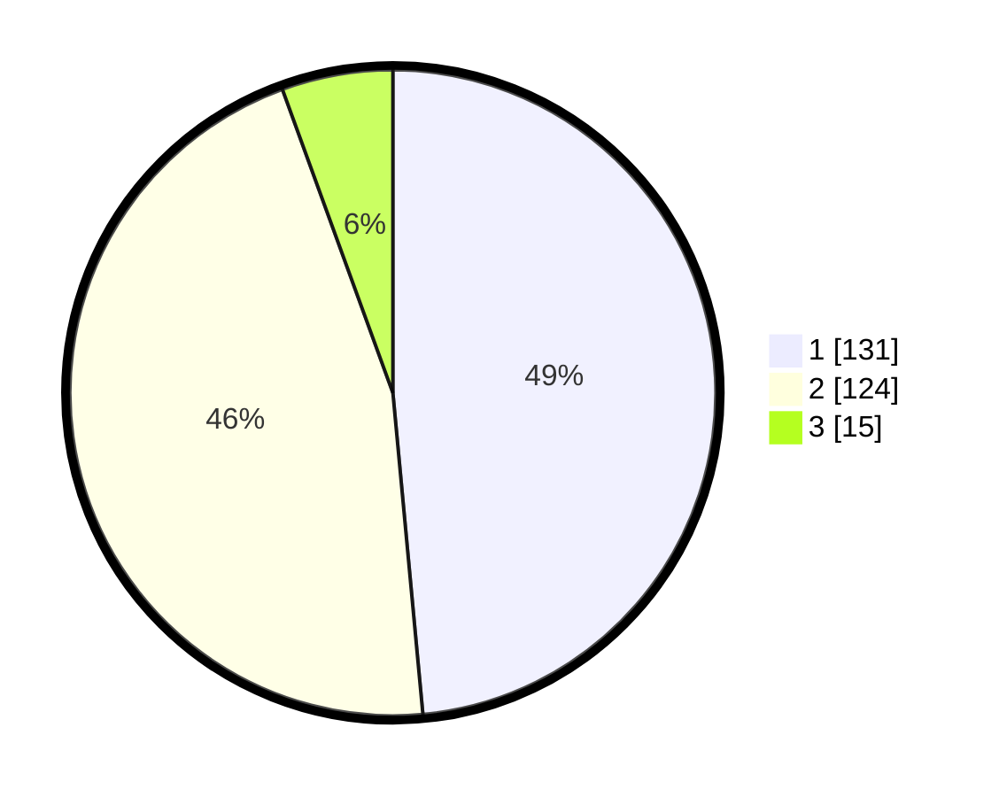

# Hasil

## Grafik

## Tabel

| No. | Nama Paslon    | Suara | Suara (raw) | Persentase |
|:--- |:-------------- | -----:| -----------:| ----------:|
| 1   | ANIES MUHAIMIN | 131   | [131][p-1]  | 48,52      |
| 2   | PRABOWO GIBRAN | 124   | [124][p-2]  | 45,93      |
| 3   | GANJAR MAHFUD  | 15    | [15][p-3]   | 5,56       |

[p-1]: https://github.com/gigit-pemilu/pemilu-2024/blob/main/pilpres/hitung-suara/sub/61-kalimantan-barat/sub/71-kota-pontianak/sub/04-pontianak-utara/sub/1002-siantan-tengah/sub/038-tps/sub/paslon-1.txt
[p-2]: https://github.com/gigit-pemilu/pemilu-2024/blob/main/pilpres/hitung-suara/sub/61-kalimantan-barat/sub/71-kota-pontianak/sub/04-pontianak-utara/sub/1002-siantan-tengah/sub/038-tps/sub/paslon-2.txt
[p-3]: https://github.com/gigit-pemilu/pemilu-2024/blob/main/pilpres/hitung-suara/sub/61-kalimantan-barat/sub/71-kota-pontianak/sub/04-pontianak-utara/sub/1002-siantan-tengah/sub/038-tps/sub/paslon-3.txt

## Foto C Plano

https://sirekap-obj-formc.kpu.go.id/c2ed/pemilu/ppwp/61/71/04/10/02/6171041002038-20240218-160105--8cf43381-ed35-453f-8762-718bae2e6e27.jpg

https://sirekap-obj-formc.kpu.go.id/c2ed/pemilu/ppwp/61/71/04/10/02/6171041002038-20240218-160155--e6f27911-ba13-4496-abd3-a662b3dcb0dc.jpg

https://sirekap-obj-formc.kpu.go.id/c2ed/pemilu/ppwp/61/71/04/10/02/6171041002038-20240218-160249--528ea51a-6bbe-474c-82b8-4ed5cf1fcf56.jpg

## Metadata

| Key        | Value               |
| ---------- | ------------------- |
| Time Stamp | 2024-02-24 22:31:28 |

