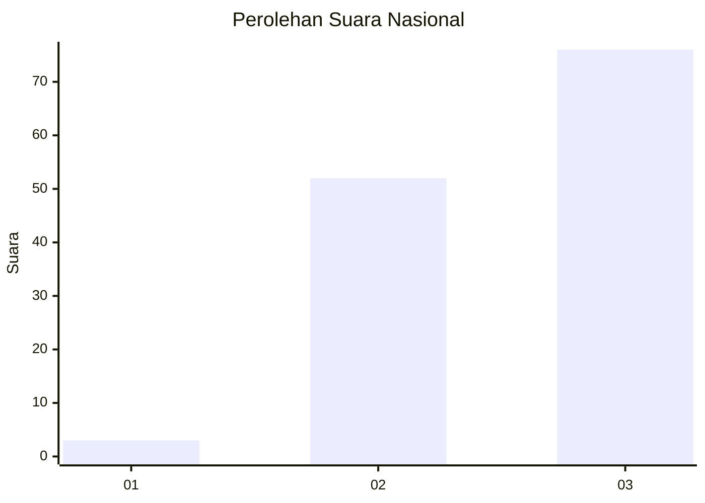
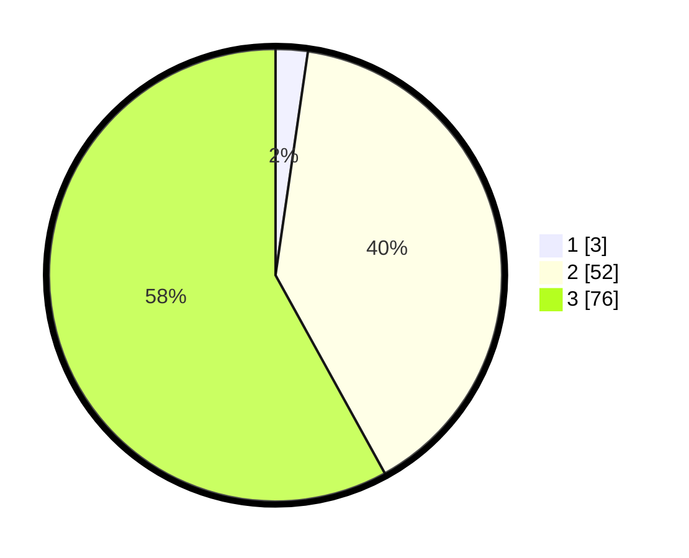

# Hasil

## Grafik

## Tabel

| No. | Nama Paslon    | Suara | Suara (raw) | Persentase |
|:--- |:-------------- | -----:| -----------:| ----------:|
| 1   | ANIES MUHAIMIN | 3     | [3][p-1]    | 2,29       |
| 2   | PRABOWO GIBRAN | 52    | [52][p-2]   | 39,69      |
| 3   | GANJAR MAHFUD  | 76    | [76][p-3]   | 58,02      |

[p-1]: https://github.com/gigit-pemilu/pemilu-2024/blob/main/pilpres/hitung-suara/sub/61-kalimantan-barat/sub/71-kota-pontianak/sub/04-pontianak-utara/sub/1002-siantan-tengah/sub/054-tps/sub/paslon-1.txt
[p-2]: https://github.com/gigit-pemilu/pemilu-2024/blob/main/pilpres/hitung-suara/sub/61-kalimantan-barat/sub/71-kota-pontianak/sub/04-pontianak-utara/sub/1002-siantan-tengah/sub/054-tps/sub/paslon-2.txt
[p-3]: https://github.com/gigit-pemilu/pemilu-2024/blob/main/pilpres/hitung-suara/sub/61-kalimantan-barat/sub/71-kota-pontianak/sub/04-pontianak-utara/sub/1002-siantan-tengah/sub/054-tps/sub/paslon-3.txt

## Foto C Plano

https://sirekap-obj-formc.kpu.go.id/5afd/pemilu/ppwp/61/71/04/10/02/6171041002054-20240218-164214--7fac8862-b689-4989-81a5-bdf8c901341a.jpg

https://sirekap-obj-formc.kpu.go.id/5afd/pemilu/ppwp/61/71/04/10/02/6171041002054-20240218-164254--9e7bed22-2107-4d61-a6b2-9eaf08c656e8.jpg

https://sirekap-obj-formc.kpu.go.id/5afd/pemilu/ppwp/61/71/04/10/02/6171041002054-20240218-164345--d32926c1-670c-4dac-b25f-1a121b75905a.jpg

## Metadata

| Key        | Value               |
| ---------- | ------------------- |
| Time Stamp | 2024-02-25 15:00:00 |

