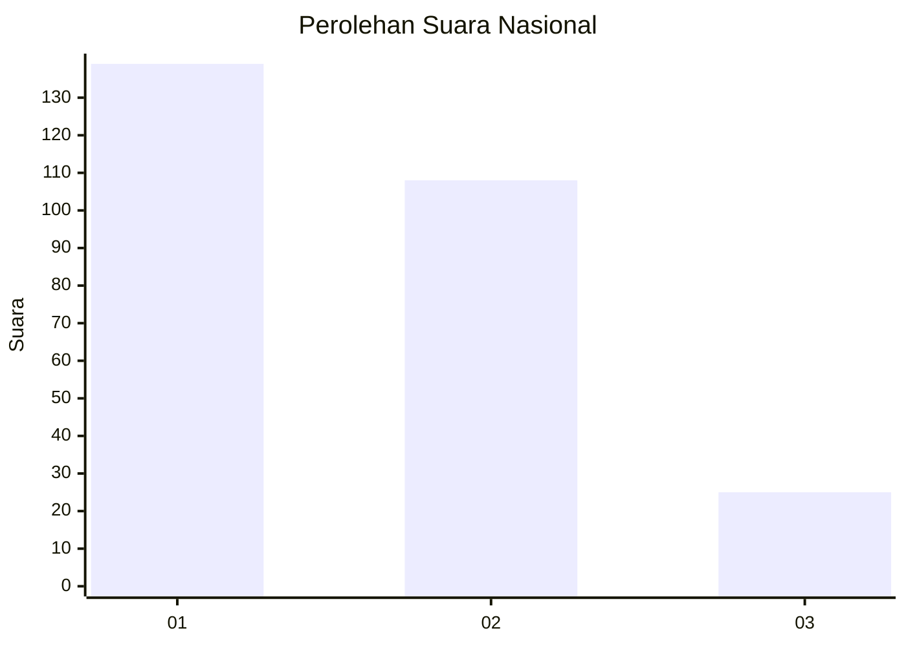
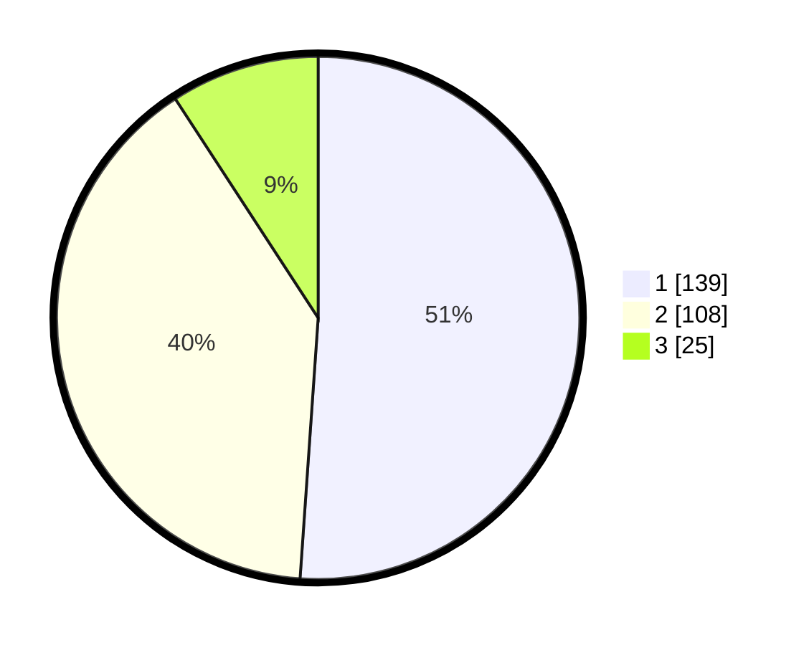

# Hasil

## Grafik

## Tabel

| No. | Nama Paslon    | Suara | Suara (raw) | Persentase |
|:--- |:-------------- | -----:| -----------:| ----------:|
| 1   | ANIES MUHAIMIN | 139   | [139][p-1]  | 51,10      |
| 2   | PRABOWO GIBRAN | 108   | [108][p-2]  | 39,71      |
| 3   | GANJAR MAHFUD  | 25    | [25][p-3]   | 9,19       |

[p-1]: https://github.com/gigit-pemilu/pemilu-2024/blob/main/pilpres/hitung-suara/sub/61-kalimantan-barat/sub/71-kota-pontianak/sub/04-pontianak-utara/sub/1002-siantan-tengah/sub/074-tps/sub/paslon-1.txt
[p-2]: https://github.com/gigit-pemilu/pemilu-2024/blob/main/pilpres/hitung-suara/sub/61-kalimantan-barat/sub/71-kota-pontianak/sub/04-pontianak-utara/sub/1002-siantan-tengah/sub/074-tps/sub/paslon-2.txt
[p-3]: https://github.com/gigit-pemilu/pemilu-2024/blob/main/pilpres/hitung-suara/sub/61-kalimantan-barat/sub/71-kota-pontianak/sub/04-pontianak-utara/sub/1002-siantan-tengah/sub/074-tps/sub/paslon-3.txt

## Foto C Plano

https://sirekap-obj-formc.kpu.go.id/39b5/pemilu/ppwp/61/71/04/10/02/6171041002074-20240218-210916--92fce594-52d3-45b1-b30f-4c50715dfbc9.jpg

https://sirekap-obj-formc.kpu.go.id/39b5/pemilu/ppwp/61/71/04/10/02/6171041002074-20240218-210959--7fa1ef38-58f4-4d05-98f2-9d2a3bc29bd7.jpg

https://sirekap-obj-formc.kpu.go.id/39b5/pemilu/ppwp/61/71/04/10/02/6171041002074-20240218-211048--987da009-f276-4b1f-9ed0-9d1c5b514d56.jpg

## Metadata

| Key        | Value               |
| ---------- | ------------------- |
| Time Stamp | 2024-02-24 22:31:28 |

