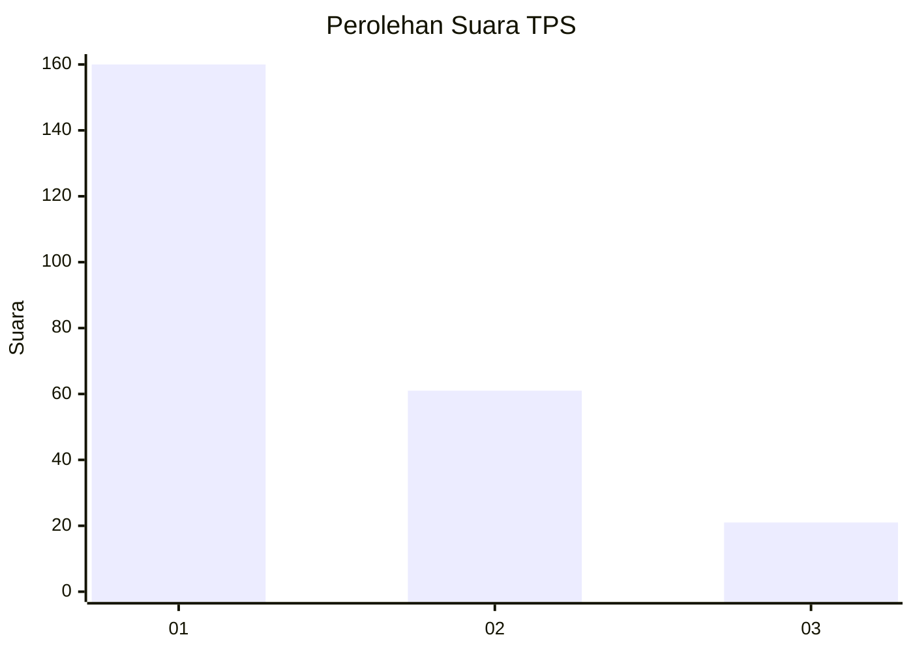
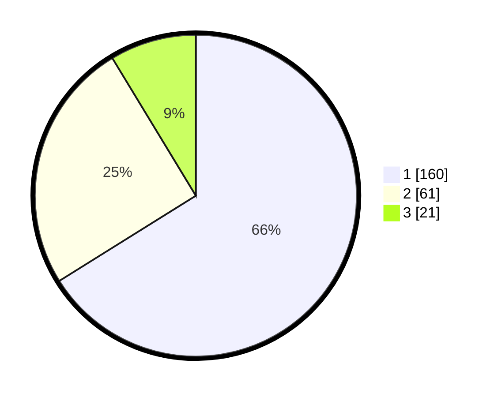

# Hasil

## Grafik

## Tabel

| No. | Nama Paslon    | Suara | Suara (raw) | Persentase |
|:--- |:-------------- | -----:| -----------:| ----------:|
| 1   | ANIES MUHAIMIN | 160   | [160][p-1]  | 66,12      |
| 2   | PRABOWO GIBRAN | 61    | [61][p-2]   | 25,21      |
| 3   | GANJAR MAHFUD  | 21    | [21][p-3]   | 8,68       |

[p-1]: https://github.com/gigit-pemilu/pemilu-2024-61-kalimantan-barat/blob/main/pilpres/hitung-suara/sub/61-kalimantan-barat/sub/71-kota-pontianak/sub/04-pontianak-utara/sub/1002-siantan-tengah/sub/087-tps/sub/paslon-1.txt
[p-2]: https://github.com/gigit-pemilu/pemilu-2024-61-kalimantan-barat/blob/main/pilpres/hitung-suara/sub/61-kalimantan-barat/sub/71-kota-pontianak/sub/04-pontianak-utara/sub/1002-siantan-tengah/sub/087-tps/sub/paslon-2.txt
[p-3]: https://github.com/gigit-pemilu/pemilu-2024-61-kalimantan-barat/blob/main/pilpres/hitung-suara/sub/61-kalimantan-barat/sub/71-kota-pontianak/sub/04-pontianak-utara/sub/1002-siantan-tengah/sub/087-tps/sub/paslon-3.txt

## Foto C Plano

https://sirekap-obj-formc.kpu.go.id/e10d/pemilu/ppwp/61/71/04/10/02/6171041002087-20240218-213956--1c40bcfc-08ff-43db-a243-906ed56f0440.jpg

https://sirekap-obj-formc.kpu.go.id/e10d/pemilu/ppwp/61/71/04/10/02/6171041002087-20240218-214046--5376e5a8-5864-4ab3-a127-0d904fb93b5b.jpg

https://sirekap-obj-formc.kpu.go.id/e10d/pemilu/ppwp/61/71/04/10/02/6171041002087-20240218-214124--c3301bb2-0f3b-4931-9e58-db5f6924e3c6.jpg

## Metadata

| Key        | Value               |
| ---------- | ------------------- |
| Time Stamp | 2024-02-24 22:31:28 |

