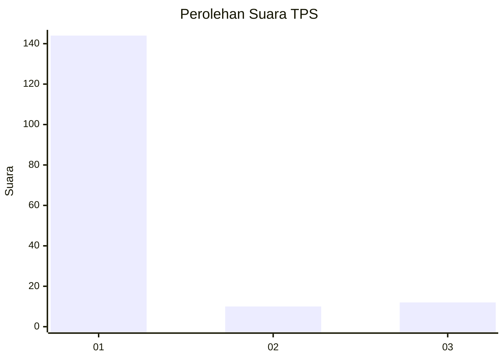
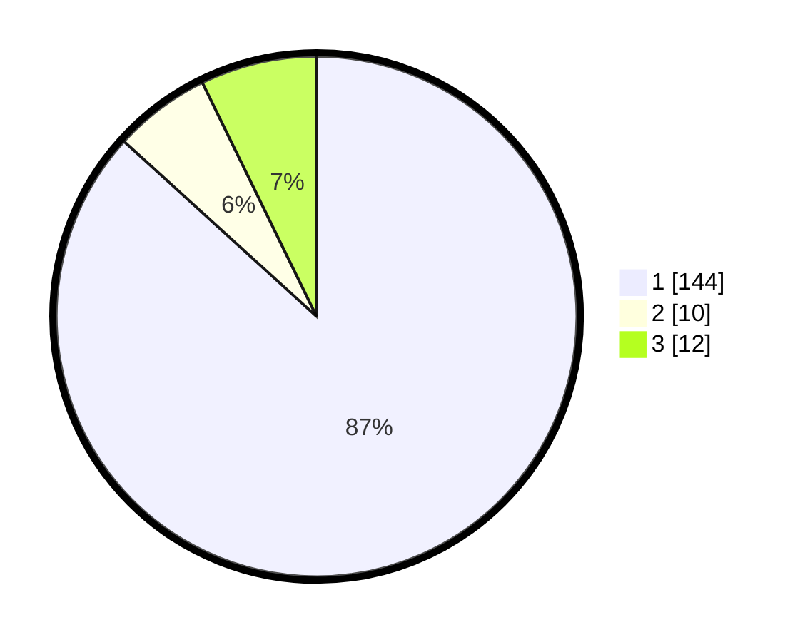

# Hasil

## Grafik

## Tabel

| No. | Nama Paslon    | Suara | Suara (raw) | Persentase |
|:--- |:-------------- | -----:| -----------:| ----------:|
| 1   | ANIES MUHAIMIN | 144   | [144][p-1]  | 86,75      |
| 2   | PRABOWO GIBRAN | 10    | [10][p-2]   | 6,02       |
| 3   | GANJAR MAHFUD  | 12    | [12][p-3]   | 7,23       |

[p-1]: https://github.com/gigit-pemilu/pemilu-2024-61-kalimantan-barat/blob/main/pilpres/hitung-suara/sub/61-kalimantan-barat/sub/71-kota-pontianak/sub/04-pontianak-utara/sub/1002-siantan-tengah/sub/089-tps/sub/paslon-1.txt
[p-2]: https://github.com/gigit-pemilu/pemilu-2024-61-kalimantan-barat/blob/main/pilpres/hitung-suara/sub/61-kalimantan-barat/sub/71-kota-pontianak/sub/04-pontianak-utara/sub/1002-siantan-tengah/sub/089-tps/sub/paslon-2.txt
[p-3]: https://github.com/gigit-pemilu/pemilu-2024-61-kalimantan-barat/blob/main/pilpres/hitung-suara/sub/61-kalimantan-barat/sub/71-kota-pontianak/sub/04-pontianak-utara/sub/1002-siantan-tengah/sub/089-tps/sub/paslon-3.txt

## Foto C Plano

https://sirekap-obj-formc.kpu.go.id/37dc/pemilu/ppwp/61/71/04/10/02/6171041002089-20240218-214818--a813b74f-9bb2-4e6f-b2f8-513c40edaf0b.jpg

https://sirekap-obj-formc.kpu.go.id/37dc/pemilu/ppwp/61/71/04/10/02/6171041002089-20240218-214719--80c0678e-34ef-488e-ac6d-fdb321e0d408.jpg

https://sirekap-obj-formc.kpu.go.id/37dc/pemilu/ppwp/61/71/04/10/02/6171041002089-20240218-214749--6503850e-44ee-4a16-923b-2bdf9e4f4037.jpg

## Metadata

| Key        | Value               |
| ---------- | ------------------- |
| Time Stamp | 2024-02-25 16:00:00 |

