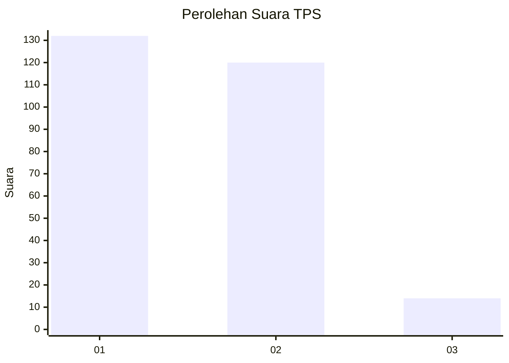
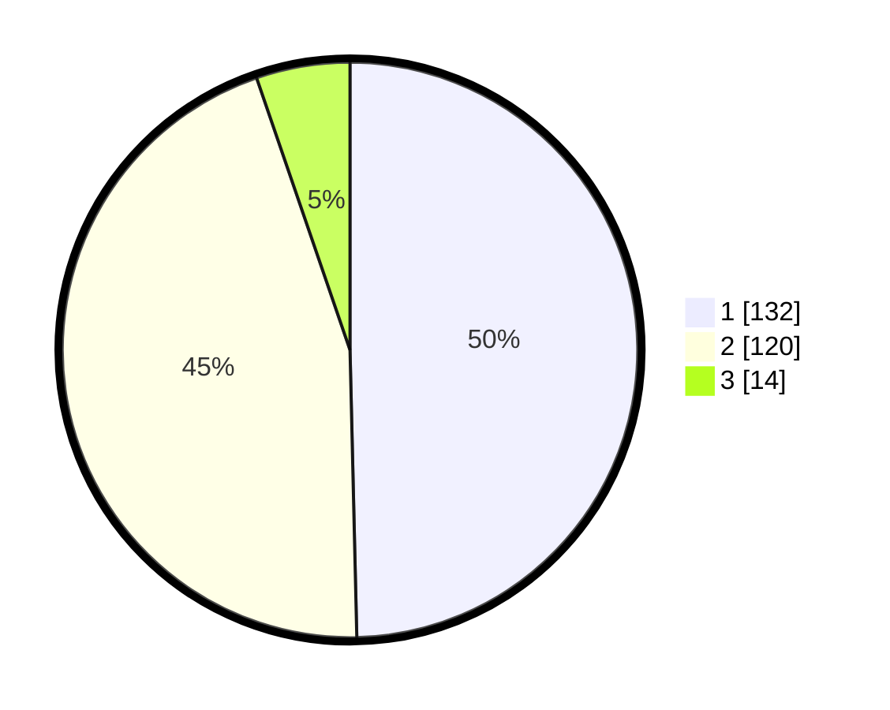

# Hasil

## Grafik

## Tabel

| No. | Nama Paslon    | Suara | Suara (raw) | Persentase |
|:--- |:-------------- | -----:| -----------:| ----------:|
| 1   | ANIES MUHAIMIN | 132   | [132][p-1]  | 49,62      |
| 2   | PRABOWO GIBRAN | 120   | [120][p-2]  | 45,11      |
| 3   | GANJAR MAHFUD  | 14    | [14][p-3]   | 5,26       |

[p-1]: https://github.com/gigit-pemilu/pemilu-2024-61-kalimantan-barat/blob/main/pilpres/hitung-suara/sub/61-kalimantan-barat/sub/71-kota-pontianak/sub/04-pontianak-utara/sub/1002-siantan-tengah/sub/091-tps/sub/paslon-1.txt
[p-2]: https://github.com/gigit-pemilu/pemilu-2024-61-kalimantan-barat/blob/main/pilpres/hitung-suara/sub/61-kalimantan-barat/sub/71-kota-pontianak/sub/04-pontianak-utara/sub/1002-siantan-tengah/sub/091-tps/sub/paslon-2.txt
[p-3]: https://github.com/gigit-pemilu/pemilu-2024-61-kalimantan-barat/blob/main/pilpres/hitung-suara/sub/61-kalimantan-barat/sub/71-kota-pontianak/sub/04-pontianak-utara/sub/1002-siantan-tengah/sub/091-tps/sub/paslon-3.txt

## Foto C Plano

https://sirekap-obj-formc.kpu.go.id/c32b/pemilu/ppwp/61/71/04/10/02/6171041002091-20240218-215245--196a53d2-9e4d-4062-aa22-55d0a34670f4.jpg

https://sirekap-obj-formc.kpu.go.id/c32b/pemilu/ppwp/61/71/04/10/02/6171041002091-20240218-215321--50d901b6-91e7-4458-931f-536a9663150d.jpg

https://sirekap-obj-formc.kpu.go.id/c32b/pemilu/ppwp/61/71/04/10/02/6171041002091-20240218-215355--7b7f4ee6-e1e4-41b0-8c75-92cefa5435e9.jpg

## Metadata

| Key        | Value               |
| ---------- | ------------------- |
| Time Stamp | 2024-02-24 22:31:28 |

