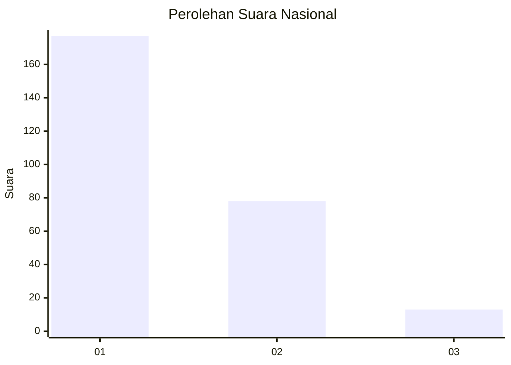
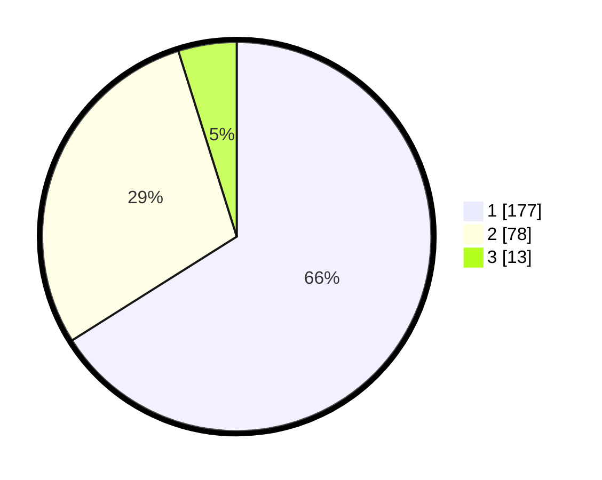

# Hasil

## Grafik

## Tabel

| No. | Nama Paslon    | Suara | Suara (raw) | Persentase |
|:--- |:-------------- | -----:| -----------:| ----------:|
| 1   | ANIES MUHAIMIN | 177   | [177][p-1]  | 66,04      |
| 2   | PRABOWO GIBRAN | 78    | [78][p-2]   | 29,10      |
| 3   | GANJAR MAHFUD  | 13    | [13][p-3]   | 4,85       |

[p-1]: https://github.com/gigit-pemilu/pemilu-2024/blob/main/pilpres/hitung-suara/sub/61-kalimantan-barat/sub/71-kota-pontianak/sub/04-pontianak-utara/sub/1002-siantan-tengah/sub/105-tps/sub/paslon-1.txt
[p-2]: https://github.com/gigit-pemilu/pemilu-2024/blob/main/pilpres/hitung-suara/sub/61-kalimantan-barat/sub/71-kota-pontianak/sub/04-pontianak-utara/sub/1002-siantan-tengah/sub/105-tps/sub/paslon-2.txt
[p-3]: https://github.com/gigit-pemilu/pemilu-2024/blob/main/pilpres/hitung-suara/sub/61-kalimantan-barat/sub/71-kota-pontianak/sub/04-pontianak-utara/sub/1002-siantan-tengah/sub/105-tps/sub/paslon-3.txt

## Foto C Plano

https://sirekap-obj-formc.kpu.go.id/9d8f/pemilu/ppwp/61/71/04/10/02/6171041002105-20240214-231150--84abceea-c212-49fb-ba89-11088ba7984c.jpg

https://sirekap-obj-formc.kpu.go.id/9d8f/pemilu/ppwp/61/71/04/10/02/6171041002105-20240218-222607--5e31f02e-b4ab-4485-b138-a49272e52e4b.jpg

https://sirekap-obj-formc.kpu.go.id/9d8f/pemilu/ppwp/61/71/04/10/02/6171041002105-20240218-222657--170c7c06-2b2d-4c0b-951c-9dfa0d0253a3.jpg

## Metadata

| Key        | Value               |
| ---------- | ------------------- |
| Time Stamp | 2024-02-24 22:31:28 |

