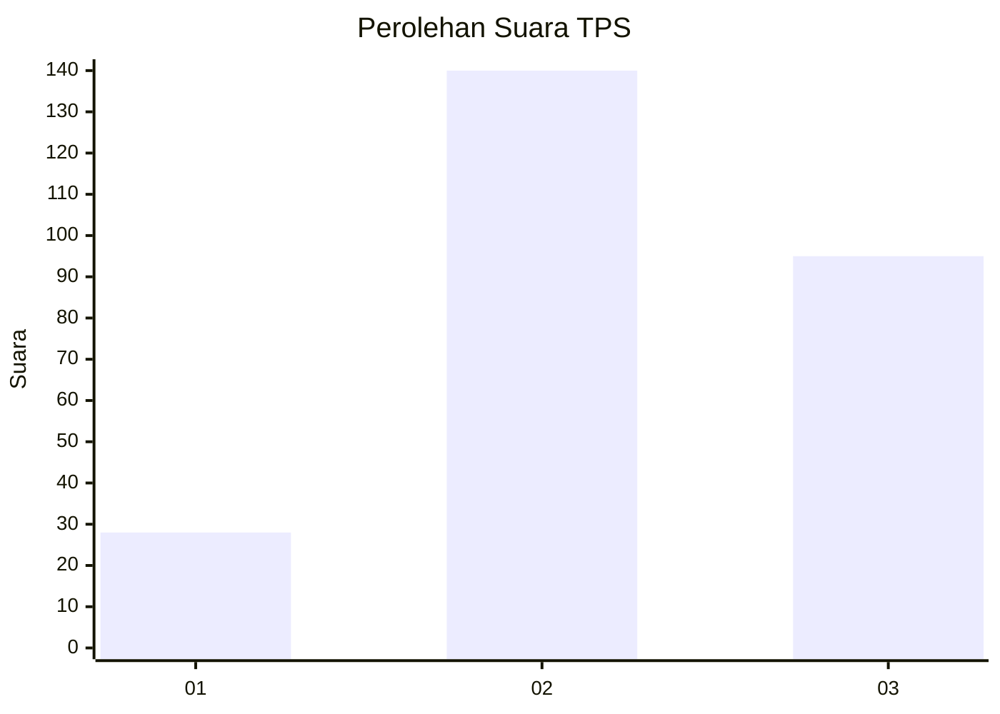
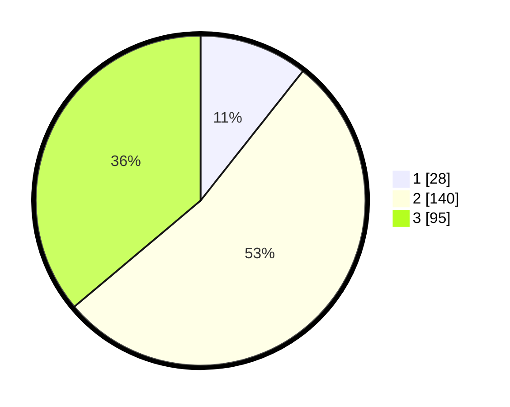

# Hasil

## Grafik

## Tabel

| No. | Nama Paslon    | Suara | Suara (raw) | Persentase |
|:--- |:-------------- | -----:| -----------:| ----------:|
| 1   | ANIES MUHAIMIN | 28    | [28][p-1]   | 10,65      |
| 2   | PRABOWO GIBRAN | 140   | [140][p-2]  | 53,23      |
| 3   | GANJAR MAHFUD  | 95    | [95][p-3]   | 36,12      |

[p-1]: https://github.com/gigit-pemilu/pemilu-2024-61-kalimantan-barat/blob/main/pilpres/hitung-suara/sub/61-kalimantan-barat/sub/71-kota-pontianak/sub/04-pontianak-utara/sub/1003-siantan-hilir/sub/088-tps/sub/paslon-1.txt
[p-2]: https://github.com/gigit-pemilu/pemilu-2024-61-kalimantan-barat/blob/main/pilpres/hitung-suara/sub/61-kalimantan-barat/sub/71-kota-pontianak/sub/04-pontianak-utara/sub/1003-siantan-hilir/sub/088-tps/sub/paslon-2.txt
[p-3]: https://github.com/gigit-pemilu/pemilu-2024-61-kalimantan-barat/blob/main/pilpres/hitung-suara/sub/61-kalimantan-barat/sub/71-kota-pontianak/sub/04-pontianak-utara/sub/1003-siantan-hilir/sub/088-tps/sub/paslon-3.txt

## Foto C Plano

https://sirekap-obj-formc.kpu.go.id/77c1/pemilu/ppwp/61/71/04/10/03/6171041003088-20240215-053005--899737b4-d289-4b52-9021-9d210f8859b3.jpg

https://sirekap-obj-formc.kpu.go.id/77c1/pemilu/ppwp/61/71/04/10/03/6171041003088-20240215-071803--2247c7f0-f8ab-4bdc-99a4-87b0f7a8019e.jpg

https://sirekap-obj-formc.kpu.go.id/77c1/pemilu/ppwp/61/71/04/10/03/6171041003088-20240215-055109--4a3d2bce-ce19-483a-88b3-d0c2b7107231.jpg

## Metadata

| Key        | Value               |
| ---------- | ------------------- |
| Time Stamp | 2024-02-25 17:00:00 |

