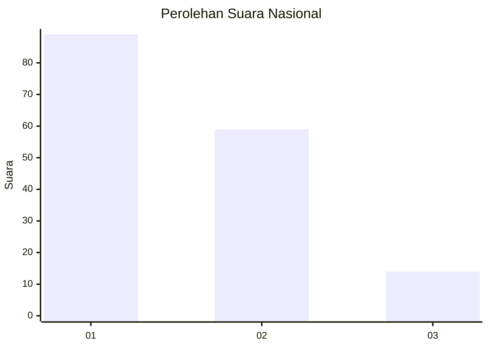
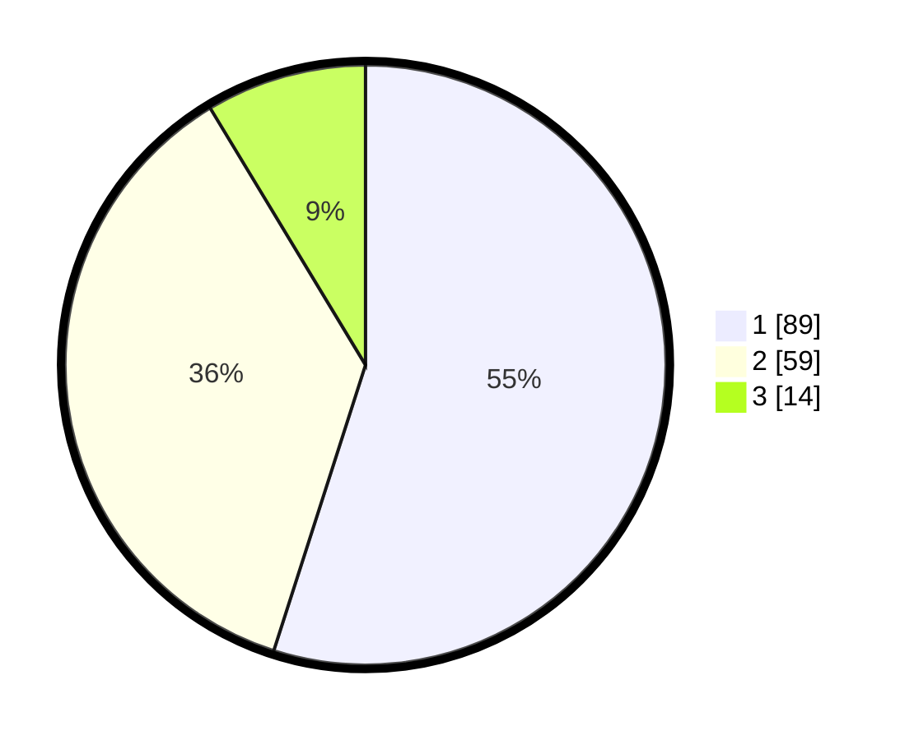

# Hasil

## Grafik

## Tabel

| No. | Nama Paslon    | Suara | Suara (raw) | Persentase |
|:--- |:-------------- | -----:| -----------:| ----------:|
| 1   | ANIES MUHAIMIN | 89    | [89][p-1]   | 54,94      |
| 2   | PRABOWO GIBRAN | 59    | [59][p-2]   | 36,42      |
| 3   | GANJAR MAHFUD  | 14    | [14][p-3]   | 8,64       |

[p-1]: https://github.com/gigit-pemilu/pemilu-2024/blob/main/pilpres/hitung-suara/sub/61-kalimantan-barat/sub/71-kota-pontianak/sub/04-pontianak-utara/sub/1003-siantan-hilir/sub/105-tps/sub/paslon-1.txt
[p-2]: https://github.com/gigit-pemilu/pemilu-2024/blob/main/pilpres/hitung-suara/sub/61-kalimantan-barat/sub/71-kota-pontianak/sub/04-pontianak-utara/sub/1003-siantan-hilir/sub/105-tps/sub/paslon-2.txt
[p-3]: https://github.com/gigit-pemilu/pemilu-2024/blob/main/pilpres/hitung-suara/sub/61-kalimantan-barat/sub/71-kota-pontianak/sub/04-pontianak-utara/sub/1003-siantan-hilir/sub/105-tps/sub/paslon-3.txt

## Foto C Plano

https://sirekap-obj-formc.kpu.go.id/5ae3/pemilu/ppwp/61/71/04/10/03/6171041003105-20240219-143752--207bd646-1271-4bd8-8978-8aba5d3954d5.jpg

https://sirekap-obj-formc.kpu.go.id/5ae3/pemilu/ppwp/61/71/04/10/03/6171041003105-20240219-143930--d9d87dee-4c0a-4bbc-b976-1aa4bd3475a1.jpg

https://sirekap-obj-formc.kpu.go.id/5ae3/pemilu/ppwp/61/71/04/10/03/6171041003105-20240219-143835--1e1270da-2f4b-4543-b036-c30dca358aae.jpg

## Metadata

| Key        | Value               |
| ---------- | ------------------- |
| Time Stamp | 2024-02-25 17:00:00 |

