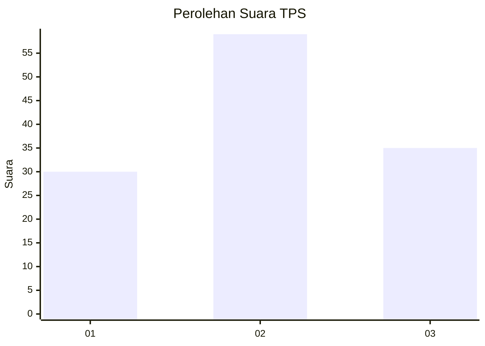
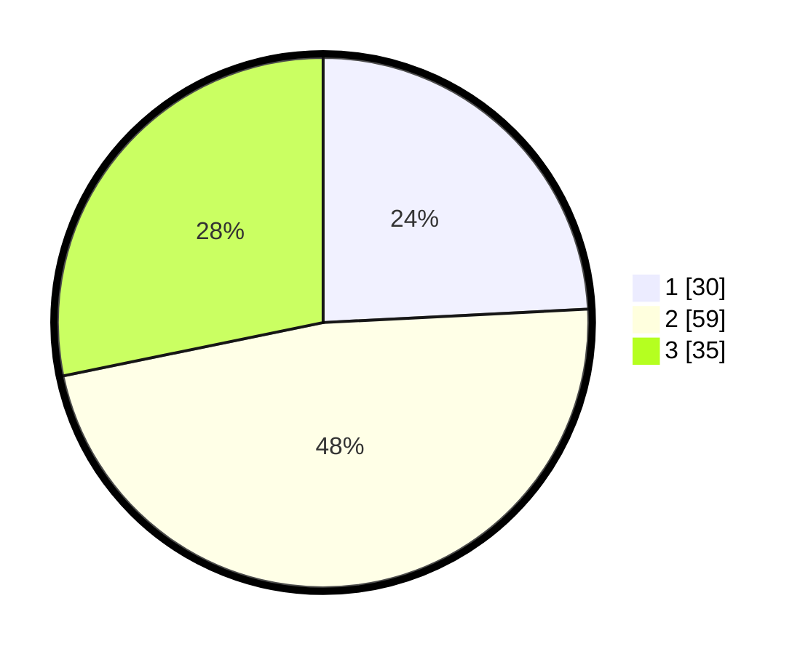

# Hasil

## Grafik

## Tabel

| No. | Nama Paslon    | Suara | Suara (raw) | Persentase |
|:--- |:-------------- | -----:| -----------:| ----------:|
| 1   | ANIES MUHAIMIN | 30    | [30][p-1]   | 24,19      |
| 2   | PRABOWO GIBRAN | 59    | [59][p-2]   | 47,58      |
| 3   | GANJAR MAHFUD  | 35    | [35][p-3]   | 28,23      |

[p-1]: https://github.com/gigit-pemilu/pemilu-2024-61-kalimantan-barat/blob/main/pilpres/hitung-suara/sub/61-kalimantan-barat/sub/71-kota-pontianak/sub/04-pontianak-utara/sub/1004-batulayang/sub/011-tps/sub/paslon-1.txt
[p-2]: https://github.com/gigit-pemilu/pemilu-2024-61-kalimantan-barat/blob/main/pilpres/hitung-suara/sub/61-kalimantan-barat/sub/71-kota-pontianak/sub/04-pontianak-utara/sub/1004-batulayang/sub/011-tps/sub/paslon-2.txt
[p-3]: https://github.com/gigit-pemilu/pemilu-2024-61-kalimantan-barat/blob/main/pilpres/hitung-suara/sub/61-kalimantan-barat/sub/71-kota-pontianak/sub/04-pontianak-utara/sub/1004-batulayang/sub/011-tps/sub/paslon-3.txt

## Foto C Plano

https://sirekap-obj-formc.kpu.go.id/fdec/pemilu/ppwp/61/71/04/10/04/6171041004011-20240219-154953--2c3e14ae-3385-4f20-af42-e875ca8a7744.jpg

https://sirekap-obj-formc.kpu.go.id/fdec/pemilu/ppwp/61/71/04/10/04/6171041004011-20240219-155036--a0c7d278-ea7f-4b14-a7da-f16bb00d1fb9.jpg

https://sirekap-obj-formc.kpu.go.id/fdec/pemilu/ppwp/61/71/04/10/04/6171041004011-20240219-155119--7e709f43-a97b-4f4c-8904-24296880e4e5.jpg

## Metadata

| Key        | Value               |
| ---------- | ------------------- |
| Time Stamp | 2024-02-25 14:00:00 |

