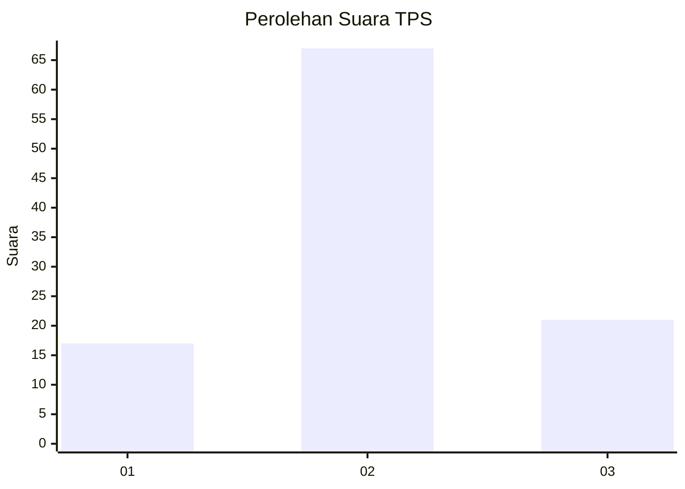
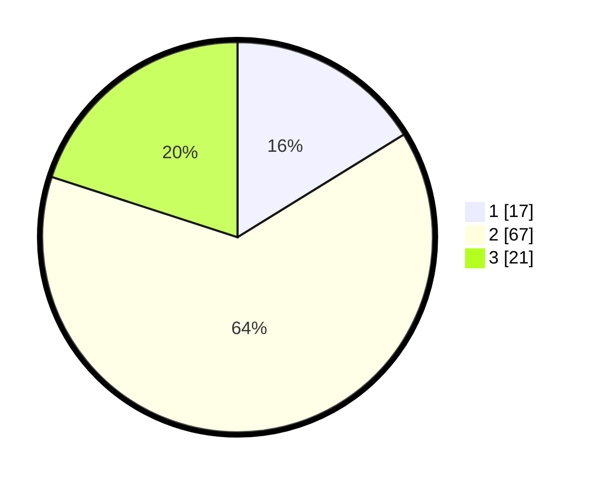

# Hasil

## Grafik

## Tabel

| No. | Nama Paslon    | Suara | Suara (raw) | Persentase |
|:--- |:-------------- | -----:| -----------:| ----------:|
| 1   | ANIES MUHAIMIN | 17    | [17][p-1]   | 16,19      |
| 2   | PRABOWO GIBRAN | 67    | [67][p-2]   | 63,81      |
| 3   | GANJAR MAHFUD  | 21    | [21][p-3]   | 20,00      |

[p-1]: https://github.com/gigit-pemilu/pemilu-2024-61-kalimantan-barat/blob/main/pilpres/hitung-suara/sub/61-kalimantan-barat/sub/71-kota-pontianak/sub/04-pontianak-utara/sub/1004-batulayang/sub/057-tps/sub/paslon-1.txt
[p-2]: https://github.com/gigit-pemilu/pemilu-2024-61-kalimantan-barat/blob/main/pilpres/hitung-suara/sub/61-kalimantan-barat/sub/71-kota-pontianak/sub/04-pontianak-utara/sub/1004-batulayang/sub/057-tps/sub/paslon-2.txt
[p-3]: https://github.com/gigit-pemilu/pemilu-2024-61-kalimantan-barat/blob/main/pilpres/hitung-suara/sub/61-kalimantan-barat/sub/71-kota-pontianak/sub/04-pontianak-utara/sub/1004-batulayang/sub/057-tps/sub/paslon-3.txt

## Foto C Plano

https://sirekap-obj-formc.kpu.go.id/3571/pemilu/ppwp/61/71/04/10/04/6171041004057-20240219-204940--2007346e-f3b6-4b72-b0d5-ccd3f79cd46f.jpg

https://sirekap-obj-formc.kpu.go.id/3571/pemilu/ppwp/61/71/04/10/04/6171041004057-20240219-205011--87026661-1aa4-48eb-9e4a-cacd8a115a6b.jpg

https://sirekap-obj-formc.kpu.go.id/3571/pemilu/ppwp/61/71/04/10/04/6171041004057-20240219-205910--315f425a-9ec6-472a-89a8-3e3e4970f15d.jpg

## Metadata

| Key        | Value               |
| ---------- | ------------------- |
| Time Stamp | 2024-02-25 17:00:00 |

