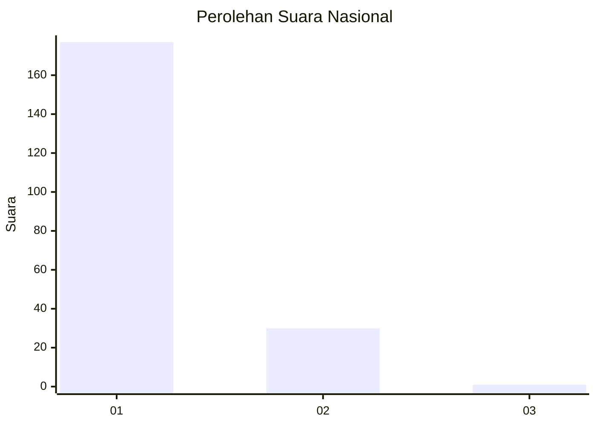
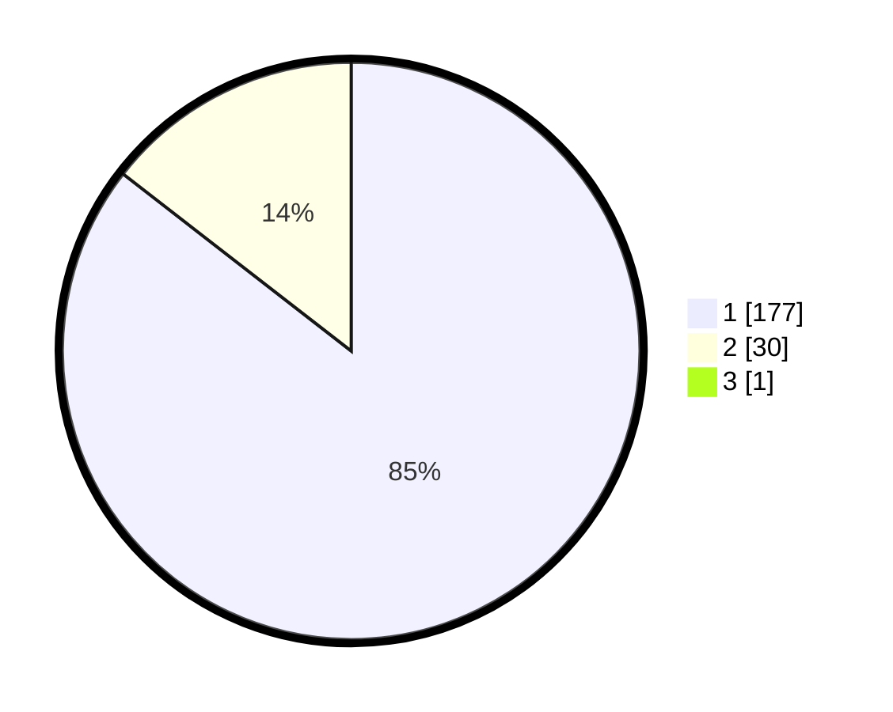

# Hasil

## Grafik

## Tabel

| No. | Nama Paslon    | Suara | Suara (raw) | Persentase |
|:--- |:-------------- | -----:| -----------:| ----------:|
| 1   | ANIES MUHAIMIN | 177   | [177][p-1]  | 85,10      |
| 2   | PRABOWO GIBRAN | 30    | [30][p-2]   | 14,42      |
| 3   | GANJAR MAHFUD  | 1     | [1][p-3]    | 0,48       |

[p-1]: https://github.com/gigit-pemilu/pemilu-2024/blob/main/pilpres/hitung-suara/sub/61-kalimantan-barat/sub/71-kota-pontianak/sub/04-pontianak-utara/sub/1004-batulayang/sub/061-tps/sub/paslon-1.txt
[p-2]: https://github.com/gigit-pemilu/pemilu-2024/blob/main/pilpres/hitung-suara/sub/61-kalimantan-barat/sub/71-kota-pontianak/sub/04-pontianak-utara/sub/1004-batulayang/sub/061-tps/sub/paslon-2.txt
[p-3]: https://github.com/gigit-pemilu/pemilu-2024/blob/main/pilpres/hitung-suara/sub/61-kalimantan-barat/sub/71-kota-pontianak/sub/04-pontianak-utara/sub/1004-batulayang/sub/061-tps/sub/paslon-3.txt

## Foto C Plano

https://sirekap-obj-formc.kpu.go.id/c1c0/pemilu/ppwp/61/71/04/10/04/6171041004061-20240214-204849--bf1b7042-4619-44a6-a45f-b10021bca468.jpg

https://sirekap-obj-formc.kpu.go.id/c1c0/pemilu/ppwp/61/71/04/10/04/6171041004061-20240214-205443--d1330746-558f-4406-b0aa-8cd9ba839864.jpg

https://sirekap-obj-formc.kpu.go.id/c1c0/pemilu/ppwp/61/71/04/10/04/6171041004061-20240214-205911--56cee3e2-d7e4-46d0-8109-71c8ff9330fa.jpg

## Metadata

| Key        | Value               |
| ---------- | ------------------- |
| Time Stamp | 2024-02-15 20:00:44 |

