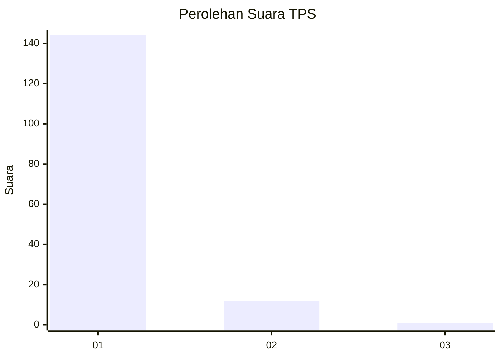
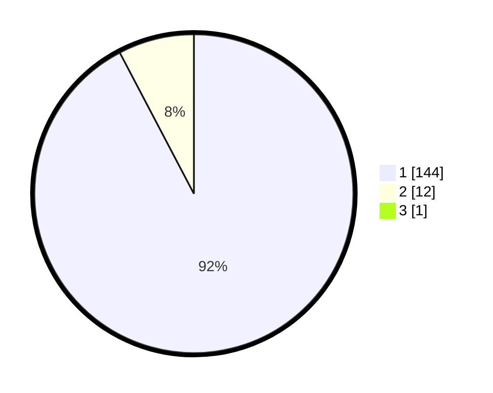

# Hasil

## Grafik

## Tabel

| No. | Nama Paslon    | Suara | Suara (raw) | Persentase |
|:--- |:-------------- | -----:| -----------:| ----------:|
| 1   | ANIES MUHAIMIN | 144   | [144][p-1]  | 91,72      |
| 2   | PRABOWO GIBRAN | 12    | [12][p-2]   | 7,64       |
| 3   | GANJAR MAHFUD  | 1     | [1][p-3]    | 0,64       |

[p-1]: https://github.com/gigit-pemilu/pemilu-2024-61-kalimantan-barat/blob/main/pilpres/hitung-suara/sub/61-kalimantan-barat/sub/71-kota-pontianak/sub/04-pontianak-utara/sub/1004-batulayang/sub/063-tps/sub/paslon-1.txt
[p-2]: https://github.com/gigit-pemilu/pemilu-2024-61-kalimantan-barat/blob/main/pilpres/hitung-suara/sub/61-kalimantan-barat/sub/71-kota-pontianak/sub/04-pontianak-utara/sub/1004-batulayang/sub/063-tps/sub/paslon-2.txt
[p-3]: https://github.com/gigit-pemilu/pemilu-2024-61-kalimantan-barat/blob/main/pilpres/hitung-suara/sub/61-kalimantan-barat/sub/71-kota-pontianak/sub/04-pontianak-utara/sub/1004-batulayang/sub/063-tps/sub/paslon-3.txt

## Foto C Plano

https://sirekap-obj-formc.kpu.go.id/0ea1/pemilu/ppwp/61/71/04/10/04/6171041004063-20240219-210013--737d716a-b6bc-487c-8c6a-2fe28ffdf663.jpg

https://sirekap-obj-formc.kpu.go.id/0ea1/pemilu/ppwp/61/71/04/10/04/6171041004063-20240219-210040--034ced05-1a06-42a9-8770-a698e1248df4.jpg

https://sirekap-obj-formc.kpu.go.id/0ea1/pemilu/ppwp/61/71/04/10/04/6171041004063-20240219-210113--e25ece84-3ee5-4233-84be-eed7957bb7dd.jpg

## Metadata

| Key        | Value               |
| ---------- | ------------------- |
| Time Stamp | 2024-02-25 12:00:00 |

