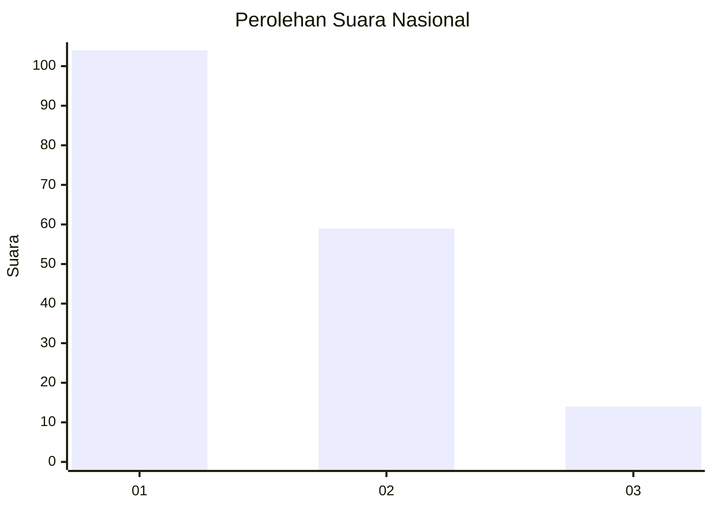
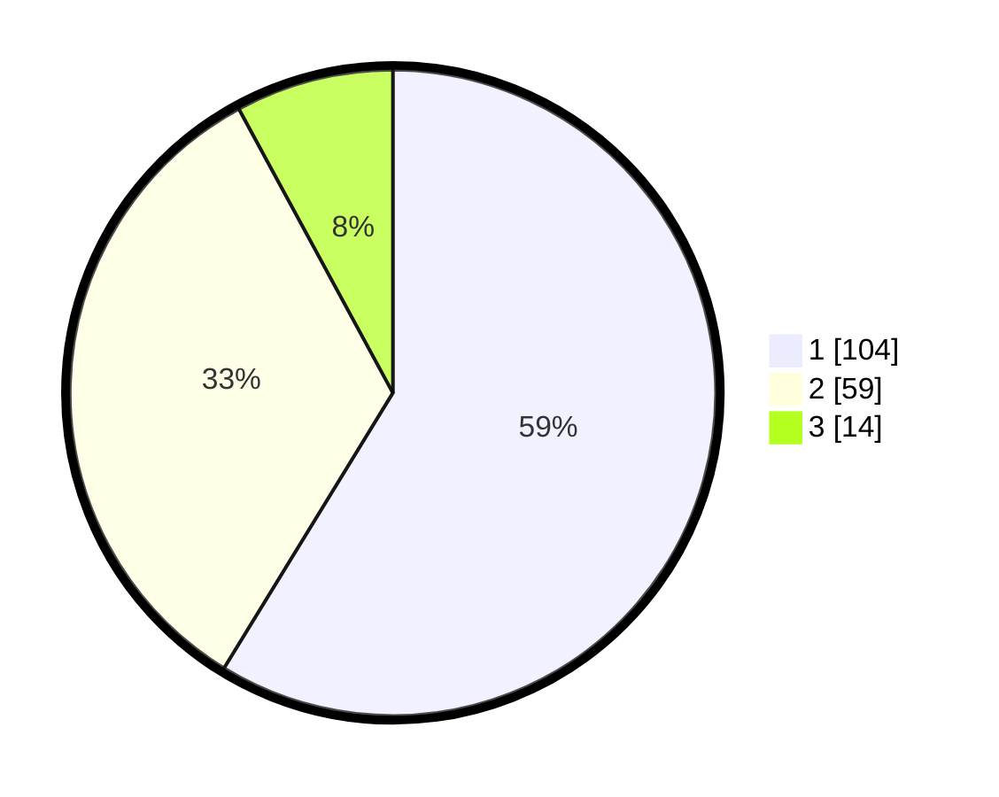

# Hasil

## Grafik

## Tabel

| No. | Nama Paslon    | Suara | Suara (raw) | Persentase |
|:--- |:-------------- | -----:| -----------:| ----------:|
| 1   | ANIES MUHAIMIN | 104   | [104][p-1]  | 58,76      |
| 2   | PRABOWO GIBRAN | 59    | [59][p-2]   | 33,33      |
| 3   | GANJAR MAHFUD  | 14    | [14][p-3]   | 7,91       |

[p-1]: https://github.com/gigit-pemilu/pemilu-2024/blob/main/pilpres/hitung-suara/sub/61-kalimantan-barat/sub/71-kota-pontianak/sub/04-pontianak-utara/sub/1004-batulayang/sub/069-tps/sub/paslon-1.txt
[p-2]: https://github.com/gigit-pemilu/pemilu-2024/blob/main/pilpres/hitung-suara/sub/61-kalimantan-barat/sub/71-kota-pontianak/sub/04-pontianak-utara/sub/1004-batulayang/sub/069-tps/sub/paslon-2.txt
[p-3]: https://github.com/gigit-pemilu/pemilu-2024/blob/main/pilpres/hitung-suara/sub/61-kalimantan-barat/sub/71-kota-pontianak/sub/04-pontianak-utara/sub/1004-batulayang/sub/069-tps/sub/paslon-3.txt

## Foto C Plano

https://sirekap-obj-formc.kpu.go.id/59b9/pemilu/ppwp/61/71/04/10/04/6171041004069-20240214-215501--da89df96-e8f8-4294-9138-295e5e25aa93.jpg

https://sirekap-obj-formc.kpu.go.id/59b9/pemilu/ppwp/61/71/04/10/04/6171041004069-20240214-215937--57830ce1-e9ad-425e-bc2b-92606cfefec9.jpg

https://sirekap-obj-formc.kpu.go.id/59b9/pemilu/ppwp/61/71/04/10/04/6171041004069-20240214-215822--cfdb321c-265b-4b57-abb8-00aef0e39abf.jpg

## Metadata

| Key        | Value               |
| ---------- | ------------------- |
| Time Stamp | 2024-02-25 00:00:00 |

