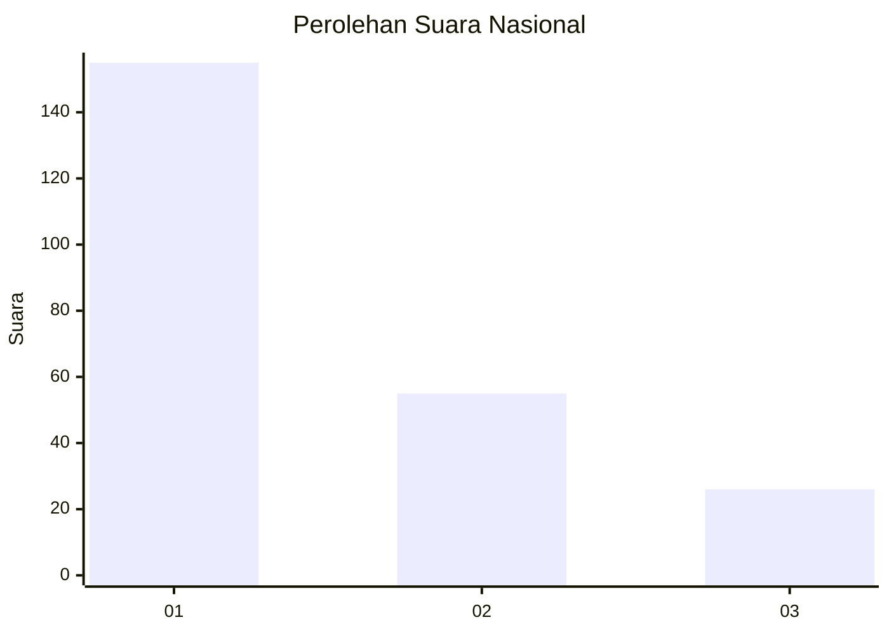
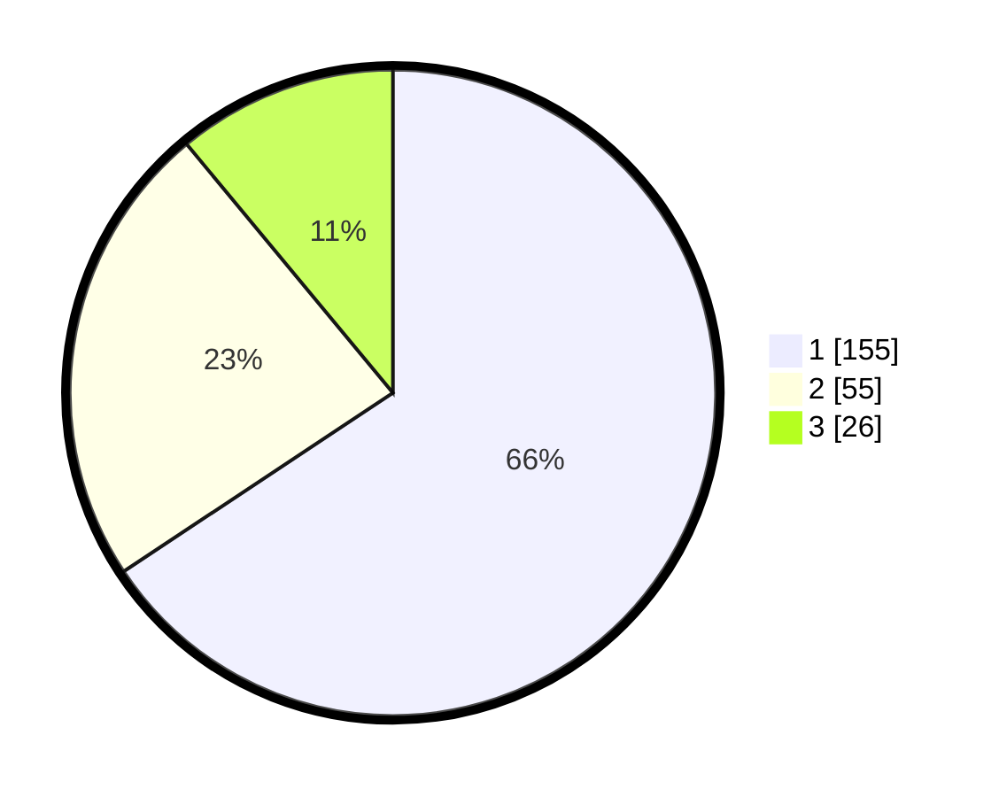

# Hasil

## Grafik

## Tabel

| No. | Nama Paslon    | Suara | Suara (raw) | Persentase |
|:--- |:-------------- | -----:| -----------:| ----------:|
| 1   | ANIES MUHAIMIN | 155   | [155][p-1]  | 65,68      |
| 2   | PRABOWO GIBRAN | 55    | [55][p-2]   | 23,31      |
| 3   | GANJAR MAHFUD  | 26    | [26][p-3]   | 11,02      |

[p-1]: https://github.com/gigit-pemilu/pemilu-2024/blob/main/pilpres/hitung-suara/sub/61-kalimantan-barat/sub/71-kota-pontianak/sub/06-pontianak-tenggara/sub/1001-bansir-laut/sub/017-tps/sub/paslon-1.txt
[p-2]: https://github.com/gigit-pemilu/pemilu-2024/blob/main/pilpres/hitung-suara/sub/61-kalimantan-barat/sub/71-kota-pontianak/sub/06-pontianak-tenggara/sub/1001-bansir-laut/sub/017-tps/sub/paslon-2.txt
[p-3]: https://github.com/gigit-pemilu/pemilu-2024/blob/main/pilpres/hitung-suara/sub/61-kalimantan-barat/sub/71-kota-pontianak/sub/06-pontianak-tenggara/sub/1001-bansir-laut/sub/017-tps/sub/paslon-3.txt

## Foto C Plano

https://sirekap-obj-formc.kpu.go.id/5804/pemilu/ppwp/61/71/06/10/01/6171061001017-20240218-133432--796844a0-a2b0-4a57-bbb8-fe2c5db52c77.jpg

https://sirekap-obj-formc.kpu.go.id/5804/pemilu/ppwp/61/71/06/10/01/6171061001017-20240218-133318--c1250a72-4f6e-4def-aec3-207ffd2e9e7b.jpg

https://sirekap-obj-formc.kpu.go.id/5804/pemilu/ppwp/61/71/06/10/01/6171061001017-20240218-133125--7edf55d5-3b24-4a61-a665-4303c63d8eca.jpg

## Metadata

| Key        | Value               |
| ---------- | ------------------- |
| Time Stamp | 2024-02-25 16:00:00 |

