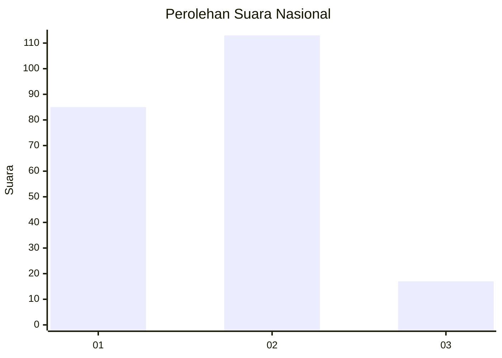
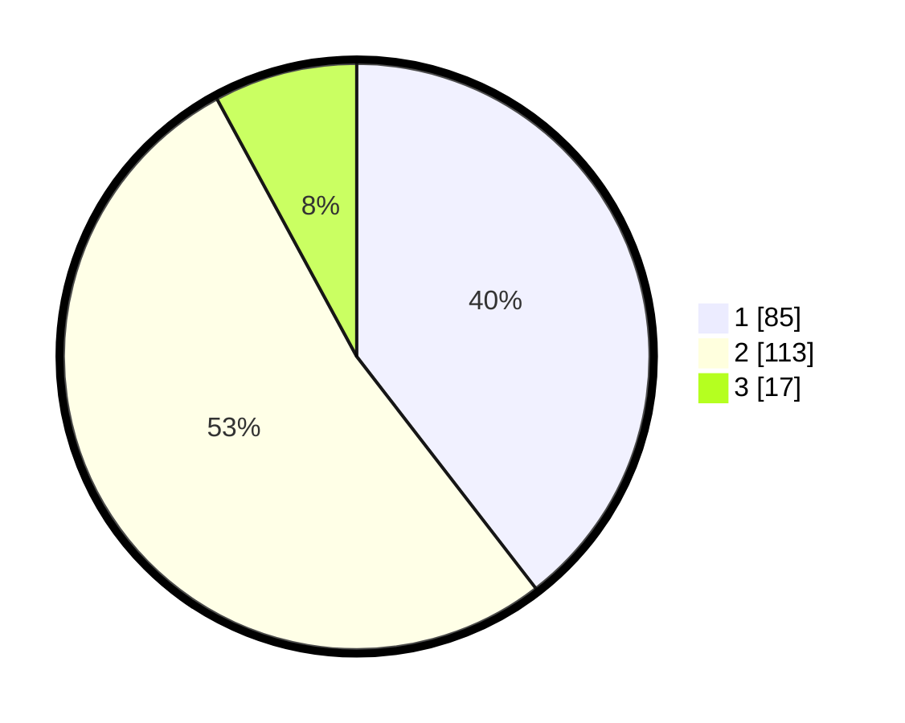

# Hasil

## Grafik

## Tabel

| No. | Nama Paslon    | Suara | Suara (raw) | Persentase |
|:--- |:-------------- | -----:| -----------:| ----------:|
| 1   | ANIES MUHAIMIN | 85    | [85][p-1]   | 39,53      |
| 2   | PRABOWO GIBRAN | 113   | [113][p-2]  | 52,56      |
| 3   | GANJAR MAHFUD  | 17    | [17][p-3]   | 7,91       |

[p-1]: https://github.com/gigit-pemilu/pemilu-2024/blob/main/pilpres/hitung-suara/sub/61-kalimantan-barat/sub/72-kota-singkawang/sub/01-singkawang-tengah/sub/1001-roban/sub/003-tps/sub/paslon-1.txt
[p-2]: https://github.com/gigit-pemilu/pemilu-2024/blob/main/pilpres/hitung-suara/sub/61-kalimantan-barat/sub/72-kota-singkawang/sub/01-singkawang-tengah/sub/1001-roban/sub/003-tps/sub/paslon-2.txt
[p-3]: https://github.com/gigit-pemilu/pemilu-2024/blob/main/pilpres/hitung-suara/sub/61-kalimantan-barat/sub/72-kota-singkawang/sub/01-singkawang-tengah/sub/1001-roban/sub/003-tps/sub/paslon-3.txt

## Foto C Plano

https://sirekap-obj-formc.kpu.go.id/242a/pemilu/ppwp/61/72/01/10/01/6172011001003-20240215-000323--cbb775db-ad2c-4cbd-8b44-f39848823a2f.jpg

https://sirekap-obj-formc.kpu.go.id/242a/pemilu/ppwp/61/72/01/10/01/6172011001003-20240215-000532--5fde91bf-8114-48c2-a044-bc76b88a2903.jpg

https://sirekap-obj-formc.kpu.go.id/242a/pemilu/ppwp/61/72/01/10/01/6172011001003-20240215-000702--92c53b02-3e8c-4ffa-90ea-5ca4246b9961.jpg

## Metadata

| Key        | Value               |
| ---------- | ------------------- |
| Time Stamp | 2024-02-24 22:31:28 |

